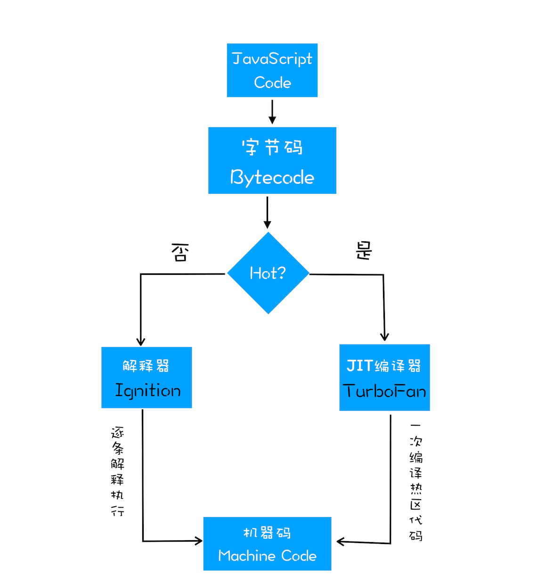

浏览器原理
===================

## 多进程

浏览器是多进程，每新开一个 tab 页都会新起一个进程(有些时候浏览器会做优化，将多个 tab 进程合并成一个，比如多个空的 tab 页)。

### 进程的组成

浏览器包含下面几个主要进程：

1. Browser 进程：浏览器的主进程(负责协调，主控)，只有一个。作用有：
> + 负责浏览器界面显示，与用户交互。如 前进、后退等
> + 负责各个页面的管理，创建和销毁其他进程
> + 网络资源的管理、下载等
> + 将 Renderer 进程得到的内存中的 bitmap，绘制到用户界面上

2. 渲染进程（即浏览器内核）（Renderer 进程，内部是多线程）：核心任务是将 HTML，CSS, JS 转换为用户可以与之交互的网页。渲染引擎 Blink 和 Javascript 引擎 V8 都是运行在该进程里。默认情况下，浏览器会为每个 Tab 标签创建一个渲染进程。处于安全考虑，渲染进程都是运行在沙盒模式下。

3. GPU 进程：最多一个，用于 3D 绘制等。起初 GPU 进程是为了实现 3D CSS 效果；后面随着网页、UI 界面都选择采用 GPU 来绘制，这使得 GPU 成为浏览器的普遍需求。最后 Chrome在其多进程架构下也引入了 GPU 进程

4. 网络进程 (Network Service)：主要负责页面的网络资源加载，之前是作为一个模块运行在浏览器进程里面的，最近才被独立出来，成为一个单独的进程。

3. 第三方插件进程：每种类型的插件对应一个进程，仅当使用插件时才创建。

因此打开 Chrome 浏览器，至少会开4个进程，1个浏览器进程，1个GPU进程，1个网络进程，1个渲染进程；随着tab页越多，进程就越多，所需的资源也就越多。

### 多进程的优势

相比单进程浏览器，多进程浏览器有如下优点：
+ 避免单个页面 crash 影响整个浏览器
+ 避免第三方插件 crash 影响整个浏览器
+ 多进程可以充分利用多核优势
+ 方便使用沙盒模型隔离插件等进程，提高浏览器稳定性

采用多进程，某个 tab 页崩溃不会影响整个浏览器。当然，内存等资源销毁会更大，有点空间换时间的意思。

## 浏览器引擎 (浏览器内核 / 渲染进程)

浏览器引擎是浏览器中的一部分，用于从互联网上获取网页，将内容转换成用户可阅读的内容。常见的浏览器引擎包括 Blink, Webkit, Gecko, Trident。

每个浏览器还有自身的 UI，包括 tabs、toolbar、menu 等等，这些叫做 chrome。比如 Firefox and SeaMonkey 是两个有着相同 engine 但是不同 chrome 的浏览器。

### 组件

浏览器引擎包含了许多子组件：
+ an Http Client
+ an Html parser
+ a CSS parser
+ a Javascript Engine (这个又包含 parsers, interpreters, compilers)

这些组件用于解析 web formats 比如 html, css, 将它们转换成用户在屏幕中看到的内容。这些组件合起来就叫做 layout engine 或者 rendering engine.

### 线程

这个引擎本身是以进程方式运行，进程里又包含多个线程，主要有：

1. GUI 渲染线程 (主要用到 HTML parser 和 css parser)
> + 负责渲染浏览器界面，解析 HTML，CSS，构建 DOM tree， render tree，layout， paint 等
> + 当界面需要 repaint (重绘) 或者由于某些操作引发 reflow (回流) 时，该线程就会执行
> + GUI 渲染线程跟 JS 引擎线程是 `互斥`的，当 JS 引擎执行时，GUI 渲染线程就会被挂起，GUI 当前操作就会被保存在一个队列中，等到 JS 引擎空闲时再执行队列中的任务。

2. JS 引擎线程 (需要用到 JS 引擎，比如 V8)
> + 也成为 JS 内核，负责处理 JS 脚本
> + JS 引擎负责解析 JS 脚本，运行代码
> + JS 引擎当前运行的代码是放在 stack 里运行，一旦 stack 空闲，就会从一个叫做`任务队列`中获取新任务来运行。一个渲染进程(Tab页)始终只会有一个 JS 线程在运行着 JS 代码
> + GUI 渲染线程 和 JS 引擎线程是 互斥，如果 JS 执行时间过长，就会导致页面渲染线程无法运行，从而导致页面卡顿

3. 事件触发线程
> + 这个是属于浏览器的一部分，而不是 JS 引擎。主要用来控制事件循环(EventLoop), 可以理解为 JS 引擎忙不过来，需要浏览器另开线程协助。这个线程管理着一个任务队列。
> + 当 JS 引擎执行代码，碰到类似 setTimeout, setInterval, 鼠标点击，Ajax 请求等，会将这些任务转给事件线程，由事件线程来处理这些任务 (这个线程会根据任务类型再转给具体的线程？)
> + 当对应的事件符合触发条件并且被触发后，该线程会把事件添加到待处理的队列中(任务队列)，一旦 JS 引擎空闲，就会获取队列中第一个任务进行执行
> + 由于 JS 是单线程，所以任务队列中的事件都得排队等待，这也是为什么 setTimeout 实际执行的等待时间 要大于等于 delay 的原因

4. 定时器触发器线程
> + setInterval 和 setTimout 所在的线程
> + 通过这个线程来计时并触发事件，将事件任务加到任务队列中 ( JS 线程 -> 事件触发线程 -> 定时器触发器线程)
> + W3C 规范中定义，如果 setTimeout 的 delay 小于 4ms，就按 4ms 处理

5. 异步 http 请求线程
> + 碰到 Ajax 代码时，浏览器会新开一个线程来处理请求
> + 检测到状态变更时，如果有对应的回调函数，这个线程就会产生状态变更事件，将对应的回调放入任务队列中。再等待 JS 执行

## Browser 进程 和 Renderer 进程之间的通信

这个通信过程简化下，大概有以下几个步骤：
1. Browser 进程进行收到用户请求，首先需要获取页面内容（比如通过网络下载资源），之后通过 RendererHost 接口将请求转给 Renderer 进程
2. Renderer 进程接收到请求后，简单处理后，转给 GUI 渲染线程，然后开始页面渲染
> + 渲染线程接收请求，加载和渲染网页，这个过程可能需要通过 Browser 进程获取资源 (CPU 和 内存)，需要 GPU 进程来帮忙渲染
> + 当然也可能需要 JS 线程操作 DOM (可能造成 reflow 和 repaint)
> + 最后 Renderer 进程将结果回传给 Browser 进程。

3. Browser进程接收到结果并将结果绘制出来

## 浏览器内核中的线程关系

浏览器内核是前端开发主要关注的地方。理清各线程之间的关系，才能更好地理解一些浏览器相关问题。

### GUI渲染线程与JS引擎线程互斥

由于 JS 是可以操作 DOM，如果在修改 DOM 的时候，GUI 线程也在同时渲染页面，就可能导致渲染的内容不一致。因此为了避免这种情形，浏览器设置 GUI 线程和 JS 引擎线程为互斥，当 JS 引擎在运行时，GUI 线程就要被挂起。GUI 任务会被添加到一个队列中等待 JS 引擎空闲时才会接着执行

### JS 阻塞页面加载

从上面的互斥关系，可以推导出，JS 如果执行时间过长，就会导致页面阻塞。因此首次渲染时，通常将 JS 代码放到最后面，就是为了避免阻塞 GUI 线程。另外有大的计算时，应该通过 webworker 另起一个线程，这样 JS 引擎线程才不会一直运行着，导致 GUI 线程阻塞。

### Webworker, JS 的多线程？

碰到需要巨大计算，通常都会被告知要使用 webworker 新开一个线程来处理。那么这个为什么不会影响页面渲染呢？
+ 创建 webworker，JS 引擎会向浏览器申请开一个子线程，子线程是由浏览器开的，完全受主线程控制，而且不能操作 DOM
+ JS 引擎线程跟 worker 线程间通过特定的方式进行通信 (postMessage API, 这个要求通过序列化对象来进行数据传输)

也就是新开的 webworker 线程是接管了 JS 引擎线程中的巨大任务，而且这个线程是由浏览器开启，并且不能操作 DOM，相当于是帮助 js 引擎线程减负，这样就不会阻塞 GUI 线程渲染。webworker 并没有改变 js 单线程的本质。

### webworker 和 sharedWorker

+ webworker 是只属于某个页面，不会和其他页面进行交互或者共享。因此由各个页面的 Renderer 进程负责创建一个 webworker 线程
+ sharedWworker 是浏览器页面共享，就不能采用 webworker 的方式来实现，它不属于某个 Renderer 进程，而是由多个 Renderer 进程共享。因此是由浏览器新开的一个 `进程` 来运行 JS
+ webworker 是 Render 进程中的一个 线程；sharedWorker 是浏览器开启的一个 进程，可以跟其他 Render 进程交互。

## 浏览器渲染过程

从输入 URL 开始的过程，前面的步骤可以简化为：

+ 浏览器里输入 url，浏览器主进程接收请求，开启一个下载线程
+ 然后进行 http 请求 (dns 查询)，服务端响应等
+ 浏览器接收到响应后，获取内容，将内容转给 Renderer 进程
+ Renderer 进程开始渲染页面

浏览器渲染进程拿到内容后，渲染大致可以划分为以下几个步骤:
1. HTML parser 解析 html 内容构建 DOM  (byte -> char -> token -> node -> DOM)
2. CSS parser 解析 css 内容构建 CSSOM
3. DOM 和 CSSOM 合并成 Render Tree (Render Tree 不包含不显示在 DOM 中的内容，比如 `<meta>` `<script>` 这些DOM；另外 `display:none` 的元素也不会包含在 Render Tree )
4. 根据 render tree, 计算每个元素的位置和大小，确定好 layout
5. 根据确定好的 layout，开始 paint，将元素内容绘制到页面上
6. 浏览器会将各层的信息发送给 GPU 进程，GPU 会将各层合成 (composite), 显示在屏幕上

### domContentLoaded 和 Load

可以开始构建 Render Tree 的时候会触发 domContentLoaded 事件，所有内容都处理完成 (包括 image，video 都下载完成), 就会触发 load 事件。

### css加载是否会阻塞渲染

css 文件是有单独的线程进行下载。
+ css 异步加载是不会阻塞 DOM 的解析
+ 但是 css 会阻塞 render tree 的构建，即会影响页面渲染

### 普通图层和复合图层 (合成层)

#### 合并图层

浏览器对页面中 DOM 元素的绘制是在多个层上进行。在每个层上完成绘制过程之后，浏览器会将所有层按照合理的顺序合并成一个图层，然后显示在屏幕上。对于有位置重叠的元素的页面，这个过程尤其重要，因为一旦图层合并顺序出现错误，将会导致元素显示异常。

#### 提升为合成层的好处

提升为合成层简单来说有以下几点好处：
+ 合成层的位图，会交由 GPU 处理，速度上要比 CPU 快
+ 当需要 repaint 时，只需要 repaint 当前层，并不会影响到其他层
+ 对于 transform 和 opacity 效果，不会触发 layout 和 repaint

#### 提升元素为合成层 (也叫硬件加速)

+ 提升合成层最好的办法就是使用 css 的 will-change 属性。will-change 设置为 opacity、transform、top、left、bottom、right 可以将元素提升为合成层。

```css
#target {
  will-change: transform;
}
```

+ 如果是不支持 will-change 属性的浏览器，可以使用 3D transfrom 属性来强制提升为合成层：
```css
#target {
  transfrom: translateZ(0);
}
```

+ 另外使用 opacity 也可以将元素提升为合成层
+ `<video><iframe><canvas><webgl>` 等元素也会提升为合成层
+ 使用 flash 插件


#### 使用 transform 或者 opacity 来实现动画效果

页面呈现出来所经历的渲染流水线：

Javascript -> Style -> Layout -> Paint -> Composite

从性能方面考虑，最理想的渲染流水线就是没有 Layout 和 Paint，只需要 Composite。

为了实现这个效果，就需要只使用那些只触发 Composite 的 css 属性。目前只有两个 css 属性满足这个条件：transform 和 opacity。元素只有提升为 合成层 后，transform 和 opacity 才不会触发 paint；如果不是合成层，还是会触发 paint。

详细内容可以参考[这篇文章](https://fed.taobao.org/blog/taofed/do71ct/performance-composite/)

### 浏览器事件循环 (EventLoop)
这部分内容已经比较熟悉了，就不展开了。

这边对 macrotask (宏任务，也叫 Task)和 microtask (微任务，也叫 job) 进行说明：

+ macrotask 可以理解是每次执行栈执行的代码就是一个宏任务，包括每次从事件队列中获取的任务都是宏任务
> + 每个 macroTask会从头执行到尾，在这个过程中不会去执行其他任务
> + 浏览器为了能够使得 JS 内部 task 与 DOM 任务能够有序地执行，会在一个 marcoTask 执行结束后，在下一个 marcoTask 执行前，对页面进行重新渲染 (macroTask -> 页面渲染 -> macroTask)

+ microTask 可以理解是在当前 macroTask 执行结束后立即执行的任务
> + 即在当前 marcoTask 之后，下一个 macroTask 之前，并且是渲染之前
> + 它的响应速度要比 setTimeout 更快，因为无需等待渲染
> + 在某一个 macroTask 执行完后，就会将在它执行期间产生的所有 microTask 都执行完毕。

宏任务包括：
+ 主代码块
+ setTimeout
+ setInterval
+ 事件队列中的每一个任务都可以当成是宏任务

微任务包括：
+ Promise
+ process.nextTick
+ MutationObserver

再根据线程来理解：
+ macroTask 都是放在事件队列中，这个队列是由事件触发线程维护
+ microTask 都是添加到微任务队列中 (Job Queue)，等待当前 macroTask 执行完毕后执行，这个队列是由 JS 引擎线程维护

所以整体的运行机制是：
+ 从任务队列中获取一个 marcoTask，开始执行
+ 执行过程中如果遇到 microTask，就将它加入到 Job Queue
+ 宏任务执行完毕后，立即执行由当前宏任务产生的所有微任务(依次执行，如果有优先级关系，先执行优先级最高的任务)
+ 当微任务都执行完毕后，GUI 线程接管，检查是否有需要渲染，如果有的话就渲染页面
+ 渲染完毕后，JS 引擎线程接管，从任务队列中获取队列，开始下一个 macroTask

### V8 是如何执行一段 JavaScript 代码

讲到 V8，会涉及到一些概念：
+ Compiler (编译器)
+ Interpreter (解释器)
+ AST (抽象语法树)
+ Bytecode (字节码)
+ JIT (即时编译器)： just-in-time compilation

#### Compiler 和 Interpreter

之所以会存在 Compiler 和 Interpreter，是因为机器不能直接读懂我们写的程序代码，所以在执行代码前，需要将程序代码转换为机器能够读懂的机器语言。按语言的执行流程，可以把语言分为编译型语言和解释型语言。

编译型语言在程序执行之前，需要经过编译器的编译过程，并且编译之后会直接保留机器能读懂的二进制文件，这样每次执行程序时，都可以直接运行对应的二进制文件，而不需要重新编译。比如 C/C++, JAVA，GO

解释型语言在每次运行时，都需要通过 Interpreter 对程序进行动态解释执行。

那编译器和解释器是如何“翻译”代码的呢，具体可以看下面这张图：


#### v8 如何执行 JS 代码


从图中可以看到，V8 在执行过程中既有 解释器 (Ignition 点火器)，又有编译器 (TurboFan 涡轮增压)，那么它们是如何配合执行一段 JS 代码呢：

1. 生成抽象语法树 (AST) 和 执行上下文 (Execution Context)
2. 有了 AST 和 EC，解释器 Ignition 就登场，它会根据 AST 生成字节码，并解释执行字节码
> 字节码是介于 AST 和 机器码之间的一种代码。但是与特定类型的机器码无关，字节码需要通过解释器将起转换为机器码后才能执行
> V8 一开始并没有字节码，而是直接将 AST 转换为机器码，但是因为机器码占用内存过多，当运行在手机端时，问题就暴露了，所以后面就增加了字节码


从图中可以看出，机器码所占用的空间远远超出了字节码，所以使用字节码可以减少系统的内存开销。

3. 执行代码

生成字节码之后，接下来就要进入执行阶段了。

如果有一段第一次执行的字节码，解释器 Ignition 会逐条解释执行(需要转成机器码才能执行吧？)。在执行字节码的过程中，如果有发现热点代码(HotSpot)，比如一段代码被执行了多次，那么后台的编译器 TurboFan 就会把该段热点的字节码编译为高效的机器码。然后当再次执行这段被优化的代码时，只需要执行编译后的机器码就可以了。

字节码配合解释器和编译器的技术被成为 JIT (即时编译)。具体到 V8，就是指解释器 Ignition 在解释执行字节码的同时，收集代码信息，当它发现某一部分代码变热之后，TorboFan 编译器便闪亮登场，把热点的字节码转换为机器码，并把编译后的字节码保存起来，以备下次使用。



