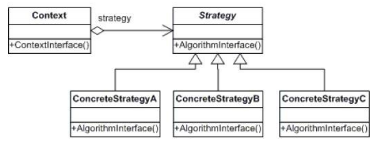

# strategy 策略模式

## 定义
定义了算法族，分别封装起来，让他们之间可以互相替换，此模式让算法的变化独立于适用算法的客户。

## uml



Context: 适用策略(算法族)的上下文
Stragegy: 算法的接口 (JS 没有这个概念)
concreteStrategy: 具体算法实现

## 延伸

## 实现

```javascript
let context = {
  setStrategy(strategy) { // 可以设置多个不同的算法族
    this.strategy = strategy;
  }

  doSomething() { // 可以在一个方法里引用多个算法族
    this.strategy.doIt()
  }
}

let strategy = { doIt()}
let strategy2 = { doIt()}
let strategy3 = { doIt()}

context.setStrategy(strategy)
context.doSomething();

// 换一个算法试下
context.setStrategy(strategy2)
context.doSomething();
```