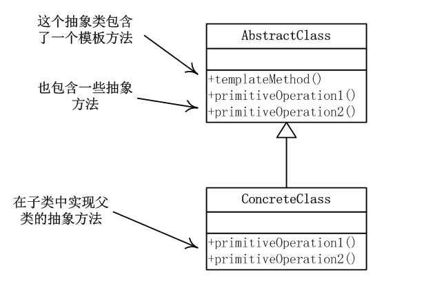

# template - 模板方法

## 定义

在一个方法中定义了一个算法的骨架， 而将一些步骤延迟到子类中。模板方法使得子类可以在不改变算法结构的情况下，重新定义算法中的某些步骤。

## uml



AbstractClass: 抽象类定义了 templateMethod(), 里面包含了具体的算法步骤，分别调用 method1, method2

具体类：对 method1， method2 进行覆盖

## 适用场景

## 实现

```javascript
class Parent() {
  template() {
    ...
    this.method1()
    other()
    other2()
    this.method2()
    ...
  }
  method1() {}
  method2() {}
}

class Child extends Parent() {
  method1(){}
  method2(){}
}

```
