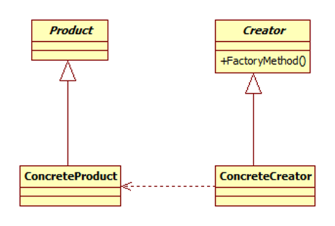

# factory

## 定义

todo

## UML

这个是工厂方法模式UML图：



## 适用场景
todo

## 实现

factory 类要包含一个 create() 方法, 用于创建产品。

在 js 里可以通过 Class 或者 object 来定义 Creator。不像 java 必须定义一个 abstract class。

```javascript
Class factory {
  create(type) {

  }
}

let factoryObj = {
  create(type) {

  }
}
```
