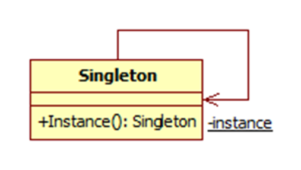

# singleon - 单例模式

## 定义
todo
## uml



## 适用场景

## 实现

### 通过 constructor 实现

```javascript
function Database() {
  if (typeof Database.instance === 'object' ) return Database.instance;
  Database.instance = this;
}
```
在构造函数上面定义一个 instance 属性; 存在之间返回，不存在就等于 this, this 指向当前创建的对象

```javascript
Class Database {
  constructor() {
    if (typeof Database.instance === 'object' ) return Database.instance;
    Database.instance = this;
  }
}
```

### 通过 object literal 实现

```javascript
let singleton = (function() {
  let instance;
  function createInstance() {}
  return {
    getInstance() {
      if (!instance) instance = createInstance()
      return instance
    }
  }
})()
```