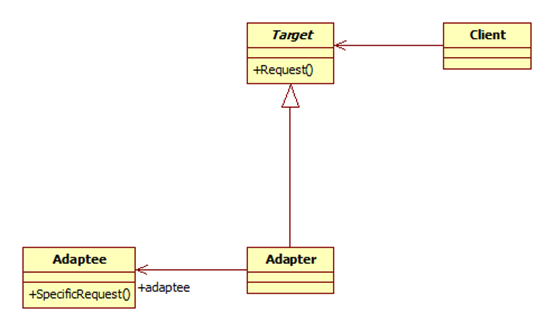

# adapter - 适配器模式

## 定义
todo
## uml



Target: 对应的是目标对象，比如 老旧的对象
Adapter：适配器，定义跟 Target 一样的接口，将请求转给 Adaptee, 需要保存有 Adaptee 的引用
Adaptee: 新的实现对象，是真正处理 request 的对象

## 适用场景

## 实现

```javascript
let oldObj = { 
  request() {}
}
let newObj = {
  newRequest() {

  }
}
let adapter = {
  setAdaptee(adaptee) { // 可以通过其他方式设置 adaptee
    this.adapter = adaptee;
  }
  request() {
    adaptee.newRequest()
  }
}
```
