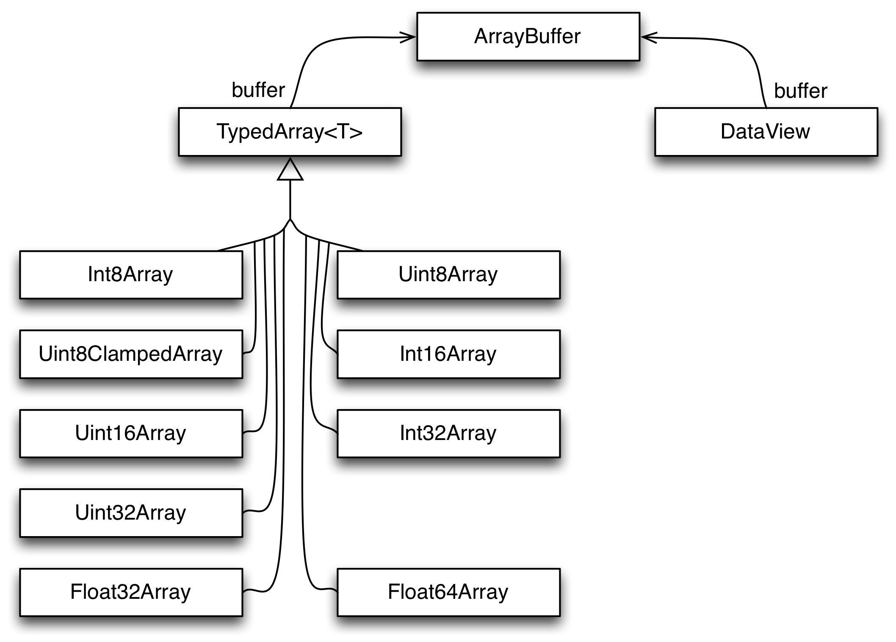

ArrayBuffer/TypedArray/DataView 介绍

这三个是 ES6 引入的用于处理二进制数据的 API。先看下这3个的关系：



## ArrayBuffer

ArrayBuffer 是一个构造函数，通过这个构造函数创建的对象，表示一个通用、固定长度的原始二进制缓冲区。说白了就是一个数组，这个数组存放的是字节空间(内存空间)。

这个字节数组不可以被直接操作，只有通过 TypedArray 或者 DataView 的对象才可以读取字节数组的内容或者写入内容到字节数组里。

它的用法，通常就是指定字节数组长度，创建一个对象，然后作为 TypedArray 或 DataView 构造函数的参数

```js
const arrayBuffer = new ArrayBuffer(8); // 分配一个8字节的内存缓冲区
console.log(arrayBuffer.byteLength); // 8，返回字节长度
const sliceBuffer = arrayBuffer.slice(4, 6); // 创建一个包含部分内容的新缓冲区，这边的 4 是起始索引， 6 是结束索引(不包含在内)，即包含2个字节，
console.log(sliceBuffer.byteLength); // 2, 
const view = new Int32Array(buffer); // 创建一个 Int32Array，用于读取或写入这个字节缓冲区，一个 Int32Array 每个元素占4字节，因此这个缓冲区只能写入1个这个类型的元素
```

## TypedArray

TypedArray 是一个概念，不可以直接被编码使用，是一组数据类型的超类, 从概念上来说是一个 view，用于操作 ArrayBuffer。它包含9个子类，每个类型存储的数据范围不同：
+ Int8Array: 有符号的8位整型数组，表示每个元素占了8 bit，即由一个字节表示，可以存储的数字范围是 -128 ~ 127 (256个数字)
+ UInt8Array: 无符号的8位整型数组，和 Int8Array 一样，每个元素也是占了 8 bit，即由一个字节表示，不过由于是无符号整数，存储的数字范围是 0 ~ 255 (2^8 - 1)
+ Uint8ClampedArray: 这个跟 Uint8Array 基本一样，除了存储数字超过范围的处理方式不同，如果只小于0，会被转为 0，如果大于 255，会被转为 255
+ Int16Array: 每个元素占了 16 bit，即 2个 Byte，可以存储的数字范围是 -2^15 ~ 2^15 -1
+ UInt16Array: 同 Int16Array，数字范围是 0 ~ 2^16 - 1
+ Int32Array: 每个元素占了 32 bit，即 4 Byte
+ Uint32Array: 同 Int32Array，存储的数字范围不同而已
+ Float32Array: 存储的是 32-bit IEEE floating point
+ Float64Array: 64-bit IEEE floating point

每一种类型只能操作一种类型的数据，其实就是存储的数字范围不同而已，比如数字 97，代表的是英文字母 a，可以由上面任何一个类型所读写。但是考虑到空间的利用率，只用 Int8Array 或者 UInt8Array 就可以存储了 (这2种类型每个元素可存储的值都大于 97)，所占的内存空间是最小的。

Nodejs 的 Buffer 其实是 UInt8Array 的子类：

```js
const buf = Buffer.from('a');
console.log(buf); // [Buffer 61], 这边输出的结果是 61 是16进制的表示，对应十进制就是 97；a 字符由于对应的 字节码是 97，这个值用一个字节就可以表示了

const buf2 = Buffer.from('中国');
console.log(buf2); // <Buffer e4 b8 ad e5 9b bd>, 这边可以看到输出了6个字节，说明每个中文是由3个字节表示
console.log(buf2.toString());
```

这边顺便说下 encode 和 decode：

讲到 encode 和 decode，需要先说明下字符集：

字符集定义了字符和字节码的对应关系。比如 字符a，对应的字节码是 97。由于每个国家使用的字符不同，就导致有很多字符集。后来为了统一，就出台了 unicode 字符集，目前比较常用的字符集是 utf8 或 utf16.具体就不展开。总之字符集是字符和字节码的对应关系。编码和解码的过程都需要用到。

编码过程：

```js
const buf = Buffer.from('a'); // 61
```

我们知道内存中实际存储的都是二进制数字，是无法直接存储字符的，因此需要一个编码处理。例子中的 Buffer.from 就是一个编码处理：

+ 根据指定的字符集找到字符对应的字节码，如果没有指定，nodejs 会默认使用 utf8。对于字符 a，查到字节码是 97
+ 将数值 97 存储到内存中，这时候存储要用多少字节，跟使用的 TypedArray 就有关系了。正常使用 UInt8Array 就可以表示了，即一个字节存储这个数字
+ 数字 97 被转换为 二进制 存储到内存中。这边打印出来的是值是 61，是因为 nodejs 为了可读性，将二进制转换为十六进制了


解码过程：

```js
const buf2 = Buffer.from('中国', 'utf8');
console.log(buf2.byteLength); // 6
console.log(buf2.length); // 6
buf2.toString();
```

上面的 buf2.toString() 就是一个解码操作：将二进制数字转换为字符的过程：

+ toString() 可以接收一个字符集参数，没有指定默认就是 utf8
+ 当前 buf2 是一个元素长度为6，字节数为 6 的TypedArray，每个元素可表示的数值范围是 0 ~ 255
+ 根据指定的字符集 和 字节码，找到对应的字符 (这边有个疑问，怎么知道要根据几个字节对应一个字符？正常一个字节都可以找到对应的字符，为什么需要用3个字节来对应一个字符？)
+ 将解码后的结果返回出来

### 创建对象

创建 TypedArray 对象有3种方式

#### 指定 ArrayBuffer
```js
const buffer = new ArrayBuffer(10); // 分配一个10个字节的缓冲区
const view = new Int8Array(buffer); // 创建一个 int8 view，可以操作这10个字节空间
const view1 = new Int8Array(buffer, 4); // 创建一个 int8 view，可以操作从第4个索引开始的字节空间，即 6个字节
const view2 = new Int8Array(buffer, 4, 2); // 创建一个 view，可以操作从第4个索引开始的2个字节空间，即索引 4~5 的空间

console.log(view.buffer === view1.buffer); // true；.buffer 返回的是应用的 ArrayBuffer 对象，跟具体字节范围无关
console.log(view1.byteOffset); // 4，字节偏移索引位置
console.log(view2.byteLength); // 2， view 实际操作的字节长度
```

#### 指定元素大小

直接传一个数值，这个代表元素的大小，注意不是字节的大小。同一个数值，不同类型，所包含的字节长度是不同：

```js
const ints = new Int16Array(2); // 包含2个元素，每个元素占16 bit，即2个byte，总的字节数就是 4
console.log(ints.length); // 2, 元素个数
console.log(ints.byteLength); // 4, 可以操作4个字节
const floats = new Float64(5); // 包含5个元素，每个元素占64 bit，即8个 byte，总的字节数是 40
console.log(floats.length); // 5, 元素个数
console.log(floats.byteLength); // 40, 可以操作40个字节
```

__注意__ 如果没有传数值或者值为0，那么就相当于创建一个 view，这个 view 不能操作任何内存空间

#### 传递对象参数

对象参数可以是下面4个类型：
+ TypedArray：传一个 TypedArray 对象，那么被传入 TypedArray 的元素会被拷贝到新创建的 TypedArray 对象中。两个 TypedArray 对应的 ArrayBuffer 会不一样。
+ Interable：传一个可迭代的对象，对象 items 会被获取并添加到 TypedArray 里
+ Array：数组元素会被拷贝到新创建的 TypedArray 里
+ Array-Like object： 类数组的对象

```js
let inst1 = new Int16Array([25, 50]) // 传一个 Array，这样 inst1 就包含2个元素，每个元素占据2个 byte
console.log(int1.length); // 2
console.log(int1.byteLength); // 4

let inst2 = new Int32Array(inst1); // 传一个 TypedArray 对象参数，元素值会被赋值到新对象中
console.log(int2.length); // 2
console.log(int2.byteLength); // 8

console.log(int1.buffer === int2.buffer); // false，由于2个类型是不一样，而元素个数一样，所以操作的字节长度就不同，自然就不是同一个 ArrayBuffer
```

### 同 Array 的差异

可以把 TypedArray 类比成 Array，它是可以对一个字节数组进行读写操作，它们有一组公共的API

下面列举下不相同的 API：

#### index 赋值

Array 可以通过 index 索引设置新的值，如果 index 大于当前数组的最大索引，会自动扩容数组大小，但是TypedArray 被创建后，大小就是固定，因此指定一个不存在的 index，会导致值不存在

```js
let ints = new Int16Array([25, 50]); // 创建一个包含 25，50 的TypeArray，每个数值用 2个字节表示
console.log(ints.length); // 2
console.log(ints[0]); // 25
console.log(int2[1]); // 50
int[2] = 75;
console.log(ints.length); // 长度还是 2
console.log(int2[2]); // undefined
```

#### 非法值自动转换

```js
let ints = new Int16Array(["hi"]);

console.log(ints.length);       // 1
console.log(ints[0]);           // 0
```
上面用 Int16Array 存储一个 hi 字符，由于 Int16Array 只能存储数值，因此会被自动转为数值 0。


```js
let ints = new Int16Array([25, 50]),
let mapped = ints.map(v => "hi");

console.log(mapped.length);        // 2
console.log(mapped[0]);            // 0
console.log(mapped[1]);            // 0

console.log(mapped instanceof Int16Array);  // true
console.log(mapped instanceof Array);       // false
```

这个例子，对 ints 做 map 处理返回一个新的 TypedArray，但是由于元素值不合法，因此都被转换为值 0

#### 缺少的方法

相比 Array，TypedArray 没有以下这些方法：

+ concat()
+ pop()
+ push()
+ shift()
+ splice()
+ unshift()

除了 concat，其他方法会修改原有数组，由于 TypedArray 是不可变的，因此这些方法都不存在于 TypedArray

concat 也不能用，是因为 concat 两个不同类型的 TypedArray，会导致最终值不确定，因为无法知道最终每个数值要以几个字节来表示，而 TypedArray 的每个元素所占用的字节数应该是固定。

#### 新增的方法

相比于 Array，TypedArray 有下面2个自有的方法：

+ set：设置数组或者TypedArray 到一个TypedArray
+ subarray(): 获取一个 TypedArray 的一部分

直接看个例子

```js
let ints = new Int16Array(4);
ints.set([25, 50]); // 没有指定第二个参数，默认就是从索引 0 开始设置值
ints.set([75, 100], 2); // 从索引2开始设置值

let ints2 = new Int16Array([25, 50, 75, 100]);
let sub1 = ints2.subarray(); // 25, 50, 75, 100
let sub2 = ints2.subarray(2); // 75, 100 获取从索引2开始到结尾的值
let sub3 = ints2.subarray(1, 3) // 50, 75 获取索引1到3(不包含)的值
```

## Dataview

同 TypedArray 一样，DataView 也是一种应用在 ArrayBuffer 的 View；不同的是，DataView 可以读写任何一种数据类型。

### 创建对象

```js
const buffer = new ArrayBuffer(10);
const view1 = new DataView(buffer);
const view2 = new DataView(buffer, 5, 2);

console.log(view1.buffer === buffer);       // true
console.log(view2.buffer === buffer);       // true
console.log(view1.byteOffset);              // 0
console.log(view2.byteOffset);              // 5
console.log(view1.byteLength);              // 10
console.log(view2.byteLength);              // 2
```

构造函数需要接收一个 ArrayBuffer 对象，第二个参数是 byteOffset，第三个是 byteLength。后面2个参数是可选。通过这样就可以构造一个读写指定 ArrayBuffer 的 view。

### 读写数据

DataView 针对每一种数据类型，都有一个对应的读写方法：

+ getInt8() & setInt8()
+ getUint8() & setUInt8()
+ getInt16() & setInt16()
+ ...

get* 方法，可以接收两个参数 (byteOffset [, littleEndian])
+ 第一个是要读取的字节偏移量
+ 第二个是 boolean 类型，表示是否要以 小端法 读取数据 (Int8 和 UInt8 没有这个参数)

set* 方法，接收三个参数 (byteOffset, value [, littleEndian]), 比 get* 多了一个 value

#### 大/小端法 (biggerEndian VS littleEndian)

这边说下这2个的区别，一个数值如果是由多个字节组成，那么存储方式就可以由两种：
+ 高字节在前，低字节在后，也就是大端法
+ 高字节在后，低字节在前，也就是小端法

比如十进制数 5882 用 16进制表示是 16FA，假设用4个字节存储，如果用小端法表示，那么在内存中的存储方式是 FA 16 00 00; 如果用大端法表示，那么存储方式就是 00 00 16 FA

#### 读写例子

看个用 DataView 读写数据的例子

```js
const buffer = new ArrayBuffer(2);
const view = new DataView(buffer);

view.setInt8(0, 5); // 第一个字节存储数字 5
view.setInt8(1, -1); // 第二个字节存储数字 -1

console.log(view.getInt8(0)); // 以 Int8 读取第一个字节，得到数值 5
console.log(view.getInt8(1)); // 第二个字节一样操作，得到 -1

console.log(view.getInt16(0)); // 1535
```

这个例子最疑惑的地方就是最后一句代码，返回的结果是 1535，下面分析下为什么是这个值:

+ 首先分配了2个字节
+ view.setInt8(0, 5), 这个会将字节存储成 0000010100000000
+ view.setInt8(1, -1); 会将字节改成 0000010111111111
+ 之后通过 view.getInt16(0), 是一次性读取2个字节的内容(Int16 每次是读取2个字节)，0000010111111111 对应的10进制是 1535

从这个例子可以看出，当混用不同的数据类型时，使用 DataView 对象是一种完美的方式。