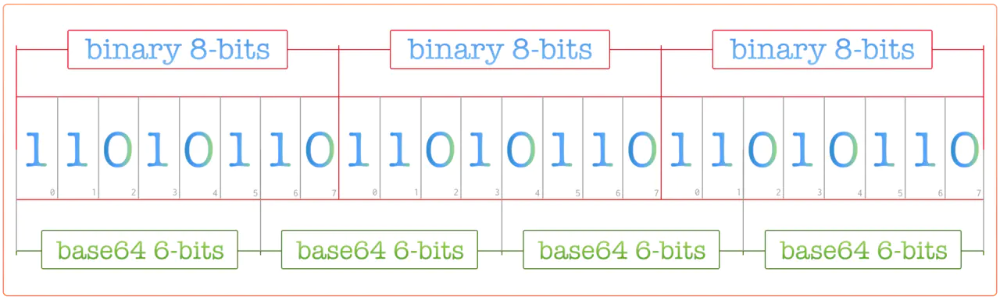
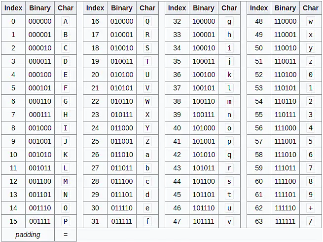
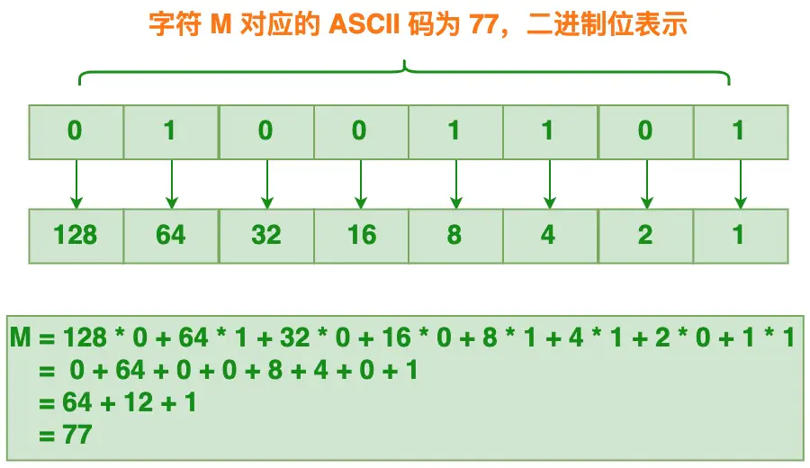
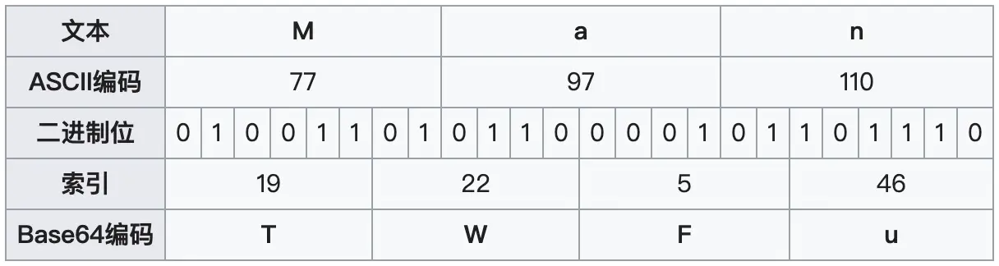
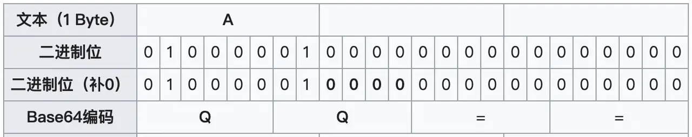
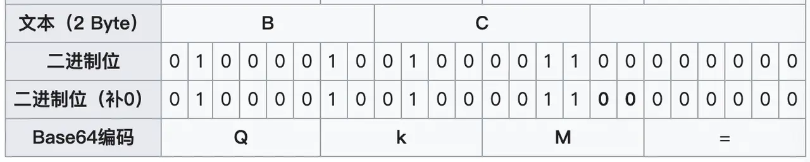

base64 编码
==================

Base64 是一种基于 64 个可打印字符来表示二进制数据的表示方法。

## 二进制、字符、编码和解码

在开始讲解 Base64 之前，有必要先说明几个概念：

+ 二进制: 由数字 0 和 1 组成的内容，所有数据最终都是以这种格式存储，计算机只能识别这种格式的数据
+ 字符：将二进制数据以某种字符集进行编码形成的数据，比如 ASCII 字符，UTF-8 字符，UTF-16 字符，Base64 字符，这种通常是人类可以直接阅读的内容
+ 字符集：定义二进制数据和字符对应关系的集合, 也成为编码表。常见字符集有 UTF-8, UTF-16, ASCII，Base64。不同字符集所支持的字符范围不同，比如 UTF-16，定义每个字符用2个字节表示，由于 2个字节是 16 bit，能支持 2^16, 即 65536 个字符。而 ASCII 字符集定义一个字符由1个字节表示，所能支持的字符只有 2^8，即 256 个字符。
+ 编码：将二进制转换为字符的过程就是编码，编码需要指定字符集，同一份二进制数据，使用不同字符集，编码出的字符内容很可能是不同。
+ 解码：将字符内容转换为二进制的过程就是解码，同样也需要指定字符集，比如一份 UTF-8 的字符串内容，如果用 UTF-16 进行解码，那最终解码后的二进制数据就会不对。

将一种编码的字符串转换为另外一种编码的字符串，涉及如下过程：
+ 以当前所使用的字符集对字符串进行解码，转换成二进制
+ 再将二进制数据以目标字符串进行编码，转换为新编码字符串

看个例子：

```js
Buffer.from('测试').toString('base64'); // 5rWL6K+V， Buffer.from() 如果没有指定字符集，默认是使用 utf-8
```

上面例子使用 node 的 Buffer，将 UTF-8 编码的字符串 '测试' 转换为 base64 编码的字符串 '5rWL6K+V'

## base64 编码原理

Base64 中的字符是以6个 bit 为一个单元，由于 2^6 = 64, 所以最多会有 64 个字符可选。

3个字节有 24个 bit，就会对应 4个 base64 字符，即 3个字节可由 4 个可打印字符表示。下面是相应的转化过程：



Base64 使用的64个字符，包括52个大小写字母、10个数字、加号 + 和 斜杆 /, 另外还会包含一个特殊字符 '=', 这个是作为后缀使用。

Base64 对应的编码表如下：



下面以 Man 为例，感受下 Base64 编码过程。Man 由 M, a 和 n 这3个字符组成，它们对应的 ASCII 码为 77, 97 和 110 (这个可以通过查看 [ASCII 编码表](https://www.cs.cmu.edu/~pattis/15-1XX/common/handouts/ascii.html)得到对应的值)



接着以 6 个 bit 为一个单元，进行 base64 编码操作，具体如下图所示：



由上图可知, Man 这3个字符经过编码后会得到 TWFu 的 Base64 字符串，字符串长度由原先的 3 变成 4，即经过 base64 编码后体积增加了 1/3。

上面这个例子 Man 的字节长度是 3，刚好可以用 4 个 base64 单元来表示。如果待编码字符串所对应的字节长度不是 3 的整数倍，要如何处理？

如果要编码的字节数不能被 3 整除，最后会多出 1 个或 2 个字节，可以使用下面的方法进行处理：先使用 0 对应的字节值在末尾补足，使其能被 3 整除，之后再进行 base64 编码。

以编码字符 A 为例，其所占的字节数是 1，不能被 3 整除，需要补 2 个字节，具体如下图所示：



由上图可知，字符 A 经过 base64 编码后的结果是 QQ==，该结果后面的两个 =, 代表补足的字节数。

接着再来看一个示例，假设要编码的字符是 BC，其所占字节数是 2，需要补 1 个字节数：



字符 BC 经过 base64 编码后得到的结果是 QkM=，最后面的 = 表示补足的字节数。

## btoa 和 atob

H5 中有两个函数被分别用于处理解码和编码 base64 字符串：

+ btoa: 该函数能够基于二进制数据 “字符串” 创建一个 base64 编码的 ASCII 字符串
+ atob：该函数能够解码通过 base64 编码的字符串数据。

下面看下这2个函数的用法：

```js
const name = 'Semlinker';
const encodedName = btoa(name);
console.log(encodedName); // U2VtbGlua2Vy
```

```js
const encodedName = 'U2VtbGlua2Vy';
const name = atob(encodedName);
console.log(name); // Semlinker
```

上面这2个方法是将一种编码的数据转换为另外一种编码的数据，其实中间隐藏了解码过程。

### 多字节字符

JS 的字符默认是使用 UTF-16 编码，即一个字符由2个字节表示。上面的 atob() 方法，要求提供的字符串中的字符必须是可以单字节表示，比如例子里的 'Semlinker', 每个字符都是可以由单个字符表示，因此可以被转换为 ASCII 字符。而对于无法由单字节表示的字符，比如中文 '李', 这个字符需要2个字节表示，此时调用 atob 会报 **InvalidCharacterError**。那么要如何处理多字节字符呢？

对于多字节字符，需要将字符转换为可以用单字节表示的字符，然后再调用 atob() 进行转换：

```js
// convert a Unicode string to a string in which
// each 16-bit unit occupies only one byte
function toBinary(string) {
  const codeUnits = new Uint16Array(string.length);
  for (let i = 0; i < codeUnits.length; i++) {
    codeUnits[i] = string.charCodeAt(i);
  }
  return String.fromCharCode(...new Uint8Array(codeUnits.buffer));
}

// a string that contains characters occupying > 1 byte
const myString = "李";
const converted = toBinary(myString);
const encoded = btoa(converted);
console.log(encoded);  // Tmc=
```

上面的 toBinary 方法将双字节字符转换为多个单字符字符：
+ 首先构造 Uint16Array 实例，由于 JS 字符串使用 UTF-16 编码，每个字符占据两个字符，因此使用 Uint16Array 构造的元素长度等于字符串长度
+ 之后依次获取每个字符的 charCode，存储到 Uint16Array 实例上
+ 构造 Uint8Array 实例，读取 Uint16Array 实例底层所对应的 ArrayBuffer 数据 (即以单字节为单位读取同一份数据)
+ 基于 Uint8Array 实例，构造新的 字符串

不过一旦使用这种方式处理多字节字符，再调用 atob() 时需要返过来再处理一遍才能得到正确的 binary string。

## Buffer

atob 和 btoa() 是属于 H5 的方法。从上面可以看出对多字符字符进行 base64 转换还是比较麻烦。而 node.js 提供的 Buffer 就能轻易进行不同编码的字符转换。

```js
Buffer.from('李', 'utf-16').toString('base64');
```

将中文字符 '李' 编码为 base64 字符串，使用 Buffer 只需要一行代码即可。


