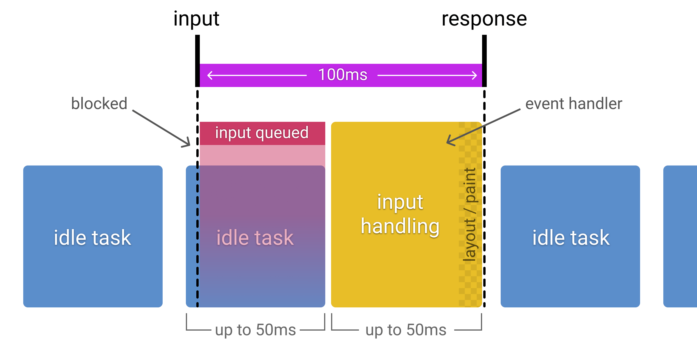

# RAIL

分别代表 Response  Animation   Idle  Load

## Response: process events in under 50ms

要在100ms以内响应用户的输入，这适用于大多数输入，比如点击按钮、切换表单控件、启动动画；但不包括触摸拖动和滚动。

而实际响应用户输入要在50ms以内完成，因为在开始执行响应代码前还需要时间用来排队。如果用户的输入操作刚好在处理空闲任务时，而每一个空闲任务需要执行50ms，所以这段时间是不能执行响应代码，要等空闲任务执行完，才能真正执行，所以留给响应代码的时间只有50ms。参考下面的图：

## Animation：produce a frame in 10ms

一个 animation frame 应该在 10ms 以内生产。实际上生产一个 frame 允许的最大时间是 16ms，但是需要留给浏览器6ms的时间用来 render each frame。常见的 animation 有：

+ 可视化的动画： 比如进入和退出、loading旋转图
+ 滚动： 
+ 拖拉

## Idle：maximize idle time

最大化增加 idle time，来提高在50ms内响应用户输入的机会：

+ 利用 idle time 来完成 可延迟的工作。比如 首次页面加载，尽可能加载最小的数据，利用空闲时间去加载其他数据
+ 如果用户的操作是在2个 idle time work之间，应将用户的操作设置成最高优先级，中止 idle time work。

## Load：deliver content and become interactive in under 5 seconds

优化加载性能跟用户访问你的网站所使用的设备和网络带宽有关。目前首次加载的一个评测目标是使用中端智能手机开启慢 3G 连接，你的网站能在5s以内加载完成并且可以交互。

针对这项的指导方针：

+ 重点优化 critical rendering path 以达到不会阻塞渲染
+ 不需要在5s内完成所有事情。允许做一些 增加式渲染，在后台做一些其他工作
+ 识别影响页面加载的因素：

  + 网速
  + 设备硬件
  + 缓存策略
  + L2/L3 缓存
  + js 的解析

## 测算 RAIL 的工具：

1. chromeDevTools： 提供关于页面首次加载或者运行时的一切详细信息。主要是在 performance tab页
1. lighthouse：提供一个评测url，lighthouse模拟以 slow 3g 的网络在中断设备上运行。提供一份加载性能的报告，还有改进性能的建议。
1. WebPageTest：类似 lighthouse，不过提供的信息会更加完整，通过配置可以包含lighthouse的评测信息。