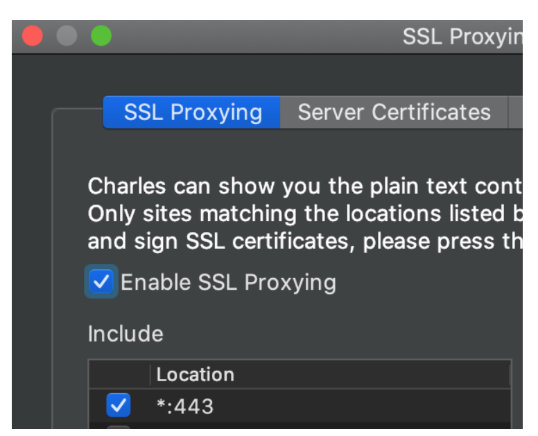

charles https 抓包配置
==============================

charles 默认就能显示 http 抓包信息；如果是 https，那么需要安装 charles 证书才可以，因为 charles 是作为一个 man-in-the-middle, 只有手动安装了证书，并且信任该证书，那么 charles 才能正常解密数据。下面讲解下如何安装和配置 https 抓包

## windows

这边以 windows 系统为例，mac 系统也是类似：

1. 点开 charles，依次打开 Help -> SSL Proxying -> Install Charles Root Certificate
2. 之后会弹出安装证书的窗口，点击右下角的安装证书 -> 选择存储位置 (当前用户/本地计算机，根据实际需要选一个即可) -> 证书存储 (选择 将所有的证书都放入下列存储) -> 点击 浏览 -> 选择 '受信任的根证书颁发机构' -> 下一步 直到 安装完成结束
3. 检验证书安装情况，在 常规 tab 页，看下证书标志旁边是否有红色打叉，如果没有就表示安装成功。
4. 打开 proxy -> SSL proxy setting -> 勾选 Enable SSL proxying -> 底部列表点击添加 -> Host 输入 *, port 输入 * 或者 443 都可以
5. 随便打开一个 https 网站，查看 API 请求，能看到正常的抓包数据就表示配置成功

__注意__ 这个安装过程容易配置错的一个地方是证书安装完后不是 可信任的证书，这是由于 证书存储 位置那边没有选择 '受信任的根证书颁发机构' 导致；另外就是忘了勾选 Enable SSL Proxying。

## 配置代理抓包

这个主要是用于抓包手机数据。这边以 iphone 为例：

1. 点开手机里的 无线局域网，选择跟 电脑 连接的同一个 wifi (必须是同一个 wifi，否则无法代理)
2. 点开 wifi 右边的 感叹号，拉到最底部，点击 配置代理，选择 手动，输入 服务器 和 端口 (服务器和端口可以通过 charles -> Help -> SSL proxying -> Install Charles Root Certificate on a mobile device or remote browser，在弹开的窗口里可以看到 host 和 port)
3. 配置完手动代理后，通常 charles 这边会弹窗提醒有 proxy 请求连接，选择 允许 即可
4. 之后用手机上的浏览器访问这个地址：chls.pro/ssl，网站会提醒下载证书，选择下载即可
5. 回到手机 设置 -> 通用 -> 描述文件与设备管理 -> 然后安装证书
6. 回到手机 设置 -> 关于本机 -> 最底部 证书信任设置 -> 将 charles proxy CA 设置为允许即可

经过上面一通配置之后，通过手机访问 https 网站，就能在 charles 看到抓包到数据，并且 https 数据也解密成功。

