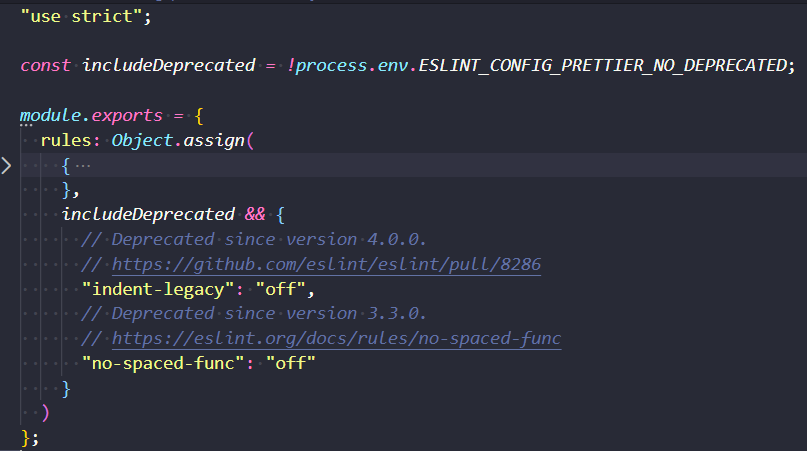
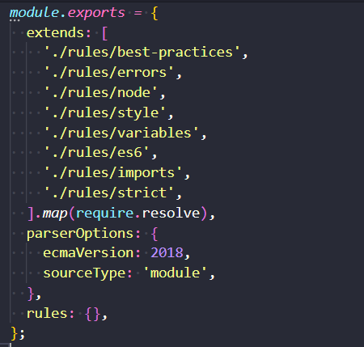
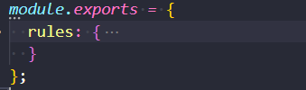

eslint
=========================

eslint 相关内容，主要包括 配置，自定义插件

## 配置

这部分内容主要参考官方文档，相当于是翻译，再加上平时实践中的一些理解和总结。

这边说的配置是基于文件形式，即使用 .eslintrc.* 或者 在 package.json 通过 eslintConfig 配置 (这个比较不常用，也不推荐)

还有一种配置方式是采用 js 注释的形式，这种是针对单行或单个文件的配置。这边不涉及这块内容。

### Parser Options

指定需要支持的 Javascript 语言选项。默认是支持 ES5 语法，可以通过对应配置项进行修改：

```js
parserOptions: {
    ecmaVersion: 2018, // 这个可以解决 spread 和 rest operator 以及 async await. 默认值是 5. 这个配置最常用
    sourceType: 'module', // 默认值是 'script', 'module' 表示使用 ES Module, 这个通常也需要配置
    ecmaFeatures: {
      globalReturn: true,  // 允许在全局作用域里使用 return 语句，这个一般不配，很少使用
      impliedStrict: true, // 允许全局的 strict mode 如果 ecmaversion >= 5
      jsx: true // supporting jsx syntax. 注意这个不表示支持 React. React 对 jsx 应用了 eslint 无法识别的特别的语义。如果要支持 React，要用 eslint-react-plugin
    }
  }
```

### Parser

Eslint 默认使用 Espree 作为它的解析器。也可以在配置文件中指定不同的 parser，只要这个 parser 满足下面的条件：

1. 必须是一个 Node module loadable。即需要通过 npm install 另外安装这个 module
1. 必须遵循 parser interface.

__注意__ 即使满足这两个条件，也不保证一个 external parser 能正确地与 eslint 一起工作，eslint 不会修复与其他 parser 不兼容的错误。

要指定一个 npm module 作为 parser，只需按下面这样配置即可

```js
{
  parser: 'esprima'
}
```

目前比较常见的 parser 有下面三个：

+ Esprima
+ Babel-ESLint - A wrapper around the Babel parser that makes it compatible with ESLint.
+ @typescript-eslint/parser - A parser that converts ts into a ESTree-compatible form so it can be used with ESLint.

__注意__ 即使指定自定义的 parser，如果使用需要非 ES5 的功能，一样需要配置 parserOptions. parserOptions 会作为参数传给 Parser, 至于 parserOptions 会不会用来开启指定功能，由 parser 决定。

### Processor

Plugins 可以提供 processor (创建自定义 plugin 时, 通过 yo eslint:plugin 时会提问是否提供 processor)。

Processor 可以从其他类型的文件中抽取 js 代码，从而让 ESLint 进行校验。也可以基于某些目的在 预处理中 对 JS 代码进行转换。

下面是一个简单的 processor 配置

```js
{
  plugins: ['a-plugin']
  processor: 'a-plugin/a-processor'
}
```

由于 processor 是属于 plugin, 因此必须配置了对应的 plugin, 然后 processor 的值采用 plugin-name/processor-name 的形式。

如果要指定 processor 应用于特定的文件类型，需要结合 overrides 进行配置：

```js
{
  plugins: ['a-plugin'],
  overrides: [
    {
      files: ['*.md'],
      processor: 'a-plugin/a-processor'
    }
  ]
}
```

关于 processor 还有其他的内容，由于这个配置项在实践应用中不常见，暂时先了解到这边。后续如果有接触其他内容再来更新。

### Environments

指定运行环境，每一个环境都会预定义一些全局变量，可用的环境有：

+ browser - 浏览器全局变量
+ node - Node.js 全局变量和作用域
+ commonjs - commonjs 全局变量和作用域 (如果是 browser-only code that uses Browserify/Webpack, 就使用这个)
+ shared-node-browser - browser 和 node.js 都共用的全局变量 ( browser 和 node 的交集)
+ es6 - 开启所有 es6 功能，除了 modules (这个会自动将 parserOptions 里的 ecmaVersion 设置为 6 / es2015)
+ es2017 - adds all ECMAScript 2017 globals and automatically sets the ecmaVersion parser option to 8.
+ es2020 - adds all ECMAScript 2020 globals and automatically sets the ecmaVersion parser option to 11.
+ worker - web worker global variables.
+ amd - defines require() and define() as global variables as per the amd spec.
+ mocha - 添加所有 mocha 的测试全局变量
+ jest - Jest global variables.
+ jquery - jQuery 

还有其他配置项，由于不常用就不列出来。这些配置项是不互斥，所以可以一次定义多个值：

```js
{
  env: {
    browser: true,
    node: true,
    jest: true
  }
}
```

也可以指定 plugin 的 enviroment, 需要先在 plugins 里指定 plugin name, 然后使用 unprefixed plugin name, 后面再跟上 / 和 environment name：

```js
{
  plugins: ['example'], // 指定 plugin
  env: {
    "example/custom": true // example 是 plugin name，custom 是 enviroment name.
  }
}
```

### globals

ESLint 默认的 `no-undef` rule 会对那些可以使用但是没有事先定义的变量提示警告，要解决这个问题，就需要配置 globals, 可以为每一个变量指定是 readonly 或者 writable

```js
{
  globals: {
    "var1": "writable",
    "var2": "readonly"
  }
}
```

### plugins

ESLint 支持使用第三方的插件，在使用插件前，需要通过 npm 安装对应插件。

#### 配置插件

在配置文件中通过 plugins 这个 key 配置 plugins：

```js
{
  plugins: [
    'plugin1', // means eslint-plugin-plugin1
    'eslint-plugin-plugin2'
  ]
}
```

这边配置了两个插件，一个名称是 `plugin1`, 这个对应的 npm package name 是 `eslint-plugin-plugin1`, 第二个对应的是 `eslint-plugin-plugin2`

#### Naming Convention (命名约定)

##### 包含一个插件

配置 plugin name 时，`eslint-plugin` 这个前缀是可以省略

```js
{
  plugins: [
    'jquery' // means eslint-plugin-jquery
  ]
}
```

简写也可以用到带有 scope 的 npm package：

```js
{
  plugins: [
    '@jquery/jquery', // means @jquery/eslint-plugin-jquery
    '@foobar' // means @foobar/eslint-plugin
  ]
}
```

##### 使用一个插件

当使用一个 plugin 所定义的 rules, enviroments, configs, 必须遵循下面的约定方式：

+ eslint-plugin-foo -> foo/a-rule  - 这边引用 plugin 的 rule, 这个 plugin 不带 scope, 就采用 `plugin-name/rule-name` 格式
+ @foo/eslint-plugin -> @foo/a-config  - 这边引用 plugin 的 config，这个 plugin 带有 scope，但不带有 name，就采用 `@scope-name/config-name` 格式
+ @foo/eslint-plugin-bar -> @foo/bar/a-environment  - 这边引用 plugin 的 enviroment, 这个 plugin 带有 scope 和 name，采用 `@scope-name/plugin-name/config-name` 格式

`@scope-name/plugin-name/config-name` 就是完整格式写法：

1. 以 `@` 开头的表示是 scope package, 后面内容有两个 `/`, 第一个就是 plugin-name, 第二个就是 rules, config, environment 中的一个
1. 以 `@` 开头的表示是 scope package, 后面内容只有一个 `/`, 那个内容表示是 rules, config, environment 中的一个, 不可能是 plugin-name
1. 不是以 `@` 开头，那肯定是 `plugin-name/xxx` 的格式, xxx 是 rules, config, environment 中的一个

__注意__ 如果是使用 plugin 定义的 config, 还得在前面完整格式加上 `plugin:` 前缀

看个具体例子，通过注释解释

```js
{
  plugins: [ // 配置三个 插件
    'jquery', // means react-plugin-jquery
    '@foo/foo', // means @foo/react-plugin-foo
    '@bar' // means @bar/react-plugin
  ],
  extends: [ // 使用 plugin 定义的 config，名称前面要加上 `plugin:`
    'plugin:@foo/foo/recommended', // refer to recommended config of @foo/react-plugin-foo plugin
    'plugin:@bar/recommended' // refer to recommended config of @bar/react-plugin
  ],
  rules: {
    'jquery/a-rule': 'error', // refer to a-rule of react-plugin-jquery
    '@foo/foo/some-rule': 'error', // refer to some-rule of @foo/react-plugin-foo
    '@bar/another-rule': 'error' // refer to another-rule of @bar/react-plugin
  }
}
```

### 配置 Rules

ESLint 自带了一堆默认 rules, 要修改一个 rule 配置，必须指定 rule id 等于下面这些值：

+ 'off' or 0 - turn the rule off
+ 'warning' or 1 - turn the rule as a warning (doesn't affect exit code)
+ 'error' or 2 - turn the rule on as an error (exit code is 1 when triggered)

```js
{
  rules: {
    'eqeqeq': 'off', // 不启用 eqeqeq 这个 rule 校验
    'curly': 'error', // 没有遵循 curly 这个 rule 就提示错误
    'quotes': ['error', 'double'], // 这种配置，多了个 option，这个表示如果没有在该用 双引号 的地方使用双引号，比如用了 单引号 或者 ES6 的模板字符，那就提示错误
    'plugin1/rule1': 'off' // 这个是插件自定义的rule，如果没有遵循这个 rule，也不会提示
  }
}
```

#### 只对某些文件禁用 rule

上面的 rule 配置是全局配置，除了全局配置，也可以对 某个文件，某一行，某几行单独配置 rules。vscode eslint plugin 支持快捷操作，这边就不展开这块内容，有需要直接看官方文档。

还有一种情形是只针对一组文件，配置 rule，这个要通过 overrides 来配置

```js
{
  rules: {...},
  overrides: [
    {
      files: ['*-test.js', '*-spec.js'],
      rules: {
        "no-unused-expressions": "off"
      }
    }
  ]
}
```

这边对所有 `*-test.js` 和 `*-spec.js` 应用特定的 rules。

### 配置 inline comment behavior

#### disable inline comments

要禁用所有 inline config comments, 可以使用 `noInlineConfig`:

```js
{
  "rules": {...},
  "noInlineConfig": true // 设置为 true，那么所有在文件中的 inline comments 都无效
}
```

#### report unused eslint-disable comments

有时候加了很多 eslint-disable inline comment, 但是这些已经不再被使用了，可以通过 `reportUnusedDisableDirectives` report：

```js
{
  "rules": {...},
  "reportUnusedDisableDirectives": true
}
```

### Adding Shared Settings

ESLint 支持在配置文件中添加 shared settings, shared setting 是 object, 这个 object 会提供给每一个要执行的 rule。这个对于添加自定义 rule 特别有用，因为这些自定义 rule 可以共用这些信息。

```js
{
  settings: {
    sharedData: 'Hello'
  }
}
```

### Using configuration files

使用配置文件有两种方式：

1. 使用 `*.eslintrc.*` 或者 `package.json` - 这种方式 ESLint 会自动去查找对应的文件，而且可以给同一个项目不同文件夹应用不同配置文件
2. 在 eslint 命令行里通过 `-c` 指定

第一种配置方式会涉及到 层叠 关系，ESLint 在查找配置文件时，会从当前目录查找，然后再往上一级目录查找，直到根目录 或者 配置文件中明确指定 `root: true`

另外不同配置文件格式的优先级也不一样，同个目录下会按下面的优先级应用配置文件：

1. .eslintrc.js
1. .eslintrc.cjs
1. .eslintrc.yaml
1. .eslintrc.yml
1. .eslintrc.json
1. .eslintrc
1. package.json

### extends configuration files

通过 extends 可以让一个配置文件从 base confirguraion 中继承一组已启用的 rules，extends 的值可以是：

+ 一个指定配置的字符串 - 配置文件的路径, 可以共享配置的名称 (eslint:recommended or eslint:all)
+ 一个字符串数组：每一个配置项都会继承前一个配置项的内容

extends 是递归继承，比如当前配置文件 extends 一个 base, 这个 base 又 extends 另外一个配置，这样就循环 extends

#### Using eslint:recommended

`eslint:recommended` 这个是 ESLint 官方自带的 config, 通常 ESLint major version 升级后，这个配置才会跟着变更。这个也是比较推荐使用的配置

```js
{
  extends: 'eslint:recommended', // 继承 eslint:recommended 定义的 rules
  rules: {
    // 添加没有包含在 eslint:recommended 里的 rule
    "indent": ["error", 4],

    // 覆盖 eslint:recommended 定义的 rule
    "comma-dangle": ["error", "always"],

    // 关闭 eslint:recommended 开启的 rule
    "no-console": "off"
  }
}
```

#### using a shareable configuration package

a shareable configuration 是一个导出 configuration object 的 npm package. 使用前要先安装这个 npm package.

这种方式，extends 值可以忽略 `eslint-config-` 前缀，比如 eslint-config-prettier

```js
{
  extends: ['prettier'] // 这边继承了 eslint-config-prettier 
}
```

#### using the confirguration from a plugin

某些 plugin 也导出了一些 named configurations. 比如 `eslint-plugin-react` 导出一个 recommended configuration

```js
{
  plugins: ['react'],
  extends: [
    'eslint:recommended',
    'plugin:react/recommended' // plugin 的 configuration，要加上 plugin: 前缀
  ]
}
```

这个例子继承了两个配置，如果两个有冲突的 rules，那么 plugin:react/recommended 会覆盖 eslint:recommended

#### using configuration file

```js
{
  "extends": [
    "./node_modules/coding-standard/eslintDefaults.js",
    "./node_modules/coding-standard/.eslintrc-es6",
    "./node_modules/coding-standard/.eslintrc-jsx"
  ],
  "rules": {
    "eqeqeq": "warn"
  }
}
```

这个例子 extends 的值是 相对路径的文件，这个相对路径是基于当前这个配置文件所在的位置

#### eslint-config-* package 解析

首先来看 `eslint-config-prettier` 这个 npm package 的内容



从图片中可以看到，这就是一个简单的 node module, exports 一个 object, object 的内容只有 rules 这么一个key。 rules 里面定义了一些默认配置项

通过 extends 这个 npm package 导出的 object, 就相当于配置了这些 rules。

再看一个 npm package, `eslint-config-airbnb-base`



这个 exports 出的 object 类似一个配置文件的内容，包含了 extends, parseOptions, rules 等内容。

其中 extends 指定了一些相对路径的文件，来看下 `./rules/best-practices` 这个文件内容



可以看到这个文件就是导出一个 包含 rules 的 object

从上面的两个例子可以看出，extends 指定的 value，都会导出一个 configuration object, 这个 object，简单的情形就是只导出一个 rules；复杂点的就是再 extends 其他 configuration, 同时也配置了其他 key，比如 parserOptions

extends 配置项还有一种比较特殊的值

```js
{
  extends: [
    "airbnb",
    "prettier",
    "prettier/react"
  ]
}
```

比如这边的 `prettier/react`, 这个其实是解析 eslint-config-prettier 这个 npm package 里的 react.js. 这个 npm package 包含了 index.js (默认的 rules), react.js ( react 相关的 prettier rule), vue.js (vue 相关的 prettier rule)

所以如果是一个 React 项目，同时使用了 eslint 和 prettier, 建议 `prettier` 和 `prettier/react` 都要 extends