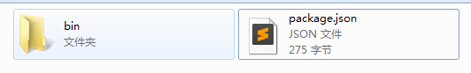

# npm link

利用这个命令，可以将本地开发好的 package 或者 cli package 关联到 config.prefix 目录下，这样就可以将开发好的 package 按 global install 的 package来使用，将 package 发布到 npm registry 前采用这种方式进行测试特别方便。

```sh
npm link (in package dir)
npm link [<@scope>/]<pkg>[@<version>]
```

npm link要分2个步骤执行：

1. 在 package 的目录下，执行 npm link: 这个命令会在 {prefix}/lib/node_modules/  创建一个 <package> 的文件夹，这个文件夹链接到执行这条命令的文件夹，并且会将执行命令文件夹里的bin链接到 {prefix}/bin/{name}

1. 在 其他目录下执行 npm link [<@scope>/]<pkg>[@<version>]（刚刚link到全局文件夹的package）, 这样就会在该目录的 node_modules 文件下全局安装了 package-name

举个 cli package 的例子进行说明：



文件夹 simple-cli 下有个 bin 文件夹 和 一个 package.json

```sh
{
  "name": "@linclark/simple-cli",
  "version": "1.0.0",
  "description": "",
  "main": "index.js",
  "bin": {
    "github-pages-commit": "bin/commit.js"
  },
  "scripts": {
    "test": "echo \"Error: no test specified\" && exit 1"
  },
  "author": "",
  "license": "ISC"
}
```

package.json 内容如上面所示，其中 name 和 version 决定了 package 的名称, 这个例子是 cli package，需要定义对应的 bin，这个指定 command 名称是 github-pages-commit，对应的 script 是 bin/commit.js

在这个目录下执行 npm link，会在 {prefix}/lib/node_modules/ 目录下生成如下文件夹  @linclark/simple-cli, 注意这边的文件名称是 package name，而不是文件所在的目录名(simple-cli)；目录下包含的就是


即这边通过 symlink 关联到 simple-cli 文件夹。

另外在 C:\Users\Administrator\AppData\Roaming\npm 目录下会生成2个文件：github-pages-commit 和 github-pages-commit.cmd （window 系统的情况，如果是 unix 系统，目录结构会不一样）

这2个文件的名称就是 bin 属性指定的 script 名称，这2个都是可执行文件。

再看下 bin/commit.js 的内容：

```javascript
#! /usr/bin/env node
console.log('console.log output!!!')
```

非常简单，就是输出一条信息到控制台。__注意__ 文件最上面的 __#! /usr/bin/env node__ 这个是创建可执行node脚本必须的内容。在terminal里执行 github-pages-commit 或 github-pages-commit.cmd 最终就是输出 'console.log output!!!'

通常 cli 命令都是全局安装，如果是要局部安装，那就在对应目录下执行上面说的第2个步骤的命令语句。

__注意__:

* 通常非 cli 的package 都是 local install，因此要执行第2条 link 命令。
* 上面提到的 {prefix}/lib 和 {prefix}/bin 是针对 unix 系统，windows 系统 没有多一个 lib 或 bin 文件夹

非 cli package，通常会在 package.json 里指定 main 属性，这个属性指定执行 require('package-name') 时得到是哪个文件的 exports 的内容。比如上面 main 指定的是 index.js，假设 index.js 包含如下内容

```javascript
function sayHi() {}
module.exports = sayHi
```

那么 let fn = require('test-hi'), fn 就是 sayHi, 这边假定 package-name 是 'test-hi'

参考资料：

* [官方 npm link](https://docs.npmjs.com/cli/link)
* [官方 package.json](https://docs.npmjs.com/files/package.json)