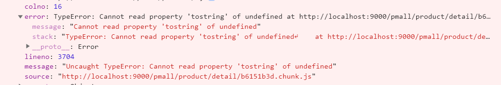
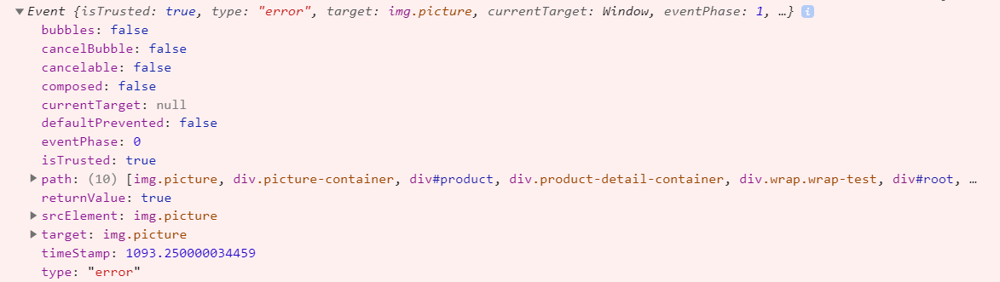

统一异常/错误处理
=======================

## 为什么需要处理异常

## 需要处理哪些错误

## 异常处理方式

### try-catch

try-catch 只能捕获同步的运行时错误，对`语法错误`和`异步错误`是无能为力。当然借助校验工具，比如 ESLint, 语法错误在上线前都会被处理掉。

```js
try {
  setTimeout(() => {
    undefined.map(v => v * 2);
  }, 100)
} catch(e) {
  console.error('捕获异常：', e); // 这边是捕获不到异常，因为异常是发生在异步代码中
}
```

运行上面的代码，最终会抛出 `Uncaught TypeError: xxxxxxx`, 即异常不会被捕获。

### window.onerror

在浏览器中，当 JS 发生运行时错误，window 会触发一个包含 ErrorEvent 接口的 error 事件，并执行 window.onerror().

```js
/**
 * @param {String} message 具体错误信息
 * @param {String} source 出错来源(文件)的信息
 * @param {Number} lineno 出错所在的行数
 * @param {Number} colno 出错所在的列数
 * @param {Error} error 出错对象信息
 */
window.onerror = function(message, source, lineno, colno, error) {
  console.error('捕获到异常：', { message, source, lineno, colno, error });
  return true;
};
```

比如上面的 onerror 发生时，打印的结果如下：


__注意__: onerror 函数最后面的 `return true`; 如果没有 `return true`, window 控制台里会多显示一条 `Uncaught TypeError xxxx` 的类似信息。

onerror 即可以捕获同步运行时错误，也可以捕获异步运行时错误，因此是对 try-catch 的一个很好补充。但是下面几种错误它依然无法处理：
+ 接口异常
+ 静态资源加载
+ 语法错误

在实际应用中，onerror 主要用来捕获预料之外的错误，而 try-catch 则是用来在可预见情况下监控特定的错误，两者结合使用会更加高效。

### window.addEventListener

当一些资源 (如图片，脚本) 加载失败，加载资源的元素会触发一个 error 事件，并执行该元素上的 onerror() 处理函数。这些 error 事件不会向上冒泡到 window，不过能被单一的 window.addEventListener 捕获

```js
window.addEventListener('error', error => {
    console.error('捕获静态资源错误:', error);
  },
  true
);
```



__注意__ 
+ 这个必现采用 `capture` 才能捕获到异常，使用 `bubble` 是捕获不了。另外虽然捕获了异常，控制台也一样会显示图片加载不到的异常。
+ 这个方式也可以捕获 API 接口请求不到的异常，不过由于无法区分 404 或者 500，通常需要再结合服务端日志来定位具体问题。
+ 不同浏览器返回的 error 对象可能不同，需要注意兼容处理
+ 需要注意避免 addEventListener 重复监听

由于静态资源加载不到的问题，线上环境也容易排查，所以这个处理方式并不是必需。

### Promise Catch

使用 promise，并不是每一个都会有对应的 catch，一旦发生异常，这些异常是不会被 window.onerror 捕获，因此需要一个统一的方案来处理 promise rejection 异常。

通过在全局监听 unhandledrejection 事件，就可以捕获所有遗漏的 promise 异常：

```js
window.addEventListener('unhandledrejection', e => {
  e.preventDefault();
  console.error('捕获到 promise 异常', e);
});
```

这边强烈建议加上 e.preventDefault()，这样 console 里才不会打印多余的异常信息。

### React 异常处理

React 16提供了一个 componentDidCatch 组件方法，使用它可以非常简单地获取到 react 组件里的错误信息。包含 componentDidCatch 或 getDerivedStateFromError 的组件就是 ErrorBoundary。由于 componentDidCatch 是属于 React.Component 的实例方法，因此只有类组件才可以是 ErrorBoundary。

建议这个项目只用一个 ErrorBoundary，将这个放到最外层，这样可以捕获任何组件异常。注意以下异常是无法被捕获

+ 事件处理函数
+ 异步代码 比如 setTimeout 或者 requestAnimationFrame
+ ssr
+ 发生在 ErrorBoundary 里的异常

由于事件处理函数异常并不会影响 react render，因此即使有异常，也只是功能异常，不会导致UI出现问题。

### Vue 异常处理

```js
Vue.config.errorHandler = (err, vm, info) => {
  console.error('通过vue errorHandler捕获的错误');
  console.error(err);
  console.error(vm);
  console.error(info);
}
```

### iframe 异常

对于 iframe 异常，还得借助 window.onerror

```js
window.frames[0].onerror = function (message, source, lineno, colno, error) {
  console.log('捕获到 iframe 异常：',{message, source, lineno, colno, error});
  return true;
};
```

只要在指定 iframe 上监听 onerror 即可。

## 处理 script error
如果出现 script error，基本可以确定是出现了跨域问题。这时候是不会有太多辅助信息，解决思路一般就是通过 cors 处理：

```html
<script src="http://jartto.wang/main.js" crossorigin></script>
```

为 script 标签添加 crossorigin 属性；或者动态添加 js 属性：
```js
const script = document.createElement('script');
script.crossOrigin = 'anonymouns';
script.src = url;
document.body.appendChild(script);
```

这种方式，服务器端需要设置： `Access-Control-Allow-Origin`

另外也可以试试下面这种方式：

```js
const originAddEventListener = EventTarget.prototype.addEventListener;
EventTarget.prototype.addEventListener = function(type, listener, options) {
  const wrapperedListener = function(...args) {
    try {
      return listener.apply(this, args);
    } catch (err) {
      throw err;
    }
  };

  return originAddEventListener.call(this, type, wrapperedListener, options);
}
```
简单解释一下：
+ 改写了 EventTarget 的 addEventListener 方法
+ 对传入的 listener 进行包装，返回包装过后的 listener，对其进行 try-catch
+ 浏览器不会对 try-catch 的异常进行跨域拦截，所以 catch 到的时候，是有堆栈信息
+ 重新 throw 异常的时候，执行的是同域代码，所以 window.onerror 捕获的时候是不会丢失堆栈信息

## 错误上报方式

### 通过 ajax 发送数据
因为 ajax 请求本身也有可能发生异常，并且有可能引发跨域问题，一般情况下更推荐使用动态创建 img 标签的形式进行上报

### 动态创建 img 标签的形式
```js
function reportError(error) {
  const reportUrl =  'http://jartto.wang/report';
  new Image().src = `${reportUrl}?logs=${error}`;
}
```

### 减少频率或者发送量

如果你的网站访问量很大，那么一个必然的错误发送的信息就有很多条，这时候，我们需要设置采集率，从而减缓服务器的压力

```js
Reporter.send = function(data) {
  if (Math.random() < 0.3) {
    send(data); // 上报错误信息
  }
}
```
采集率应该根据实际情况来设定，随机数或者某些用户特征都是不错的选择。

## 总结
如何优雅地处理前端异常：

+ 可疑区增加 try-catch
+ window.onerror 全局监控 JS 异常
+ window.addEventListener 全局监控静态资源异常
+ unhandlerrejection 全局捕获没有 catch 的 promise 异常
+ VUE errorHandler 和 React componentDidCatch
+ 跨域 crossorigin 解决