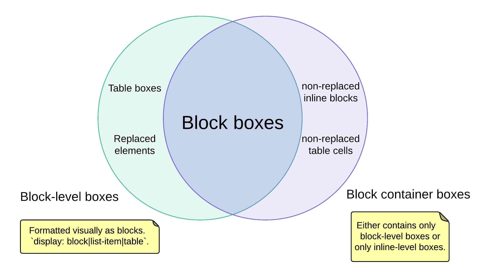

# box

这边说明几个跟box相关的概念，根据类型分成 block box 和 inline box

## block box

包括 block-level box, block container box, block box, 以及它们之间的关系，这三个名词是属于概念性，用于帮助理解 visual formatting model, 实际应用中不会直接使用它们。

### block-level box

一个 document element 是 block-level 的要求是该元素的 display property 的 calculated value 是 block, list-item, table 这三种之一。每一个 block-level element 都会生成至少一个 block-level box, 叫做
principal block-level box. 有些元素，比如 li, 会生成额外的 box 来放置项目符号；大多数 block-level element 只生成一个 block-level box.

principal block-level box 包含后代生成的 boxes 和 生成的内容。

每一个 block-level box 都会参与 block formatting context (BFC)，它表述的是对应元素 和 父级元素、兄弟元素的表现形式。这个 box 会涉及定位.

常见的 block-level element 有 div, p, table, li; 也可以设置 display 将 span 这样的 element 变成 block-level element。特别要注意的是 Replaced elements 也是 block-level，最常见的是 img, audio. video
这些元素，它们都是表现成 block.

### block container

一个 block container 要嘛只包含 block-level boxes，要嘛只包含 inline-level boxes。

block container 是一个 container，因此表述的是这个 container 和 所有子元素的关系。

大部分 block-level box 都是 block container, 但不一定都是 block container box, 特殊的有两个 table 和 Replaced element：

1. table 不是 block container 的原因是因为它建立的是 table layout 而不是 block layout, 另外 content 是在 table cell elements 里，而不是在 table 里，这也是为什么 table cell boxes 是 block container，而table不是
1. replaced elements 因为不能包含其他子元素和内容，因此不可能是一个container，所以不是 block container

同样不是所有 block container 都是 block-level box，比如 non-replaced inline block and non-replaced table cells。因为它们并不是表现成 block 的形式

实际应用中，大部分都是 block-level boxes 和 inline-level boxes 混合到一起，如果一个 block container 里面有一个 block-level box，那么里面的其他 inline-level box 就会强制被转成 block-level box。转换的规则是相邻的
inline-level boxes 合成一个 block-level box, 这个合成的 block-level box 叫做 anonymous block boxes, 这个 box 不能被通过css对其添加样式，所以叫 anonymous.

### block boxes

既是 block-level box 有事 block container box 的 box 称作 block boxes, 这3者的关系如下图所示：

## inline level

### inline-level elements and inline boxes

一个 document element 是 inline-level element 的情况是该 element 对应的 css display property 值是 inline, inline-block, inline-table. inline-level element 会生成 inline-level box, 该 box 会参与 inline formatting
context (IFC)

inline box 指的是既是 inline-level box，并且它的内容会参与由它创建的那个IFC. 一个 non-replaced element 的 display 是 inline 会生成一个 inline box.

是 inline-level box 但不是 inline box 的叫做 atomic inline-level box，这些 box 会参与它们自身创建的 IFC，这些 element 包括 replaced elements, inline-block elements, inline-table elements.

### Anonymous inline boxes

包含在 block-container element (不是inline element的情形) 的文本必须被当作 anonymous inline element

```html
<p>Some <em>emphasized</em> text</p>
```

上面的 p 元素生成一个 block container box, 包含几个 inline box. em 元素生成一个 inline  box；而其他的 boxes (包含内容 Some 和 text) 是由 block-level elment p 生成的 inline-box。后面的这几个boxes，叫做 anonymous inline box，因为它们不是由具体的 inline-level element 创建。