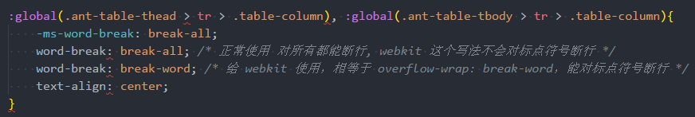

# word-break & overflow-wrap

这2个属性都是对超出 content area 的内容进行处理，word-break 是以 character 为最小单元进行处理，overflow-wrap 是以 word 为最小单元进行处理。首先看下各自的用法

## word-break

这个属性用于指定当内容超出content box时，是否要在超出的地方加上换行符，有3个值可以指定：

+ normal：默认值，不对非CJK的字符进行换行
+ break-all: 对除了CJK以外的任何字符都进行换行。不过 webkit 内核比较特殊，这个值不会对标点符号进行断行(chrome 就有这样的问题)。用这个值后，会强制将某个完整的英文单词进行断行，导致内容语义受影响。从视觉上看，内容会填满content box的宽度。
+ keep-all：不对任何字符进行断行，包括CJK字符
+ break-word：这个是webkit独有的值，用了这个值等同于 overflow-wrap:break-word，对于webkit内核，用这个值可以对标点符号进行断行，不过是以word为最小单元，所以视觉上来看，如果当前行剩余空格不足以容纳一个完整的单词，那么这个单词就会被放到下一行，而上一行后面就会有空格存在

因为webkit内核的特殊性，导致 break-all 不能对标点符号断行，因此如果有需要对标点符号也进行处理，那么需要给 webkit 内核设置 break-word, 其他的设置 break-all，如下面的示例：

## overflow-wrap

这个跟 word-break 最大的区别就是，断行是以 word 为最小单元，最常见的值就是 break-word, 这个能保持语义的完整，不会将完整的单词强制拆成2行显示。

这个属性是css3才有，css2对应的属性是 word-wrap
