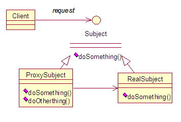

# Proxy 代理模式

## 定义

为另一个对象提供一个替身或者占位符以控制对这个对象的访问。

## uml



Subject：抽象类或者接口。 js 没有这个概念
RealSubject：被代理对象，真正做事的人
ProxySubject：代理对象，持有 RealSubject 的引用，将请求转给 RealSubject。

## 适用场景

远程代理：

虚拟代理：

缓冲代理：

保护代理：

## 延伸：

ES6 的 Proxy

## 实现

```javascript
let realSubject = {
  doSomething() {}
}

let proxySubject = {
  setSubject(subject) {
    this.subject = subject;
  }
  doSomething() {
    this.subject.doSomething();
  }
}
```

