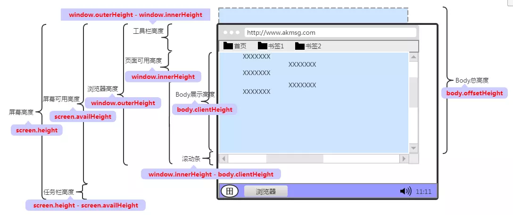

dom 元素位置尺寸
====================

## 属性图片

## Element 的属性

### offsetHeight

返回一个元素的高度，包括 padding 和 border，以及水平滚动条。但是不包括伪元素 ::before 和 ::after。这个属性值会被四舍五入为一个整数值。如果需要一个浮点数值，要用 `element.getBoundingClientRect()`

### clientHeight

对于没有定义 css 或者 内联布局盒子的元素，该属性值是 0。否则它是元素内部高度(单位像素), 包含内边距，但不包括水平滚动条、边框和外边距。

如果 clientHeight 用在根元素上 (<html> 或者 <body>)，这个值就是返回 viewport 的高度 (即一屏的高度)。

这个属性通常需要兼容不同浏览器：`document.documentElement.clientHeight || document.body.clientHeight`

### scrollHeight

是一个元素内容高度的度量，包括由于溢出导致的视图中不可见的内容。

通常有下面两种使用场景：

+ 如果元素滚动到底，下面等式就返回 true，否则返回 false
> element.scrollHeight - element.scrollTop === element.clientHeight

+ 当容器不滚动但有溢出的子容器时，这些检查可以确定容器能否滚动：
> window.getComputedStyle(element).overflowY === 'visible'
> window.getComputedStyle(element).overflowY !== 'hidden'

### scrollTop

获取或设置一个元素的内容垂直滚动的像素数。

