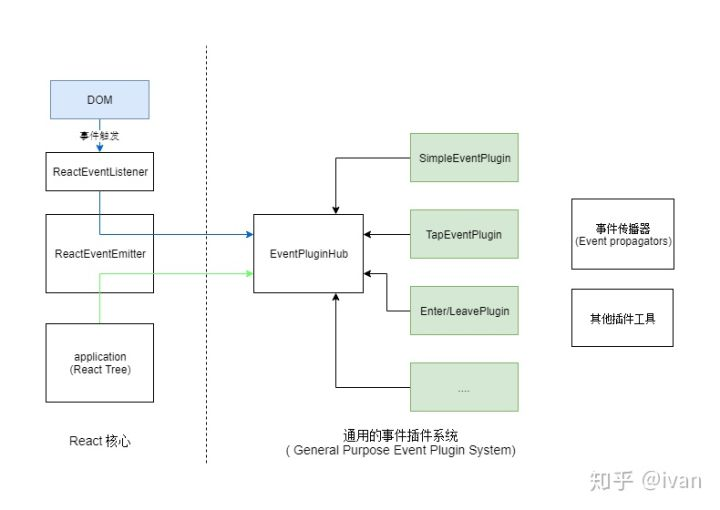
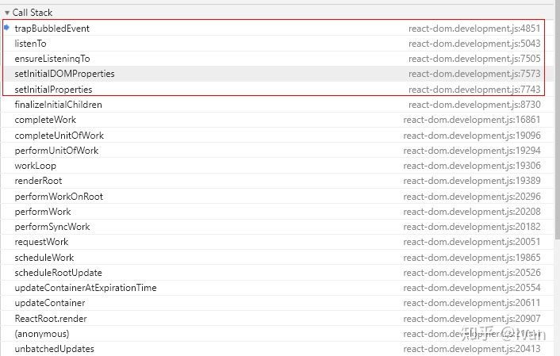
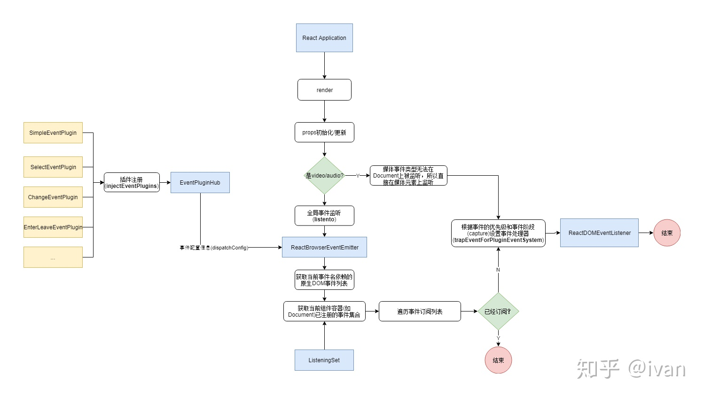
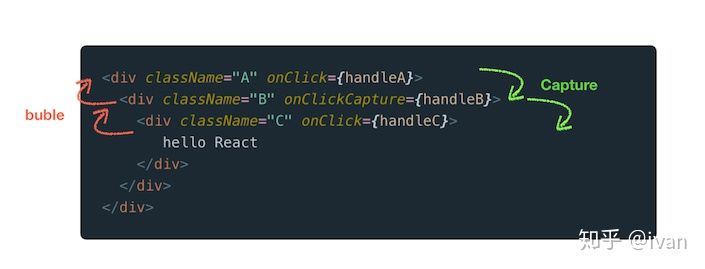
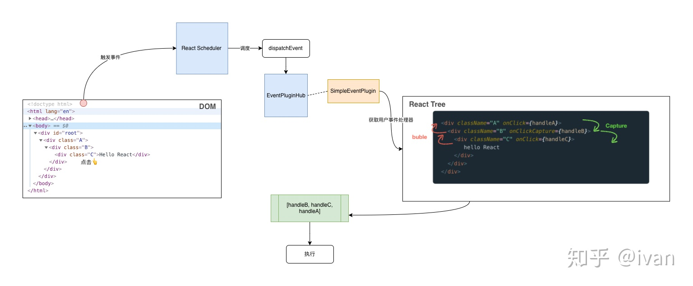

React event 机制
========================

当我们在组件上设置事件处理函数时，React 并不会在该 DOM 元素上直接绑定事件处理函数。React 内部定义了一套事件系统，在这个系统上统一进行事件注册和分发。

具体来讲，React 利用事件委托机制在 Document 元素上统一注册 DOM 事件，再根据触发事件的 target 将事件分发到具体的组件实例上。另外在事件处理函数里的 event 参数并不是原生的 event 对象，而是一个合成事件对象 (SyntheticEvent)。

## 为什么要自定义事件系统？

React 自定义一套事件系统的动机有以下几点：
+ 抹平浏览器之间的兼容性差异。这个应该是最原始的动机。通过定义合成事件来处理浏览器兼容问题
+ 事件 '合成'，即事件自定义。事件合成除了处理兼容性问题，还可以用来自定义高级事件，比较典型的就是 React 的 onChange 事件，它为表单元素定义了统一的值变化事件。
+ 抽象跨平台事件机制。和 VirtualDOM 的意义差不多，VirtualDOM 抽象了跨平台的渲染方式，SyntheticEvent 的目的也是提供一个抽象的跨平台事件机制。
+ React 打算做更多优化。比如利用事件委托机制，大部分事件最终绑定在 Document 元素上，而不是 DOM 元素本身。这样简化了 DOM 事件处理逻辑，减少了内存开销。这也意味着 React 需要自己模拟一套事件冒泡的机制。
+ React 打算干预事件的分发(dispatch)。V16 引入 Fiber 架构，React 为了优化用户的交互体验，会干预事件分发。不同类型的事件有不同的优先级，比如高优先级的事件可以中断渲染，让代码可以及时响应用户交互。

## 整体架构


+ ReactEventListener - 事件处理器。在这里进行事件处理函数的绑定。当 DOM 触发事件时，会从这里开始调度分发到 React 组件树。
+ ReactEventEmitter - 暴露接口给 React 组件，用于事件注册
+ EventPluginHub - 事件插件插槽，负责管理和注册各种插件。在事件分发时，调用插件来生成合成事件。
+ Plugin - React 事件系统使用了插件机制来管理不同行为的事件。这些插件会处理自己感兴趣的事件类型，并生成合成事件对象。目前 ReactDOM 有以下几种插件类型：
 > + SimpleEventPlugin - 简单事件，处理一些比较通用的事件类型。比如 click，input，keyDown
 > + EnterLeaveEventPlugin - mouseEnter/mouseLeave和 pointerEnter/pointerLeave这两类事件比较特殊。如果树层级比较深，大量的 *enter 触发可能导致性能问题。另外也不支持冒泡，无法在 Document上进行事件的注册和分发。所以 ReactDOM 使用 *over/*out 来模拟 *enter/*leave 事件。
 > + ChangeEventPlugin 
 > + SelectEventPlugin 
 > + BeforeInputEventPlugin 

 + EventPropagators 按照 DOM 事件传播的两个阶段，遍历 React 组件树，并收集所有组件的事件处理函数。
 + EventBatching 负责批量执行事件队列和事件处理函数，处理事件冒泡
 + SyntheticEvent 合成事件的基类，可以对应 DOM 的 Event 对象。React 为了减少内存损耗和垃圾回收，使用一个对象池来构建和释放事件对象，也就是说 SyntheticEvent 不能用于异步引用， 它在同步执行完事件处理函数后就会被释放。它有一些子类，这些子类跟 DOM 具体事件类型是想匹配。

## 插件协议

React 事件机制中的插件协议，每个插件的结构如下：
```ts
export type EventTypes = {[key: string]: DispatchConfig };

// 插件接口
export type PluginModule<NativeEvent> = {
  eventTypes: EventTypes, // 具体插件支持的事件类型
  extractEvents: (
    topLevelType: TopLevelType,
    targetInst: null | Fiber,
    nativeEvent: NativeEvent,
    nativeEventTarget: EventTarget,
  ): ?ReactSyntheticEvent,
  tapThreshold?: number,

}
```

eventTypes 声明该插件负责的事件类型，它通过 DispatchConfig 来描述:
```ts
export type DispatchConfig = {
  dependencies: Array<TopLevelType>, // 依赖的原生事件类型，简单事件一般只有一个，复杂事件比如onChange会监听多个
  phasedRegistrationNames?: { // 两阶段的注册事件名称，React 会根据这些名称在组件实例中查找对应的 props 事件处理函数
    bubbled: string, // 冒泡阶段，比如 onClick
    capture: string, // 捕获阶段，比如 onClickCapture
  },
  registrationName?: string, // props 里的事件注册名称
  eventPriority: EventPriority, // 事件的优先级
}
```

extractEvents 这个方法接收事件类型，原生 DOM 事件对象，事件触发的 DOM 元素，以及对应的 React 组件实例。该方法返回一个合成事件对象或者空，如果返回空，表示无需对这个事件进行处理。

另外在 ReactDOM 启动时会向 EventPluginHub 注册一组插件：
```ts
EventPluginHubInjection.injectEventPluginByName ({
  SimpleEventPlugin: SimpleEventPlugin,
  EnterLeaveEventPlugin: EnterLeaveEventPlugin,
  ChangeEventPlugin: ChangeEventPlugin,
  SelectEventPlugin: SelectEventPlugin,
  BeforeInputEventPlugin: BeforeInputEventPlugin,
})
```

## 事件注册(监听/绑定)



从调用栈可以看出 React 在 props 初始化和更新时会进行事件绑定。下面先看下绑定的流程图：


1. 在 props 初始化和更新时进行事件绑定。首先判断元素是否是 媒体类型，因为媒体类型的事件无法在 Document 上监听，所以会直接绑定在 Dom 元素上
1. 其他元素都是讲事件绑定在 Document 元素。这边需要注意两个信息：
> + 一个就是上文提到的事件依赖列表 dependencies，比如 onMouseEnter 会依赖 mounseover/mouseout
> + 一个是 ReactBrowserEventEmitter 维护了一个全局的 `已订阅事件列表` listeningSet. 事件类型只需在 Document 上订阅一次，相比于在每个元素上订阅事件要节省很多资源。

代码大致如下：
```ts
export function listenTo(
  registrationName: string, // 事件注册名称，比如 onClick
  mountAt: Document | Element | Node, // 事件要挂载在哪里，通常是 Document
):void {
  const listeningSet = getListeningSetForElement(mountAt); // 已订阅的事件列表
  const dependencies = registrationNameDependencies[registrationName]; // 获取事件名称对应的原生事件名称列表

  for (let i = 0, length = dependencies.length; i < length; i++) {
    const dependency = dependencies[i];
    if (!listeningSet.has(dependency)) { // 原生的事件名称还没被订阅
      switch(dependency) {
        // ... 特殊的事件监听处理逻辑
        default:
          const isMediaEvent = mediaEventTypes.indexOf(dependency) !== -1;
          if (!isMediaEvent) {
            trapBubbledEvent(dependency, mountAt); // 设置事件处理函数
          }
          break;
      }
      listeningSet.add(dependency);
    }
  }
}
```

接下来就是根据事件的 '优先级' 和 '捕获阶段' 来设置事件处理函数：

```ts
function trapEventForPluginEventSystem(
  element: Document | Element | Node,
  topLevelType: DOMTopLevelEventType, // 事件类型
  capture: boolean,
): void {
  let listener;

  switch (getEventPriority(topLevelType)) {
    // 不同优先级的事件类型，有不同的事件处理函数进行分发
    case DiscreteEvent:                     // ⚛️离散事件
      listener = dispatchDiscreteEvent.bind(null, topLevelType, PLUGIN_EVENT_SYSTEM);
      break;
    case UserBlockingEvent:                 // ⚛️用户阻塞事件
      listener = dispatchUserBlockingUpdate.bind(
        null,
        topLevelType,
        PLUGIN_EVENT_SYSTEM,
      );
      break;
    case ContinuousEvent:                   // ⚛️可连续事件
    default:
      listener = dispatchEvent.bind(null, topLevelType, PLUGIN_EVENT_SYSTEM);
      break;
  }

  const rawEventName = getRawEventName(topLevelType);
  if (capture) {
    addEventCaptureListener(element, rawEventName, listener);
  } else {
    addEventBubbleListener(element, rawEventName, listener);
  }
}
```

从这边可以看到对于非 Media 的元素，事件绑定有如下特点：
+ 事件通常都是绑定到 Document 元素
+ 绑定的事件名称是 onclick, oninput 这种原生的事件名称，而且每个事件名称只会绑定一次(通过 listeningSet 控制)
+ 绑定的具体事件函数 (listener) 根据事件类型和优先级有对应的处理函数，比如 dispatchDiscreteEvent、dispatchUserBlockingUpdate, dispatchEvent 等

## 事件分发

### 事件触发调度

通过上面的 trapEventForPluginEventSystem 函数可以知道，不同的事件类型有不同的事件处理函数，它们的区别是调度的优先级不一样：

```ts
// 离散事件
// discreteUpdates，在 UserBlocking 优先级中j执行
function dispatchDiscreteEvent(topLevelType, eventSystemFlags, nativeEvent) {
  flushDiscreteUpdatesIfNeeded(nativeEvent.timeStamp);
  discreteUpdates(dispatchEvent, topLevelType, eventSystemFlags, nativeEvent);
}

// 阻塞事件
function dispatchUserBlockingUpdate(topLevelType, eventSystemFlags, nativeEvent) {
  if (enableUserBlockingEvents) {
    runWithPriority(
      UserBlockingPriority,
      dispatchEvent.bind(null, topLevelType, eventSystemFlags, nativeEvent);
    )
  } else {
    dispatchEvent(topLevelType, eventSystemFlags, nativeEvent);
  }
}
```

最终不同的事件处理函数都会调用 dispatchEvent 函数. dispatchEvent 会从 DOM 原生事件对象获取事件触发的 target 元素，再根据这个 target 获取关联的 React 节点实列。

```ts
export function dispatchEvent(
  topLevelType: DOMTopLevelEventType,
  eventSystemFlags: EventSystemFlags,
  nativeEvent: AnyNativeEvent
): void {
  // 获取事件触发的目标 DOM 元素
  const nativeEventTarget = getEventTarget(nativeEvent);

  // 获取离该 DOM 元素最近的组件实例 (只能是 DOM 元素组件)
  let targetInst = getClostestInstanceFromNode(nativeEventTarget);

  // ...
  dispatchEventForPluginEventSystem(topLevelType, eventSystemFlags, nativeEvent, targetInst);
}
```

接着会调用 EventPluginHub 的 runExtractedPluginEventInBatch, 这个方法遍历插件列表来处理事件，生成一个 SyntheticEvent 列表：
```ts
export function runExtractedPluginEventInBatch(
  topLevelType: TopLevelType,
  targetInst: null | Fiber,
  nativeEvent: AnyNativeEvent,
  nativeEventTarget: EventTarget
) {
  // 遍历插件列表，调用插件的 extractPluginEvents，生成 SyntheticEvent 列表
  const events = extractPluginEvents(
    topLevelType,
    targetInst,
    nativeEvent,
    nativeEventTarget
  );
  // 批量执行 SyntheticEvent 列表
  runEventInBatch(events);
}
```

### 插件是如何处理事件？

上面的 extractPluginEvents 会调用具体的插件生成 SyntheticEvent，下面以 SimpleEventPlugin 为例，看下是如何处理：
```ts
const SimpleEventPlugin: PluginModule<MouseEvent> & {
  getEventPriority: (topLevelType: TopLevelType) => EventPriority,
} = {
  eventTypes: eventTypes,
  // 抽取事件对象
  extractEvents: function(
    topLevelType: TopLevelType,
    targetInst: null | Fiber,
    nativeEvent: MouseEvent,
    nativeEventTarget: EventTarget,
  ): null | ReactSyntheticEvent {
    // 获取事件配置
    const dispatchConfig = topLevelEventsToDispatchConfig[topLevelType];

    // 根据 topLevelType 获取 SyntheticEvent 子类事件的构造器
    let EventConstructor;
    switch(topLevelType) {
      // ...
      case DOMTopLevelEventTypes.TOP_KEY_DOWN:
      case DOMTopLevelEventTypes.TOP_KEY_UP:
        EventConstructor = SyntheticKeyboardEvent;
        break;
      case DOMTopLevelEventTypes.TOP_BLUR:
      case DOMTopLevelEventTypes.TOP_FOCUS:
        EventConstructor = SyntheticFocusEvent;
        break;
      // ... 省略
      case DOMTopLevelEventTypes.TOP_GOT_POINTER_CAPTURE:
      // ...
      case DOMTopLevelEventTypes.TOP_POINTER_UP:
        EventConstructor = SyntheticPointerEvent;
        break;
      default:
        EventConstructor = SyntheticEvent;
        break;
    }

    // 构造事件实列，这边是从 事件对象池 里获取
    const event = EventConstructor.getPooled(
      dispatchConfig,
      targetInst,
      nativeEvent,
      nativeEventTarget
    );

    // 根据 DOM 事件传播的顺序获取用户事件处理函数
    accumulateTwoPhaseDispatches(event);
    return event;
  }
```

SimpleEventPlugin 的 extractEvents 主要做下面三件事：
1. 根据事件的类型确定 SyntheticEvent 的子类构造器
1. 根据子类构造器创建 SyntheticEvent 对象实列
1. 根据 DOM 事件传播的顺序获取用户事件处理函数的列表

`为了避免频繁创建和释放事件对象导致性能损耗(对象创建和垃圾回收)，React 使用一个事件对象池来负责管理事件对象，使用完的事件对象会放回池中，以备后续的复用`

这也意味着，`在事件处理函数同步执行完后，SyntheticEvent 对象会马上被回收`，所以一般不会在异步操作中访问 SyntheticEvent 事件对象。但是可以通过以下方法来保持对事件对象的引用：
1. 调用 SyntheticEvent#persist() 方法，告诉 React 不要将该事件对象回收到池里
1. 直接引用 SyntheticEvent#nativeEvent, nativeEvent 是可以持久引用的，不过为了不打破事件的抽象，建议不要直接引用 nativeEvent

构建完 SyntheticEvent 对象后，就需要 `遍历组件树来获取订阅该事件的具体事件处理函数(即我们写的事件处理函数)`:
```ts
function accumulateTwoPhaseDispatches(event) {
  // 以 _targetInst 为基点，按照 DOM 事件传播的顺序遍历组件树
  traverseTwoPhase(event._targetInst, accumulateDirectionalDispatches, event);
}

function traverseTwoPhase(inst, fn, arg) {
  const path = [];
  while (inst) { // 从 inst 开始，向上回溯
    path.push(inst);
    inst = getParent(inst);
  }

  let i;
  // 捕获阶段，先从最顶层的父组件开始, 向下级传播
  for (i = path.length; i-- > 0;) {
    fn(path[i], 'captured', arg);
  }

   // 冒泡阶段，从inst，即事件触发点开始, 向上级传播
  for (i = 0; i < path.length; i++) {
    fn(path[i], 'bubbled', arg);
  }
}
```

accumulateDirectionalDispatches 函数则是简单查找当前节点是否有对应的事件处理函数：

```ts
function accumulateDirectionalDispatches(inst, event, phase) {
  // 检查当前组件实例是否存在事件处理函数，这边的 listener 就是 props 里定义的事件函数
  const listener = listenerAtPhase(inst, event, phase);

  if (listener) {
    // 所有事件处理函数都放入到 _dispatchListeners 队列中，后续批量执行这个队列
    event._dispatchListeners = accumulateInto(
      event._dispatchListeners,
      listener
    )
    event._dispatchInstances = accumulateInto(event._dispatchInstances, inst);
  }
}
```

比如下面的组件树，遍历过程是这样的


最终计算出来的 _dispatchListeners 队列是这样的：[handleB, hanldeC, hanldeA]

### 批量执行

遍历执行插件后，会得到一个 SyntheticEvent 事件对象列表，每个事件对象都包含一个 _dispatchListeners, runEventInBatch 就是批量执行这个事件队列
```ts
export function runEventsInBatch(events: Array<ReactSyntheticEvent> | ReactSyntheticEvent | null) {
  // ...
  forEachAccumulated(processingEventQueue, executeDispatchesAndRelease)
}

const executeDispatchesAndRelease = function (event: ReactSyntheticEvent) {
  if (event) {
    // 按顺序执行 _dispatchListeners
    //
    executeDispatchesInOrder(event);

    // 如果没有调用 persist()，那么就回收事件对象
    if (!event.isPersistent()) {
      event.constructor.release(event);
    }
  }
}

export function executeDispatchesInOrder(event) {
  for (let i = 0; i < dispatchListeners.length; i++) {
    if (event.isPropagationStopped()) {
      break;
    }
    // 执行事件处理函数
    executeDispatch(event, dispatchListeners[i], dispatchInstances[i])
  }
}
```

对上面的核心过程做下处理，得到下面的流程图：



OK, 到这里React的事件机制就基本介绍完了，这里只是简单了介绍了一下SimpleEventPlugin, 实际代码中还有很多事件处理的细节，限于篇幅，本文就不展开去讲了。有兴趣的读者可以亲自去观摩React的源代码.