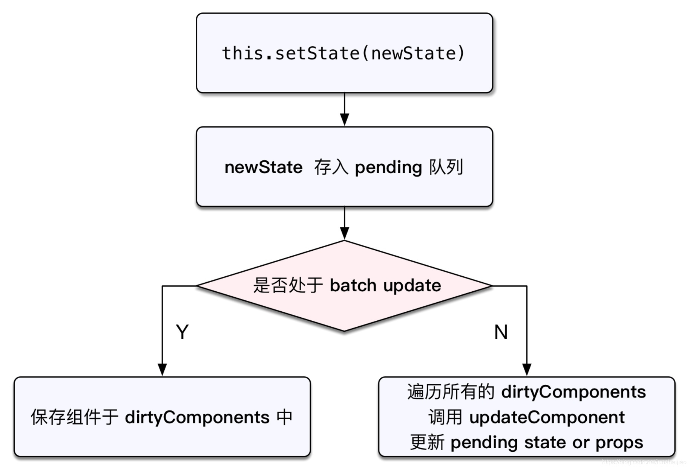

setState
===========================

## 使用方式

先看下 setState 的定义：
```js
ReactComponent.prototype.setState = function(particalState, callback) {} // 其中 particalState 可以是 Object 或者 Function 类型
```

setState 的使用方式有三种：

+ 只有 particalState，并且 particalState 值是 object
+ 同时有 particalState 和 callback
+ 只有 particalState 并且值是 function, 这种情形通常将 particalState 名称改成 updater

下面分别看下这三种使用方式:

```js
constructor() {
  super();
  this.state = {
    age: 18
  };
}

// 直接提供一个 object 类型的 particalState，这边的 this.state.age 的值是 18
this.setState({
  age: this.state.age + 1
});

// 这边继续访问 this.state.age 更新 age，这时候 this.state.age 的值就不一定已经是 19
this.setState({
  age: this.state.age + 1
});
```
这种是最常见的使用方式，适用于不需要访问最新 state 的情形。如果需要依赖于最新状态值，就需要使用后面两种方式

```js
this.setState({
  age: this.state.age + 1
}, () => {
  this.setState(this.state.age + 1); // callback 里的 this.state.age 已经是最新的值, 即 19
})
```
上面这种是通过 callback 访问最新的 state 值。

```js
this.setState((state, props) => { // 这边 particalState 是一个函数
  return { // 注意这种调用方式，需要 callback 返回一个 state
    age: state.age + 1 // 在函数里访问参数 state 就能获取到最新的值
  };
})
```

这种方式也可以在函数里得到最新的 state

## batch update 和 order

### order

关于多次调用 setState, 不管是异步或者同步的 setState, 最终状态都会按照 setState 声明顺序进行执行，即 setState 的调用顺序会被尊重(respected)

多次 setState，状态是采用按照执行时的顺序进行 `浅合并` (shadow merged)。

比如一开始是更新 { a: 10 }, 接下来是更新 { b: 20 }, 最后更新 { a: 30 }, 那么最终的 state 就是 { a: 30, b: 20 }。即对于同一个 key 的值进行多次更新，会使用最新的那次更新操作结果。

### batch update

#### 在 React event handler

当前版本(react 16 及其之前的版本) 只有在 `React event handlers` 里才会默认 batch update；在将来的版本里，React 会默认 batch 所有 update，到时候就无需考虑什么情形会 batch update。

只要是在 React event handlers，一次事件执行不管涉及到多少个 component，有几个 setState, 在事件执行完成后，所有 setState 会被一起 flush，因此最终也只会触发一次 re-render。在这个过程中， state 是没有中间状态 (通过 callback 或 updater 看到的都是最终更新后的状态)

如果在 handler 里有多个 setState，是不会每次都触发 re-render，只有等 event handler 执行完才会 batch update，最终只触发一次 re-render。但是如果是在其他地方多次调用 setState，那么每次 setState 都会触发 re-render。

this.state 对象会在 re-render 最终更新 UI 时被更新，所以如果需要根据前一个状态进行操作，应该使用 setState(fn) 的方式，而不是使用 this.state。

#### 在其他地方

不在 React event handler里多次调用 setState，比如在 ajax response handler 里
```js
promise.then(() =>{
  // 不在 react event handler 里，setState 会独立刷新状态
  this.setState({ a: true }); // 触发 re-render，状态更新为  { a: true, b: false }
  this.setState({ b: true }); // 触发 re-render，状态更新为 { a: true, b: true }
  this.props.setParentState(); // re-render 父组件
})
```

从上面可以可以得知，是否 batch update 跟是否运行在 React event handler 中有关，只有 event hander 里才会 batch update。将来的版本会将 batch update 设置为默认行为，不管有没有在 event handler 里 (而且可能会提供一个可选的 API 来操作同步 flush 变更)。当前版本，有一个 API 方法可以用来强制 batching：
```js
promise.then(() => {
  ReactDOM.unstable_batchedUpdates(() => {
    this.setState({ a: true }); // 不会触发 re-render
    this.setState({ b: true }); // 不会触发 re-render
    this.props.setParentState(); // 还不会触发 re-render
  });
  // 退出 unstable_batchedUpdates, 才会 re-render，而且只触发一次
})
```

React event handler 就是因为被包装在 unstable_batchedUpdates 函数里，所以默认会 batching update。注意将 update 包装到 unstable_batchedUpdates 两层是没有特别效果，只有退出最外层的 unstable_batchedUpdates 才会 flush update。

这个API 是 `unstable` 意味着将来会被移除掉。在 batch 还不是默认行为的之前，都可以使用这个方法来使用 batch update.

## 执行机制



上面是简化后的 setState 调用栈，其中核心代码如下：
```js
function ReactComponent(props, context, updater) {
  this.props = props;
  this.context = context;
  this.refs = emptyObject;
  this.updater = updater || ReactNoopUpdateQueue;
}

ReactComponent.prototype.setState = function(particalState, callback) {
  this.updater.enqueueSetState(this, particalState);
  if (callback) {
    this.updater.enqueueCallback(this, callback);
  }
}
```

上面的 enqueueSetState 和 enqueueCallback 都会调用下面的 enqueueUpdate 函数：

```js
function enqueueUpdate(component) {
  if (!batchingStrategy.isBatchingUpdates) {
    batchingStragegy.batchedUpdates(enqueueUpdate, component);
    return;
  }
  dirtyComponents.push(component);
}
```
如果 isBatchingUpdates 为 false，所有队列中更新执行 batchedUpdate；否则，把当前组件(调用 setState 的组件) 放入 dirtyComponents 队列中。

这边的 batchingStragegy 是一个简单的对象，定义了 isBatchingUpdates 和 batchedUpdates：
```js
var ReactDefaultBatchingStrategy = {
  isBatchingUpdates: false,
  batchedUpdates: function(callback, a, b, c, d, e) {
    var alreadyBatchingUpdates = ReactDefaultBatchingStrategy.isBatchingUpdates;
    ReactDefaultBatchingStrategy.isBatchingUpdates = true;
    if (alreadyBatchingUpdates) {
      callback(a, b, c, d, e);
    } else {
      transaction.perform(callback, null, a, b, c, d, e);
    }
  },
};
```
batchingStrategy实质上就是一种批量更新策略，其属性isBatchingUpdates表示的是否处于批量更新的过程中，开始默认值为false。

batchedUpdates 是处于一个事务中，该事务在 close 阶段做了两件事
+ 首先将 ReactDefaultBatchingStrategy.isBatchingUpdates 设置为 false，即关闭批量更新的标志位
+ 其次就是调用 ReactUpdates.flushBatchedUpdates，这个方法会涉及到 VDOM 到真实 DOM 的映射，

现在再来回顾下为什么 React event handler 里的 setState 是 batching update。
+ React event handler 是被包装在 ReactDOM.unstable_batchedUpdates 函数中
+ unstable_batchedUpdates 会调用 batchingStrategy.batchedUpdates
+ batchingStrategy.batchedUpdates 会将 isBatchingUpdates 设置为 true
+ 之后执行 setState 进入 enqueueUpdate 函数，由于 isBatchingUpdates 是 true
+ 那么会将 component 放入 dirtyComponents，这个会等同步代码都执行完完再执行，因此看起来像是异步操作
+ 而其他的场景，由于 isBatchingUpdates 是 false，就会立即执行 batchedUpdates，再通过 transaction.perform 更新状态

__注意__：在生命周期函数里调用 setState (比如 didMount) 也是 batch update，因为生命周期执行前后都有相应的钩子，分别是 pre钩子 和 post钩子，pre钩子会调用batchedUpdate 将 isBatchingUpdates 设置为 true，开启批量更新，而 post 钩子会将 isBatchingUpdates 设置为 false。 

另外要注意，多次 setState，React 内部是采用 `浅合并` 的方式进行操作数据