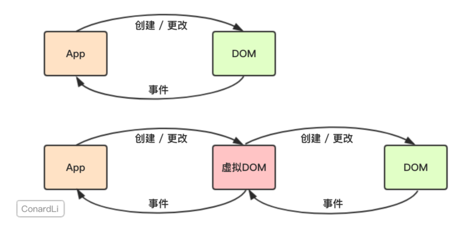
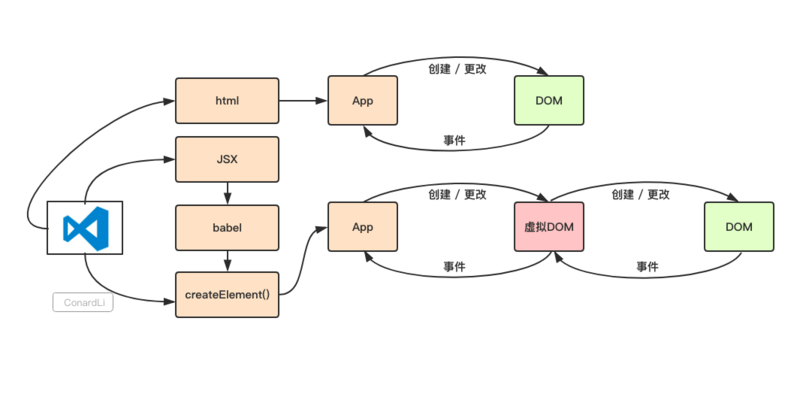
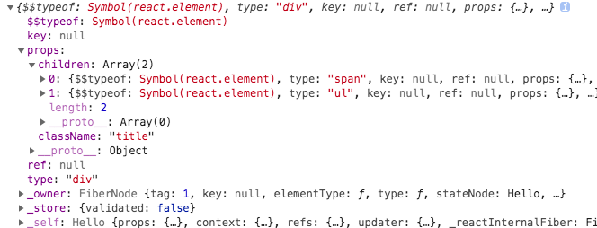
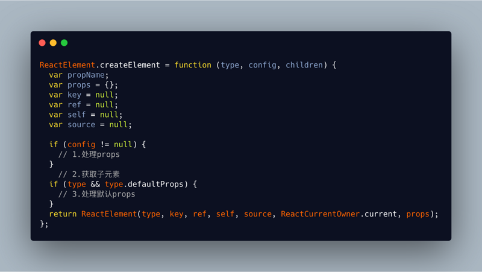
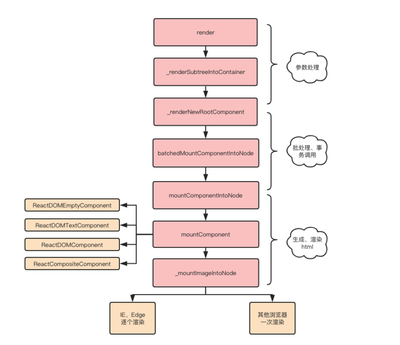
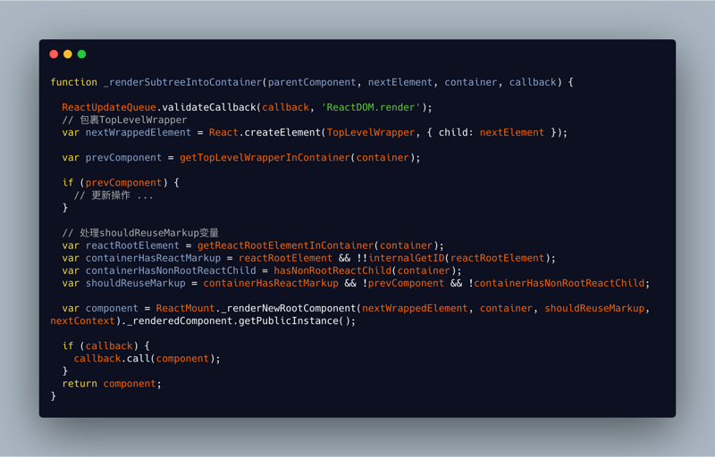
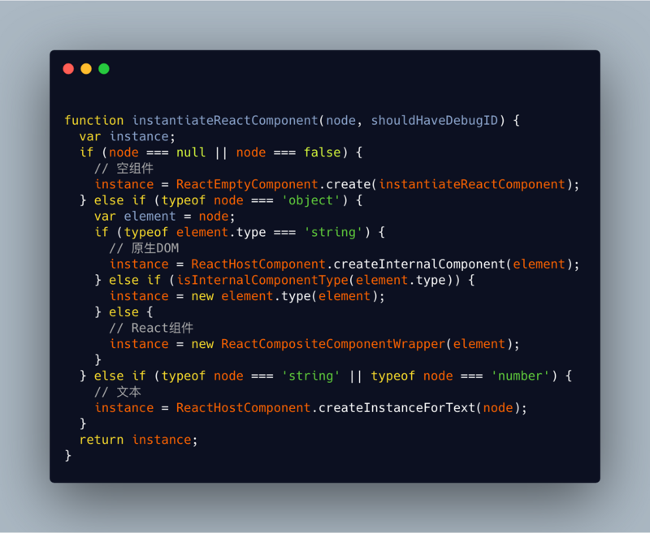

React vdom
=========================

## 虚拟 DOM



图中上面部分是使用原生 JS 对 DOM 进行创建和更新，而 DOM 元素通过监听事件来跟 APP 进行交互

下面部分，React 会将 JS 代码转换为一个 JS 对象，然后再将这个 JS 对象转换为真实 DOM，而这个 JS 对象就是 虚拟 DOM

比如下面一段代码：
```html
<div class="title">
  <span>Hello World</span>
  <ul>
    <li>苹果</li>
    <li>香蕉</li>
  </ul>
</div>
```

在 React 中可能会被转换为下面的 JS 对象
```js
const virtualDOM = {
  type: "div",
  props: {
    class: "title",
  },
  children: [
    {
      type: 'span',
      children: 'Hello ConardLi'
    },
    {
      type: 'ul',
      children: [
        { type: 'li', children: '苹果' },
        { type: 'li', children: '橘子' }
      ]
    }
  ]
}
```

当我们需要创建或更新元素时，React 会对这个 VDOM 进行创建或更新，之后再将这个 VDOM 对象转换为真实 DOM

## 为何使用 VDOM

React 为何使用 VDOM 这种方案呢：

### 提供开发效率

使用 React，开发人员只需要告诉 React 想让 View 处于什么状态，React 通过 VDOM 确保真实 DOM 与状态相匹配。开发人员无需自己去操作 DOM、进行事件处理、DOM 更新等

这让我们更关注业务逻辑而非 DOM 操作，这有助于提升开发效率

### 提升性能

直接操作 DOM 是非常损耗性能。而 React 使用 VDOM 最终也是需要操作 DOM，从这点来看，对于性能提升并没有帮助。

使用 VDOM 的优势在于 React 的 diff 算法和批处理策略。React 在更新页面之前，提前计算好了如何更好地更新和渲染 DOM。这个计算过程，使用 JS 直接操作 DOM，也是可以自己判断和实现的，但是一定会耗费非常多的时间和精力，而且往往做得没有 React 好，所以在这个过程中，react 使用 VDOM 帮助提升了性能。

### 跨浏览器兼容

React 基于 VDOM 实现了一套自己的事件机制，模拟了事件冒泡和捕获过程，采用了事件代理，批量更新等方法，抹平了浏览器的兼容问题

### 跨平台兼容

VDOM 为 React 带来了跨平台渲染的能力。以 RN 为例，React 根据 VDOM 渲染出相应平台的 UI，不同平台的差异是渲染方式不同而已。

## 实现原理



接下来根据图中的流程，依次分析 VDOM 的实现原理

### JSX 和 createElement

实现一个 React 组件，有两种编码方式，一种是使用 JSX:
```js
class Hello extends React.Component {
  render() {
    return <div>Hello World</div>
  }
}
```

另外一种是直接使用 createElement 编写：
```js
class Hello extends React.Component {
  render() {
    return React.createElement("div", null, "Hello World");
  }
}
```

上面这两种写法是等价的，JSX 只是 React.createElement 的语法糖。通过 Babel 会将 JSX 转换为 React.createElement。

__注意__ babel 在编译时会判断 JSX 中的组件的首字母，如果是小写，就认定为为原生 DOM 标签，这时 createElement 的第一个参数就被编译成字符串；首字母是大写，会被认为是自定义组件，第一个参数会被编译成对象。

另外 JSX 需要被 Babel 事先编译，因此不能在运行时动态选择类型：

```js
function Story(props) {
  // Wrong! JSX type can't be an expression.
  return <components[props.storyType] story={props.story} />;
}
```

改成下面这样就行：
```js
function Story(props) {
  // Correct! JSX type can be a capitalized variable.
  const SpecificStory = components[props.storyType];
  return <SpecificStory story={props.story} />;
}
```

使用 JSX 需要安装 Babel 插件 babel-plugin-transform-react-jsx
```js
{
  "plugins": [
    ["transform-react-jsx", {
      "pragma": "React.createElement"
    }]
  ]
}
```

### 创建 VDOM

先看下 VDOM 的真实模样，将下面的 JSX 代码在控制台中打印出来：

```js
<div className="title">
  <span>Hello ConardLi</span>
  <ul>
    <li>苹果</li>
    <li>橘子</li>
  </ul>
</div>
```



那么 React 是如何将上面的 JSX 代码转换为 VDOM 这个结构呢？下面看下 createElement 函数的具体实现过程：



createElement 函数的功能就是将 props 和 子元素进行处理后返回一个 ReactElement 对象。

#### 处理 props

+ 将特殊属性 ref, key 从 config 中取出并赋值给内部变量 ref 和 key
+ 将特殊属性 self，source 从 config中取出并赋值
+ 将上面那些属性之外的属性取出并赋值给内部的 props 变量

#### 获取子元素
+ 获取子元素的个数：第二个参数后面的所有参数个数
+ 如果只有一个子元素，直接赋值给 props.children
+ 如果有多个子元素，则将子元素填充为一个数组并赋值给 props.children

#### 处理默认 props 值

```js
if (type && type.defaultProps) {
  var defaultProps = type.defaultProps;
  for (propName in defaultProps) {
    if (props[propName] === undefined) {
      props[propName] = defaultProps[propName]
    }
  }
}
```
将组件的静态属性 defaultProps 定义的默认 props 值赋值给相应的 prop

#### ReactElement

ReactElement 将传入的几个属性进行组合，并返回：

+ type: 组件类型，可以是原生 html 类型(字符串), 或者自定义组件 (函数或者class)
+ key：组件的唯一标识，用于 diff 算法
+ ref：用于访问原生的 dom 节点
+ props：传入组件的 props
+ owner: 当前正在构建的 Component 所属的 Component
+ self：指定当前位于哪个组件实例
+ _source: 指定调试代码来自哪个文件 (filename) 和 代码行数 (lineNumber)

另外还有一个 ``$$typeof` 属性，它被赋值为 REACT_ELEMENT_TYPE:

```js
var REACT_ELEMENT_TYPE = (typeof Symbol === 'function' && Symbol.for && Symbol.for('react.element')) || 0xeac7;
```
从上面定义可以看出 $$typeof 是一个 Symbol 类型的值。这个变量可以防止 XSS 攻击。

```js
ReactElement.isValidElement = function(object) {
  return typeof object === 'object' && object !== null && object.$$typeof === REACT.ELEMENT.TYPE;
}
```

React 渲染时会把没有 $$typeof 标识，以及校验不通过的组件过滤掉。

### VDOM 转换为真实 DOM

这部分的逻辑比较复杂，先用一张流程图来梳理下整个过程：



整个过程大概可以分为四步：

#### 初始参数处理

当调用 ReactDOM.render(element, container[, callback]) 将组件进行渲染，React 内部实际调用了 _renderSubtreeIntoContainer:
```js
function render(nextElement, container, callback) {
  return ReactMount._renderSubtreeIntoContainer(null, nextElement, container, callback);
}
```



_renderSubtreeIntoContainer 主要实现以下功能：
1. 将当前组件使用 TopLevelWrapper 进行包裹

> TopLevelWrapper 只是一个空壳，它为需要挂载的组件提供了一个 rootID 属性。ReactDOM.render 函数的第一个参数可以是原生 DOM 也可以是 React 组件，通过 TopLevelWrapper 包裹后，可以在后面的渲染中将它们进行统一处理，就无需关心是否是原生。

2. 判断根节点下是否已经渲染过元素，如果已经渲染过，判断是执行更新或者卸载操作。
3. 处理 shouldReuseMarkup 变量，该变量表示是否需要重新标记元素
4. 将上面处理好的变量作为 _renderNewRootComponent 的参数并执行该函数，渲染完成后调用 callback

_renderNewRootComponent 会调用 instantiateReactComponent 对传入的组件进行分类包装


React 创建了下面四大类组件，对组件进行分类渲染：
+ ReactDOMEmptyComponent 空组件
+ ReactDOMTextComponent 文本
+ ReactDOMComponent 原生 DOM
+ ReactCompositeComponent 自定义React组件

这些组件都具备下面三个方法：
+ constructor 用来接收 ReactElement 进行初始化
+ mountComponent 用来生成 ReactElement 对应的真实 DOM 或 DOMLayTree
+ unmountComponent: 卸载 DOM 节点，解绑事件

#### 批处理、事务调用

_renderNewRootComponent 函数接着会使用 ReactUpdates.batchedUpdates 调用 batchedMountComponentIntoNode 进行批处理。在 batchedMountComponentIntoNode 调用 transaction.perform 调用 mountComponentIntoNode 让其基于事务机制进行调用。

```js
ReactUpdates.batchedUpdates(batchedMountComponentIntoNode, componentInstance, container, shouldReuseMarkup, context);

transaction.perform(mountComponentIntoNode, null, componentInstance, container, transaction, shouldReuseMarkup, context);
```

#### 生成 html

在 mountComponentIntoNode 函数里会调用 ReactReconciler.mountComponent 生成真实 DOM 节点。mountComponent 内部实际上调用过程1中四种对象共有的 mountComponent 方法：

+ 对特殊 DOM 标签、 props 进行处理
+ 根据标签类型创建 DOM 节点
+ 调用 _updateDOMProperties 将 props 插入到 DOM 节点，_updateDOMProperties 也可用于 props diff，第一个参数为上次渲染的 props，第二个参数为当前 props，如果第一个参数为空，表示首次创建
+ 生成一个 DOMLazyTree 对象并调用 _createInitialChildren 将子节点渲染到上面

#### 渲染 html

+ 判断不是IE或bEdge时return
+ 若children不为空，递归insertTreeBefore进行插入
+ 渲染html节点
+ 渲染文本节点

## VDOM原理和特性总结

React 组件的渲染流程：
+ 使用 React.createElement 或 JSX 编写组件，实际上 JSX 代码最终会被转换为 React.createElement(), Babel 插件负责完成这个转换
+ createElement 函数对 key 和 ref 等特殊的 props 进行处理，并获取 defaultProps 对默认 props 进行赋值。递归对子节点进行处理，最终构造成一个 ReactElement 对象，即 VDOM
+ ReactDOM.render 将生成好的 VDOM 渲染到指定容器上，其中采用了 批处理、事务机制，并且对特定浏览器进行了性能优化，最终转换为真实 DOM


