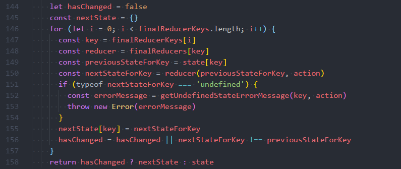

# Immutability 在 Redux 和 React-Redux 中的应用

首先来看一个例子，这个例子是 Redux reducer 函数的写法，功能很简单，就是接收 Redux action 请求，根据 action 参数，对state进行管理：

```javascript
export default createReducer(initList, {
    [actionConstants.GET_TODOS.SUCCESS](state, action) {
        let { todos = [] } = action
        state.todos = todos  // 第4行
        return state
    },
})
```

对Redux稍微有些熟悉的同学应该都能看出来，这个例子有个很明显的问题，在第4行这边，我们直接修改了原有state的值。Redux基本原则第三条说到reducers应该是pure function，显然这个例子已经违法了这个原则。那么这么做到底会有什么问题呢？我们先来讲解下理论知识，最后再回来回答这个问题。

## 浅比较 和 深比较

在开始讲解Redux 和 React-Redux 这2个类库的相关内容前，先来说明下对象比较的两种方式：浅比较(Shallow equality checking) 和 深比较 (Deep equality checking)。

### 浅比较

浅比较也叫引用比较(reference equality)，这种比较方式就是判断2个变量是否引用同一个对象，即是否指向内存中的同一个地址。这种比较方式简单、高效。

### 深比较

相比于浅比较，深比较就比较复杂；这种方式要比较两个对象中每一个属性(property)对应的值是否相等，如果属性又是对象，需要递归的比较。从效率上来说，这种方式要比浅比较慢，尤其是对象结构有多层嵌套时，执行效率要差不少。

—就是因为执行效率上的明显差别，Redux 和 React-Redux 都是采用__浅比较__的方式来判断2个对象是否相等。

下面通过一个简单例子，说明下这2种比较方式的差异：

```javascript
let obj = { name: '张三', age: 18 }
let obj2 = { name: '张三', age: 18 }

obj === obj2 //  如果是深比较，比较结果就是true；如果是浅比较，结果就是false
```

## Redux 为什么要用 immutability

针对这个问题，我们反过来问，如果 Redux 不用 immutability 会有什么问题？不用的话，会产生2个对我们平时开发影响比较大的问题：

1. 如果使用Redux的时间穿梭功能；Redux 将每次状态的变更保存到数组里；要实现时间穿梭功能，对于 Redux 而言就是获取数组里的不同状态数据；如果不使用 immutability，每次状态变更修改的都是当前状态，最终的结果就是不同阶段的状态指向的都是同一份数据，自然就无法实现时间穿梭功能。

1. 如果使用 React-Redux 将 Redux 状态关联到 React Component，假如 Redux 状态没有被正确修改，那么 React-Redux 可能不会触发 React 组件的重新渲染。也就是我们修改了 Redux 的 state，但是 React 组件在UI上并没有刷新出来。这种情形不少初学者应该都遇到过。

## Immutability 在 Redux 中的应用

前面已经说过，Redux 是使用浅比较判断两个对象是否相等；要比较前后两次的 state 是否有变更，就得保证 state 的 immutability，即处理某个action请求，如果 state 需要变更，那么就基于当前 state 返回一个修改后的state，而不是直接修改当前 state；如果不需要变更，则直接返回当前 state。

### Redux 如何使用 浅比较

Redux 是在它的 combineReducers 函数里使用 浅比较。Redux state 的结构，官方建议是将整个 root state 拆分成多个相对独立的小state，每一个小state由各自的 reducer 函数负责管理。combineReducers 函数使得对state的这种管理方式变得容易，来看下 combineReducers 的例子：

```javascript
combineReducers({ todos: myTodosReducer, counter: myCounterReducer })
```

combineReducers 接受一个 object 对象，对象中的每一个 key 就是每一个 小state 的名称，value 是一个 reducer 函数，用于管理这个 小state。

现在结合 combineReducers 源码，看下 combineReducers 都做了什么，是如何使用浅比较：



1. 146行，Redux 对所有 key 组成的finalReducerKeys进行迭代，以上面那个例子为例，finalReducerKeys 就是 ['todos', 'counter']
1. 149行，根据当前迭代key，获取当前key对应的 小state，将 小state 存储到变量 previousStateForKey
1. 150行，将 previousStateForKey 和 action 作为参数，执行reducer函数，得到新的 小state，存储到 nextStateForKey 变量里
1. 155行，更新 nextStateForKey 到 nextState 里
1. 156行，使用__浅比较__判断 previousStateForKey 和 nextStateForKey 是否相等 (如果 hasChanged 是 true，就不再比较)，将比较结果存储到变量 hasChanged
1. 158行，所有key都迭代结束后，根据 hasChanged 的值，决定返回新状态(nextState)还是当前状态(state)

这边的 nextState 和 state 是整个root state，数据结构如下：

```javascript
{
    todos: array,
    counter: number
}
```

从源码中我们可以看出，只要有一个 小state 浅比较不相等，hasChanged 值就是true，最终就会返回新state。

研究完 Redux 源码后，现在回过头看下最开始那个例子，那个例子直接修改了当前 state，这样 combineReducers 在执行第156行，计算 hasChanged 就会得到不正确的结果，就会影响最终返回的 root state。如果实现了时间穿梭功能，就没办法回到上一个状态；另外一个就是对 React-Redux 的影响，我们接着往下看。

### React-Redux 如何使用 浅比较

先看下基于 React-Redux 实现的 Smart Component：

```javascript
function mapStateToProps(state) {
    return {
        todos: state.todos
    }
}
```

React-Redux 使用浅比较来判断它所包装的 Component 是否需要 re-render, 判断的依据是：

1. 对 Redux 前后的 root state 进行浅比较，如果 状态发生变更了，则执行下一条判断；如果没有发生变更，则不会触发 re-render;
1. 对 mapStateToProps 返回对象中每一个 key 对应的 value 进行浅比较，如果有一个 key 对应的 value 和 前一个状态相同 key 对应的 value 不一样，就执行 re-render

从这边可以看出，React-Redux 是依赖于 Redux 的 state，如果 Redux state 没有被正确更新，就有可能导致 React-Redux 所包装的 Component 没能正确在。还是最开始那个例子，我们直接修改了 Redux state，但是 combineReducers 计算后 hasChanged 值是 false，导致 React-Redux 在对 root state 进行浅比较时，就判定状态没有变更，因此组件也就不会 re-render.

### React-Redux 为什么是对 mapStateToProps 函数返回对象中的每一个属性值 进行浅比较

这是因为 mapStateToProps 每次都是返回一个新的对象，如果直接浅比较返回对象，就有可能出现不必要的 re-render，通过一个例子来说明：

```javascript
function mapStateToProps(state) {
    return {
        todos: state.todos
    }
}
```

假如 Redux State 的 count 发生变更了，而 todos 没有变更；根据 React-Redux 判断 re-render 的依据，因为 Redux root state 发生变更了，因此第一条判断是通过；这样就会执行第二条判断。如果第二条判断直接比较 mapStateToProps 的返回值，结果也会判定状态有变更，因此就会引起包装的component re-render。 而实际是这个 Smart Component 只关注 todos 的状态变更，只有todos发生变更了，才重新渲染组件，但是现在 count 的变更却引起了组件的重新渲染，从而导致不必要的性能开销。基于这个原因，__React-Redux 是对 mapStateToProps 函数返回对象中每一个 key 对应的 value 进行浅比较__。

## 常见使用例子分析

前面主要讲解一些理论知识，现在基于这些知识来分析下几个例子存在的问题。

### 例子1

```javascript
import update from 'immutability-helper'
export default createReducer(initList, {
    [actionConstants.GET_TODOS.SUCCESS](state, action) {
        let { todos = [] } = action
        let newState = state  // 第5行
        newState.todos = todos // 第6行
        return update(state, { // 第7行
            '$set': newState
        })
    },
})
```


## 使用 immutability 说明