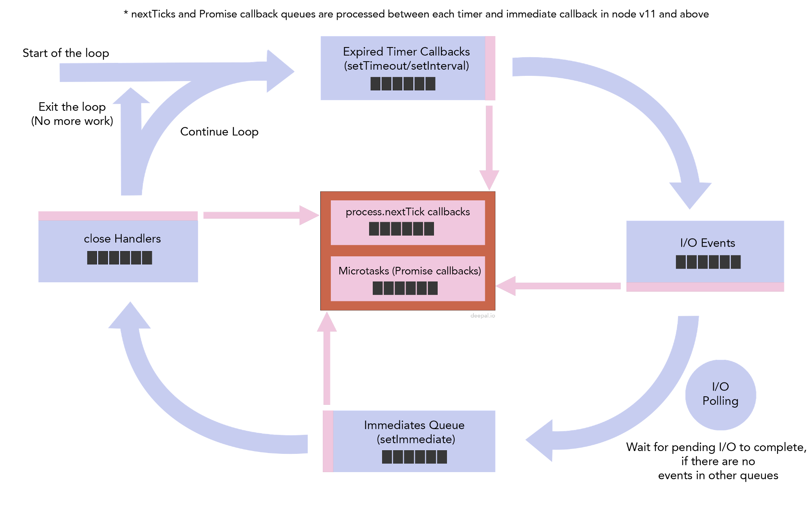

event loop
================================

## nodejs 整体架构

首先看下 nodejs 的组成


+ V8: JS 引擎，用于快速执行 JS 代码
+ LibUV: 提供事件轮询的异步 I/O
+ c-ares：用于 DNS 查询，这也是一个 C 编写的库，暴露 DNS 功能给 dns 模块中的 resolve*() 的 functions. lookup 函数使用的是 getaddrinfo，这个会用到 ThreadPool
+ http parser: nodejs 是使用 llhttp (一个由 TS 和 C 编写的库) 来处理 http 解析
+ OpenSSL：被用在 crypto 和 tls 这2个 module
+ zlib：用于快速地压缩和解压缩。nodejs 使用行业标准的 zlib 库，这个库也用于 gzip 和 libpng。nodejs 使用 zlib 来创建 sync, async 和 streaming 压缩和解压缩

nodejs 底层就是由这些 utilities 组成的一个聚合层，从而提供一个高效能的 nodejs runtime。

除了上面这些依赖库之外，nodejs 还依赖于下面3个 tools：
+ npm：模块管理工具
+ gyp：The build system is handled by gyp, a python-based project generator copied from V8
+ gtest：Native code 的测试工具

### libuv

看下 nodejs 官网对 libuv 的定义：

libuv 是一个由 C语言编写的库，用于抽象非阻塞的 I/O 操作，从而提供跨平台的一致 API。它主要用于处理 file system、dns、network、child process、pipes、signal handling、polling and streaming。它也包含一个 ThreadPool 用于分担那些不能通过系统级别实现异步操作的工作。

## Reactor pattern


Nodejs 应用的运行流程就是像上面这个图所示，这个也叫 Reactor pattern。

这其中涉及到 `Event Demulitiplexer`、 `Event Queue`、 `Event Loop` 这三个概念。下面简单描述下 Reactor pattern：

1. 应用接收到请求，遇到 V8 引擎无法识别的API (比如 timer，http，fs 等)，就会将请求转给 Event Demultiperxer；
2. Event Demultiperxer 接收到请求 (通常都是 I/O 请求)，将这些请求转给相应的底层服务；
3. 一旦请求被底层服务处理完，就会通知 Event Demultiperxer，Event Demultiperxer 将请求所对应的 handler 和 Event对象 添加到 Event queue;
4. Event loop 从 Event Queue 中获取 handler，然后执行；
5. 执行 handler 的过程中，如果涉及到 I/O API，又会重复 1 ~ 4 的 过程
6. 一旦 Event loop 执行完所有 queue 中的 handler，并且 Event Demulitiplexer 也没有 pending request，那么应用就会退出。

## Event Demulitiplexer

从上面的描述得知，Event Demulitiplexer 的作用是接收 I/O 请求，然后调用底层服务完成 I/O 操作，操作后将 I/O 请求对应的 handler 和 event (描述事件信息) 添加到事件队列。

我们知道，nodejs 是基于事件的非阻塞模型，那么 Event Demulitiplexer 是如何做到执行 I/O 请求而不阻塞呢。

现代操作系统都提供一个 Event Notification Interface 用于异步的 I/O 操作，不同操作系统，这个事件通知接口有不同的实现：

+ Linux 系统使用 epoll
+ BSD systems 系统(比如 macOS )使用 kqueue
+ Solaris 系统使用 event ports
+ Windows 系统使用 IOCP (Input Output Completion Port)

NodeJS 正是使用这个平台级别的 Event Notifiacton System 来完成异步非阻塞的 I/O 请求。

### ThreadPool

但是事情并不没有这么简单。因为不是所有 I/O 请求类型都可以直接调用操作系统提供的事件通知接口。比如 File I/O 请求，DNS I/O 请求。对于这些无法通过操作系统直接实现异步处理的请求，Nodejs 底层是通过 ThreadPool 来实现：

+ 默认一个线程池有 4个 线程
+ I/O 请求进来后，启用一个线程去处理，处理结束后通知 Event Demulitiplexer，并将线程放回线程池

nodejs 就是通过这种方式来实现其他 I/O 请求的异步处理。

虽然 ThreadPool 大部分情况都是用来处理 File I/O 请求，getaddrinfo, getnameinfo (DNS相关请求)，不过像一些 CPU 密集型的操作，比如 Crypto (randomBytes、randomFill、pbkdf2) 也是运行在 ThreadPool 上。因此采用 ThreadPool 的方式，一旦并发请求数目超过 4个，就会导致有些请求需要等待，从而影响应用性能。

针对这个问题，nodejs 允许通过设置 `UV_THREADPOOL_SIZE` 环境变量来增加线程数，目前支持的最大线程数是 128。

下面看下 Event Demulitiplexer 的组成：


Event Demulitiplexer 类似于 Browser 中处理 Timer、Web API、DOM API 的集合，V8 引擎碰到不识别的 API，就将请求转给 Event Demulitiplexer；Event Demulitiplexer 优先使用操作系统特性实现 I/O 请求，如果 I/O 请求类型无法通过操作系统来实现异步操作，那么 Event Demulitiplexer 就会使用 ThreadPool 来完成。

从上图可以看出 Event Demultiplexer 并不是单个原子实体，而是一个处理 I/O 请求的 API 抽象层，这个都是由 libuv 库来完成，实际上 Event Demulitiplexer 是 libuv 的一部分。

## Event Queue

libuv 不只包含了 Event Demultiplexer，也包含了 Event Queue。

Event Queue 是一种数据结构(类似于 queue)，用于存储需要被执行的 handler 和 event 信息。和 browser 只有一个 event queue 不同，libuv 包含了4个 queue：

+ Expired timers and intervals queue，包含已经计算好的 setTimeout 和 setInterval 的 callback；
+ I/O Event queue：包含已经处理完 I/O 的 callbacks，这些 callbacks 通常都是用户代码；
+ Immediates Queue：通过 setImmediate 添加的 callback；
+ Close Handlers Queue：任何 close event 的 handlers

Event Demulitiplexer 完成 I/O 请求后，会根据 Event 信息将 handler 加到对应的的 queue 里。

下面是各个 queue 的执行顺序：



1. 首先执行存储已经计时好的 setTimeout 和 setInterval 所对应的 callbacks；
2. 然后是处理 I/O callback queue；
3. 之后执行 setImmediate 的 callback；
4. 最后是执行 Close event 对应的 handler，执行完后回到步骤1，开启下一个 loop

__注意__：

+ 这边用 queue，并不是说就是使用 queue 这种数据结构，只是结构上类似而已。比如 timer 所用的数据结构实际是 min heap
+ 每个 queue 都有最大执行数目的限制，一旦执行 callbacks 超过最大数目限制，就会跳过这个 queue，进入下一个 queue，这样可以避免其他 queue 长期等待

### Timer queue

当使用 setTimeout 和 setInterval, nodejs 最终会将对应的 callback 添加到 Timer heap (Timer 使用的是 min heap 数据结构，也是 FIFO)。

当一个 timer/interval 指定一个 delay，并不能保证在 delay 时间到达时，callback 就会被调用。callback 被调用的的时机跟系统性能有关（因为nodejs 调用 callback 之前，会先检查是否已经达到 delay 时间，这个操作需要消耗一点 CPU 时间），另外 callback 在 queue 里也需要排队执行。不过可以保证的是，callback 一定不会在指定的 delay 时间之前被调用。

可以通过下面的代码验证 callback 调用时间：
```js
const start = process.hrtime();
setTimeout(() => {
  const end = process.hrtime();
  console.log(`timeout callback executed after ${end[0]}s and ${end[1]/Math.pow(10, 9)ms}`);
}, 1000);
```
多次执行上面这段代码，会打印类似下面的内容：

timeout callback executed after 1s and 0.006058353ms
timeout callback executed after 1s and 0.004489878ms
timeout callback executed after 1s and 0.004307132ms

### setImmediate queue

setImmediate 同 setTimeout 类似，但是还是有些区别：
+ setTimeout 用于调度一个 callback 在指定 delay 时间后被执行
+ setImmediate 用于表示一旦 poll phase 结束后，就立即执行 callback。 (poll phase 后面会讲到)

关于 setTimeout 和 setImmediate 的区别，可以使用下面的例子来展示：

```js
setTimeout(() => {
  console.log('setTimeout');
}, 0);

setImmediate(() => {
  console.log('setImmediate');
});
```

多执行几次上面的代码，会发现打印结果是不固定，有可能 setTimeout 在前，也有可能 setImmediate 在前。

下面分析下为什么会有这样的输出结果：
+ event loop 先从 timer queue 开始，虽然 setTimeout 指定 delay 为 0，但并不能保证 callback 会立即被添加到 timer queue
+ 如果 timer queue 还是空，那么就会进入下一个 queue，因此就会先执行 setImmediate (这个在 I/O quque 之后一定会被执行)
+ 到下一个 loop，setTimeout 的 callback 已经被添加到 timer queue 了，因此也会被执行

```js
const fs = require('fs');

fs.readFile(__filename, () => {
  setTimeout(() => {
    console.log('setTimeout');
  });

  setImmediate(() => {
    console.log('setImmediate');
  })
})
```

再看一个例子，这个例子将 setTimeout 和 setImmediate 放到 File I/O 的 callback 里。执行这段代码，输出结果始终都是 'setImmediate' 在前，setTimeout 在后：

+ 当 I/O 请求完成后，会调用 callback；在 callback 里调用 setTimeout 和 setImmediate 将对应的 callback 加入到对应的 queue
+ I/O phase 结束后，是先进入 setImmediate phase，因此先执行 setImmediate queue，所以刚刚加入的 setImmediate callback 就会被执行
+ setImmediate phase 执行结束后，还得先进入 Close event phase，最后再回到 timer phase，然后才会执行 setTimout 的 callback

+ Other Microtasks Queue：存储其他的 microTasks，比如 resolve promise callback.

### process.nextTick 和 microTasks

除了上面这 4个 queue，其实还有2个 queue：

+ Next Ticks Queue: 存储由 process.nextTick 添加的 callback
+ micorTaks：存储 promise resolve 或 reject 的 callback

这2个队列并不属于 libuv 的内容，因此跟 event loop 并没有直接关系。但是经常会拿来跟 setTimeout, setImmediate 讨论。

看下之前的事件队列执行顺序图，可以发现在每一个 queue 执行结束后都会先执行这2个队列，然后再进入下一个queue。这个是 nodejs 11 之前版本的行为；11+ 的版本对这个行为做了调整，将这2个的执行顺序改成在任意一个队列的 callback 执行后并且在 event loop 继续之前就执行，而不管当前 event loop 在哪个 phase，即执行时机被提前了。看个例子：

```js
setTimeout(() => console.log('timeout1'));
setTimeout(() => {
    console.log('timeout2')
    Promise.resolve().then(() => console.log('promise resolve'))
});
setTimeout(() => console.log('timeout3'));
setTimeout(() => console.log('timeout4'));
```

nodejs 11 之前版本，这段代码会输出：

timeout1
timeout2
timeout3
timeout4
promise resolve

而 11+ 的版本，输出结果变成：

timeout1
timeout2
promise resolve
timeout3
timeout4

由于 process.nextTick 会在 event loop 继续运行前先被执行，这个特性会引发一个问题：如果递归调用 process.nextTick，就会导致其他 phase 都无法执行。

因此官方更推荐使用 setImmediate，而不是 process.nextTick

而 process.nextTick

__注意:__
+ process.nextTick 的优先级要比 micorTasks 更高
+ 这边的 microTask 指的是 natvie promise，如果是其他类似 promise，有的是使用 process.nextTick 实现，有的是使用 setImmediate 实现，行为跟 native promise 还是有差别

## event loop

### 定义

event loop 就是允许 nodejs 执行非阻塞 I/O 操作。虽然 JS 是单线程，但是它可以将操作分担给系统内核处理。由于大多数系统内核都是多线程，它们可以在后台同时执行多个操作。一旦操作完成后，系统内核就会通知 nodejs，这样操作对应的 callback 就会被添加到 poll queue 里，并最终被执行。

当 nodejs 启动时，会先初始化 event loop，处理已提供的输入脚本，输入脚本可能会执行一些异步 API，调度 timers 或者调用 process.nextTick; 然后 nodejs 开始处理 event loop。

### phase

前面说到 libuv 包含 Event Queue 概念 (其中有4个 queue)，而 libuv 还有 7个 phase，phase 说明了 event loop 的执行顺序：


每个 phase 都有一个 FIFO 的 callbacks queue 需要被执行。当 event loop 进入指定的 phase，就会执行特定于该 phase 的操作，然后执行 callbacks，一直执行到queue为空 或者超过最大的 callbacks 数目。一旦 queue 被执行完成 或者执行callbacks 超过最大数目限制，就会进入下一个 phase。

由于每个 callback 都可能再调用其他 I/O 操作 或者 timer，所以当 callback 执行期间，会有其他 callback 被添加到 poll queue 里，这也是为什么有些 timer 的callback执行时机要比设定的 delay 晚。

那么这 7个 phase 和 前面 4个 queue 有什么区别和关联呢？

1. Timers: 处理通过 setTimeout 和 setInterval 添加的已经计时完成的 callbacks
2. Pending I/O callbacks：处理已经完成 I/O 操作的 callback，也称作 pending I/O callbacks (等待执行的 I/O 回调函数)
3. Idle handlers：执行一些 libuv 内部的东西
4. Prepare Handlers: 在 poll I/O 前做一些准备工作
5. I/O Poll: 等待I/O 操作的完成。这个是可选的 phase
6. Check handlers：执行一些事后的 work，setImmediate 的 callbacks 就是在这个 phase 被调用
7. Close handlers：执行任何 close event 的 handler，比如 socket.on('close', ...)

Idle handlers，Prepare Handlers，I/O Poll，这3个 phase 跟 queue 没有直接关系，其中前面2个是 libuv 内部工作，一般无需特别关注，这边重点看下 I/O Poll。

poll phase 主要完成两个功能：

+ 计算可以用于阻塞轮询的时间
+ 执行 poll queue 里的 events

从上面的说明可以看到 I/O poll 是等待 I/O 操作的完成，也就是阻塞操作。而我们知道 nodejs 推崇的是非阻塞，这边采用阻塞操作，不就影响了其他操作了吗

实际上这个 phase 不是一定会执行的，它是属于 optional，是有一定的执行条件：
+ 如果当前没有 pending tasks，即所有 queue 都是空的，那么就允许执行 I/O poll，等待正在执行中的 I/O 完成
+ 等待时间是要求，会在最近一个 timer goes off 前结束等待，然后重新激活 loop

一旦进入 poll phase，one of the two things will happen：
+ 如果 poll queue 不为空，event loop 会轮询 queue callback，并同步执行直到 callback 都被执行完或者系统允许运行时间已经到达
+ 如果 poll queue 为空：
> + 如果脚本调用了 setImmediate, 那么事件循环就会结束 poll phase, 进入 check phase 执行 setImmediate 的 callback
> + 如果脚本没有调用 setImmediate, event loop 会等待 callbacks 被添加到 queue 里，并且立即执行 callbacks。

对于一个 web 应用，比如 express，启动完之后，很快就会进入 poll phase, 在这个阶段会等待新的 http request 进来，在这个过程中，如果没有 timer / setImmediate 等定时器，那么会一直处于 poll phase

## event loop best practice

讲到这边，event loop 核心内容都已经覆盖到了，下面讲述下针对 event loop 的最佳实践：

1. 避免在重复调用的代码中 (比如 for 循环 或者 经常被调用的函数) 使用 同步 I/O 操作；
1. 同步 I/O 应该只在应用启动的阶段使用，通常是读取配置文件
1. 一个函数应该要嘛都是同步，要嘛都是异步；而不能混合同步和异步
1. 不能有太多的 process.nextTicks，因为它的优先级很高，会导致其他 queue 被延迟执行
1. dns.lookup() vs dns.resolve*()：尽量使用 dns.resolve*()，因为它会使用操作系统特性来实现异步，而 dns.lookup 是使用线程池，而线程池的线程数优先，效率会比较低

下面针对第三点举个例子说明：

```js
const cache = {};

function readFile(fileName, callback) {
  if (cache[filename]) {
    return callback(null, cache[filename])
  }

  fs.readFile(fileName, (err, fileContent) => {
    if (err) return callback(err);
    
    cache[fileName] = fileContent;
    callback(null, fileContent);
  });
}

function letsRead(){
  readFile('myfile.txt', (err, result) => {
    // error handler redacted
    console.log('file read complete');
  });

  console.log('file read initiated')
}
```

执行上面代码的 letsRead 函数，第一次会打印 file read initiated, 然后再打印 file read complete；而后面再调用，就会先打印 file read complete, 再打印 file read initiated

这就是因为 readFile 混合了同步和异步功能导致。如果 cache 有 fileName 对应的值，readFile 就变成同步，否则就是异步。这会导致调用代码 letsRead 出现不一致的行为。

为了避免这个问题，有两种解决方案，一是将 readFile 变成都是同步，只要将 fs.readFile 改成 fs.readFileSync 即可。不过更推荐使用异步来处理，如果 cache 有对应的值，通过 process.nextTick 或者 setTimeout、setImmediate 调用 callback 即可。