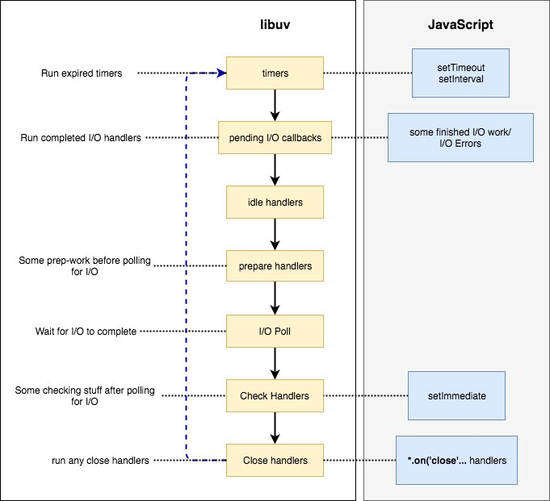

event loop
================================

## Reactor pattern


Nodejs 应用的运行流程就是像上面这个图所示，这个也叫 Reactor pattern。

这其中涉及到 `Event Demulitiplexer`、 `Event Queue`、 `Event Loop` 这三个概念。下面简单描述下 Reactor pattern：

1. 应用接收到请求，遇到 V8 引擎无法识别的API (比如 timer，http，fs 等)，就会将请求转给 Event Demultiperxer；
2. Event Demultiperxer 接收到请求 (通常都是 I/O 请求)，将这些请求转给相应的底层服务；
3. 一旦请求被底层服务处理完，就会通知 Event Demultiperxer，Event Demultiperxer 将请求所对应的 handler 和 Event对象 添加到 Event queue;
4. Event loop 从 Event Queue 中获取 handler，然后执行；
5. 执行 handler 的过程中，如果涉及到 I/O API，又会重复 1 ~ 4 的 过程
6. 一旦 Event loop 执行完所有 queue 中的 handler，并且 Event Demulitiplexer 也没有 pending request，那么应用就会退出。

## Event Demulitiplexer

从上面的描述得知，Event Demulitiplexer 是的作用是接收 I/O 请求，然后调用底层服务完成 I/O 操作，操作后将 I/O 请求对应的 handler 和 event (描述事件信息) 添加到事件队列。

我们知道，nodejs 是基于事件的非阻塞模型，那么 Event Demulitiplexer 是如何做到执行 I/O 请求而不阻塞呢。

现代操作系统都提供一个事件通知接口用于异步的 I/O 操作，不同操作系统，这个事件通知接口有不同的实现：

+ Linux 系统使用 epoll
+ BSD systems 系统(比如 macOS )使用 kqueue
+ Solaris 系统使用 event ports
+ Windows 系统使用 IOCP (Input Output Completion Port)

NodeJS 正是使用这些由操作系统提供的底层功能，来完成异步非阻塞的 I/O 请求。

但是事情并不没有这么简单。因为不是所有 I/O 请求类型都可以之间调用操作系统提供的事件通知接口。比如 File I/O 请求，DNS I/O 请求。对于这些无法通过操作系统直接实现异步处理的请求，Nodejs 底层是通过 ThreadPool 来实现：

+ 默认一个线程池有 4个 线程
+ I/O 请求进来后，启用一个线程去处理，处理结束后通知 Event Demulitiplexer，并将线程放回线程池

nodejs 就是通过这种方式来实现其他 I/O 请求的异步处理。

虽然 ThreadPool 大部分情况都是用来处理 File I/O 请求，getaddrinfo, getnameinfo (DNS相关请求)，不过像一些 CPU 密集型的操作，比如 Crypto (randomBytes、randomFill、pbkdf2) 也是运行在 ThreadPool 上。因此采用 ThreadPool 的方式，一旦并发请求数目超过 4个，就会导致有些请求需要等待，从而影响应用性能。

针对这个问题，nodejs 允许通过设置 `UV_THREADPOOL_SIZE` 环境变量来增加线程数，目前支持的最大线程数是 128。

下面看下 Event Demulitiplexer 的组成：


Event Demulitiplexer 类似于 Browser 中处理 Timer、Web API、DOM API 的集合，V8 引擎碰到不识别的 API，就将请求转给 Event Demulitiplexer；Event Demulitiplexer 优先使用操作系统特性实现 I/O 请求，如果 I/O 请求类型无法通过操作系统来实现异步操作，那么 Event Demulitiplexer 就会使用 ThreadPool 来完成。

从上图可以看出 Event Demultiplexer 并不是单个原子实体，而是一个处理 I/O 请求的 API 抽象层，这个是属于一个叫 libuv 的库来完成，实际上 Event Demulitiplexer 是 libuv 的一部分。libuv 作为一个抽象层提供 API 供 Nodejs 上面一层(通常是应用代码)调用

__注意__ ThreadPool 也是 libuv 的一部分。

## Event Queue

libuv 不只包含了 Event Demultiplexer，也包含了 Event Queue。

Event Queue 是一种数据结构(类似于 queue)，用于存储需要被执行的 handler 和 event 信息。和 browser 只有一个 event queue 不同，libuv 包含了4个主要的 queue：

+ Expired timers and intervals queue，包含已经计算好的 setTimeout 和 setInterval 的 callback
+ I/O Event queue：已经处理完 I/O 的 callbacks，这些 callbacks 通常都是用户代码
+ Immediates Queue：通过 setImmediate 添加的 callback
+ Close Handlers Queue：任何 close event 的 handlers

Event Demulitiplexer 完成 I/O 请求后，就是根据 Event 信息将对应的 handler 加到特定的 queue 里。

__注意__：

+ 这边用 queue，并不是说就是使用 queue 这种数据结构，只是结构上类似而已。比如 timer 所用的数据结构实际是 min heap
+ setTimeout 和 setInterval 所设置的 callback，被添加到 queue 里的实时间一定是 >= delay，这是由于 nodejs 需要检查 timer 是否已经计时完成，而这需要点时间，所以如果设置 delay 是 0，并不能保证 callback 一定是立即被添加到 callback 里。
+ 调用 setImmediate 后，callback 是马上被加到 Immediates Queue 里，但是需要等到这个执行到这个 queue 时，callback 才会被执行

除了上面这 4个 queue，还有2个由 nodejs 维护的 queue：

+ Next Ticks Queue: 存储由 process.nextTick 添加的 callback
+ Other Microtasks Queue：存储其他的 microTasks，比如 resolve promise callback.

## phase

我们知道Browser event loop 模型中只有一个 queue，依次获取 queue 的 callback 执行就可以了。

在讨论执行顺序前，需要先讲下 phase 概念。phase 是执行一个 queue 的过程，libuv 有4个 queue，因此就涉及到 4个 phase (另外2个不属于 libuv，所以没有对应的 phase)，那么这些 phase 是以什么顺序执行呢？


上面是各个 queue 的执行顺序图，下面分析下这个图的执行顺序：

1. 首先执行已经计时好的 setTimeout 和 setInterval 所对应的 callback，一旦这个 queue 执行完成，就进入下一个 phase；
2. 然后是处理 I/O callback，执行完后进入下一个 phase；
3. 之后执行 setImmediate 的 callback，执行完后进入下一个 phase；
4. 最后是执行 Close event 对应的 handler，执行完后回到步骤1，开启下一个 loop

在上面每一个 phase 的后面，event loop 都会查看 Next Ticks Queue 和 Microtasks Queue 是否有需要执行的任务，如果有的话，先执行 Next Ticks Queue，再执行 Microtasks Queue；之后才会真正执行下一个 phase。

__注意__：
+ process.nextTick 的优先级要高于 micorTasks
+ process.nextTick 和 micorTasks 在每个 phase 之间执行，这个是适用于 nodejs 11之前的版本，nodejs 11之后，改成在每个 callback 之后就调用(跟 浏览器 一致)
+ 如果无限循环 process.nextTick 或 micorTasks 会导致其他 phase 没机会被执行，因此需要避免这点

有了上面这部分知识，我们就可以来解答 event loop 相关的问题

```js
setTimeout(() => {
  console.log('setTimeout');
}, 0);

setImmediate(() => {
  console.log('setImmediate');
});
```

多执行几次上面的代码，会发现输出结果的是不固定，有可能 setTimeout 在前，也有可能 setImmediate 在前。

下面分析下为什么会有这样的输出结果：
+ event loop 先从 timer queue 开始，虽然 setTimeout 指定 delay 为 0，但并不能保证 callback 会立即被添加到 timer queue
+ 如果 timer queue 还是空，那么就会进入下一个 phase，因此就会先执行 setImmediate (这个在 I/O phase 之后一定会被执行)
+ 到下一个 loop，setTimeout 的 callback 已经被添加到 timer queue 了，因此也会被执行

```js
const fs = require('fs');

fs.readFile(__filename, () => {
  setTimeout(() => {
    console.log('setTimeout');
  });

  setImmediate(() => {
    console.log('setImmediate');
  })
})
```

再看一个例子，这个例子将 setTimeout 和 setImmediate 放到 File I/O 的 callback 里。执行这段代码，输出结果始终都是 'setImmediate' 在前，setTimeout 在后：

+ 当 I/O 请求完成后，会调用 callback；在 callback 里调用 setTimeout 和 setImmediate 将对应的 callback 加入到对应的 queue
+ I/O phase 结束后，是先进入 setImmediate phase，因此先执行 setImmediate queue，所以刚刚加入的 setImmediate callback 就会被执行
+ setImmediate phase 执行结束后，还得先进入 Close event phase，最后再回到 timer phase，然后才会执行 setTimout 的 callback

关于 process.nextTick 和 microTasks 的执行顺序，要特别注意 nodejs 11 和 11之前的版本差异。看下代码：

```
setTimeout(() => console.log('timeout1'));
setTimeout(() => {
    console.log('timeout2')
    Promise.resolve().then(() => console.log('promise resolve'))
});
setTimeout(() => console.log('timeout3'));
setTimeout(() => console.log('timeout4'));
```

nodejs 11 之前版本，这段代码会输出：

timeout1
timeout2
timeout3
timeout4
promise resolve

这是由于 promise 对应的 microTask 是在 setTimeout callback 里，只有 timer queue 里所有 setTimeout callback 都执行完后，才会执行 microTask (换成是 process.nextTick 也是一样)

而 11+ 的版本，输出结果变成：

timeout1
timeout2
promise resolve
timeout3
timeout4

这是因为 nodejs 调整了 nextTick 和 microTask 的执行顺序了，这2个对应的代码会在当前 callback 执行完后就立马执行，然后再执行下一个 callback。所以会看到 timeout2 后是 promise，然后才是 timeout3。

## libuv 和 nodejs I/O

上面讲的主要是 timer queue 和 setImmediate queue，以及 process.nextTick、 microTask。这部分主要涉及 libuv I/O。

前面说到 libuv 有4个 queue，分别对应 4个 phase，而实际 libuv 有 7个 phase：



那么这 7个 phase 和 前面 4个 phase 有什么区别和关联呢？

1. Timers: 处理通过 setTimeout 和 setInterval 添加的已经计时完成的 callback
2. Pending I/O callbacks：处理已经完成 I/O 操作的 callback，也称作 pending I/O callbacks (等待执行的 I/O 回调函数)
3. Idle handlers：执行一些 libuv 内部的东西
4. Prepare Handlers: 在 poll I/O 前做一些准备工作
5. I/O Poll: 等待I/O 操作的完成。这个是可选的 phase
6. Check handlers：执行一些事后的 work，setImmediate 的 callbacks 就是在这个 phase 被调用
7. Close handlers：执行任何 close event 的 handler

这边比之前多出来了3个 phase：Idle handlers，Prepare Handlers，I/O Poll；前面2个都是 libuv 内部工作，无需特别关注，这边重点看下 I/O Poll。

从上面的说明可以看到 I/O poll 是等待 I/O 操作的完成，那就是阻塞操作。而我们知道 nodejs 推崇的是非阻塞，这边采用阻塞操作，不就影响了其他操作了吗

实际上这个 phase 不是一定会执行的，它是属于 optional，是有一定的执行条件：
+ 如果当前没有 pending tasks，即所有 queue 都是空的，那么就允许执行 I/O poll，等待正在执行中的 I/O 完成
+ 等待时间是要求，会在最近一个 timer goes off 前结束等待，然后重新激活 loop

## event loop best practice

讲到这边，event loop 核心内容都已经覆盖到了，下面讲述下针对 event loop 的最佳实践：

1. 避免在重复调用的代码中 (比如 for 循环 或者 经常被调用的函数) 使用 同步 I/O 操作；
1. 同步 I/O 应该只在应用启动的阶段使用，通常是读取配置文件
1. 一个函数应该要嘛都是同步，要嘛都是异步；而不能混合同步和异步
1. 不能有太多的 process.nextTicks，因为它的优先级很高，会导致其他 queue 被延迟执行
1. dns.lookup() vs dns.resolve*()：尽量使用 dns.resolve*()，因为它会使用操作系统特性来实现异步，而 dns.lookup 是使用线程池，而线程池的线程数优先，效率会比较低

下面针对第三点举个例子说明：

```js
const cache = {};

function readFile(fileName, callback) {
  if (cache[filename]) {
    return callback(null, cache[filename])
  }

  fs.readFile(fileName, (err, fileContent) => {
    if (err) return callback(err);
    
    cache[fileName] = fileContent;
    callback(null, fileContent);
  });
}

function letsRead(){
  readFile('myfile.txt', (err, result) => {
    // error handler redacted
    console.log('file read complete');
  });

  console.log('file read initiated')
}
```

执行上面代码的 letsRead 函数，第一次会打印 file read initiated, 然后再打印 file read complete；而后面再调用，就会先打印 file read complete, 再打印 file read initiated

这就是因为 readFile 混合了同步和异步功能导致。如果 cache 有 fileName 对应的值，readFile 就变成同步，否则就是异步。这会导致调用代码 letsRead 出现不一致的行为。

为了避免这个问题，有两种解决方案，一是将 readFile 变成都是同步，只要将 fs.readFile 改成 fs.readFileSync 即可。不过更推荐使用异步来处理，如果 cache 有对应的值，通过 process.nextTick 或者 setTimeout、setImmediate 调用 callback 即可。