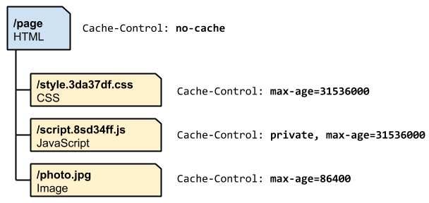

# Http Caching

## 基础知识

资源可以有3个存储地方，分别是服务器、中间代理层(比如CDN)、浏览器。最好的请求是不需要去服务端去获取，从浏览器获取是最快的。每一个浏览器都实现 Http Caching，要应用 Http Caching，需要服务器配置正确的 response header, 告诉浏览器什么时候缓存资源，以及可以缓存多久。

当服务端返回资源时，会携带一些 response headers 信息, 这些信息包括 缓存指令、资源大小、校验token(ETags) 等等。上面这张图里，首次请求资源，服务端返回对应的资源和response headers，浏览器将这些信息保存到缓存里(通常是硬盘里)，缓存时间是120秒；并且提供一个 ETags 的校验 token，当缓存时间过了之后，可以利用这个token来校验资源十分已经被修改。

## ETags

还是上面的例子，假如120秒后，对这个资源发起新的请求，浏览器会检查本地缓存，找到之前缓存的结果。由于时间已经超过120，缓存过期了，浏览器就不能直接使用这个资源。接下来，浏览器就会发起一个请求，将这个token信息传给服务端，服务端对资源进行计算，得到token，然后同接收到的token进行比较，从而判断资源是否已经修改，如果2个token一样，那么response code就会是304，浏览器接收到这个code之后，就明白资源没有变更，因此直接使用本地缓存，同时会再更新缓存时间为120秒。如果token不一样，表示资源已经变更了，那么浏览器需要再发起一次请求来获取新资源。

上图演示了使用ETags校验资源的过程。整个过程都由浏览器自主完成，无需开发介入，唯一需要确认的是服务器正确配置ETags。

通过使用ETags校验资源，只要资源没有变更，就不需要返回重复内容，可以有效减少资源的下载成本和带宽占用。

## Cache-Control

这个header用于设置缓存信息，可设置的信息包括三部分：

1. 如何缓存资源
1. 要缓存多久
1. 中间代理是否缓

### no-store 和 no-cache

no-cache 表明同一个URL的请求，浏览器缓存不能直接被使用，需要到服务器上校验资源是否发生变更。这时候 E-Tags 就发挥作用了，虽然需要一个网络来回用于校验缓存，但是可以消除不必要的资源下载，只要资源没有变更。

相比而言，no-store 就简单多了，直接不允许 浏览器 和 中间代理 缓存任何资源（通常包含隐私或者安全信息的数据，会采用这种策略），每次请求都要求到服务器上获取。

### public 和 private

如果 response 标志成 public，表示资源可以在任何地方都缓存，通常是指中间代理；如果是 private，表示资源只能在 浏览器 缓存，不允许缓存在中间代理

### max-age

指定资源可以缓存多久，单位是秒，比如 max-age=60，表示资源可以被缓存60秒，这60秒内，对资源的请求都可以直接从缓存读取。

### 定义最佳的缓存策略

上图展示了使用 Cache-Control 来实现最佳缓存策略。通常应该尽可能多的缓存资源，这样一来响应速度快，二来减少对服务器的压力。

## 废弃和更新缓存

使用缓存能带来很多好处，不过也带来一个需要解决的问题：如果资源已经发生变更了，如何及时更新缓存，应用最新的资源？

解决这个问题的办法是，改变请求资源的URL，这样就会强制重新下载，因为资源是按照URL来进行标识。通常的做法时，在URL里携带文件内容的指纹信息，比如 hash，webpack的 chunkhash。

如图，利用 Cache-Control 可以针对每个资源或者每类资源设定缓存策略：

1. 由于 css、image、js 是包含在 html 里，因此 html 要设置成 no-cache，这样每次请求html，都会通过ETag进行校验，一旦服务端的html发生变更，就会重新请求，确保浏览器端会应用最新的html内容；
1. css 和 js 的请求 URL 要带有 hash 信息；如果文件内容发生变更，那么对应的hash就会变化，URL 就会变更，由于 html 包含这些URL，所以 html 也会跟着发生变更；而 html 的缓存是设置成 no-cache，一旦html发生变更，就会请求新的html内容，也就会请求新的 js/css 内容。所以 css/js 的 缓存策略就是将 max-age 设置成尽可能长。
1. 图片的URL是固定，缓存时间设置成一天，通常这么设置是没有问题，因为图片相比不怎么会变更，如果有变更，一天之后缓存就会失效，就会重新获取了。

这边对不同资源采用不同缓存策略，再结合ETags，组合起来充分发挥缓存的效用。

## 结语

需要注意的一点是，要将资源进行合理拆分，如果一个文件经常只是修改其中的一小部分，那就应该把这一小部分内容独立出来，分成两个文件：一个经常变更，另外一个基本不变，不变的那个文件就能长久享用缓存带来的好处，经常变更的可以设置较短的缓存时间。