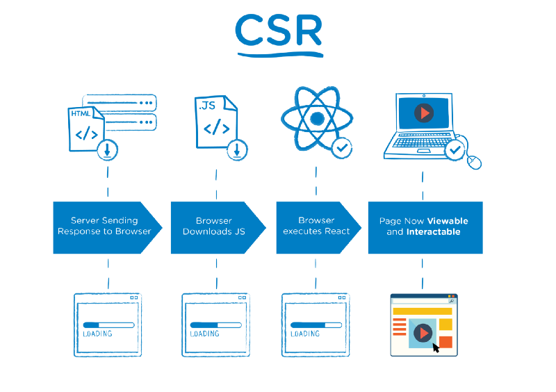

# React SSR 简介

## SSR 和 CSR

  SSR (server-side rendering), 即服务端渲染技术，是服务端预先把html页面上的特定区域，特定内容，用数据填充过，将处理过的html内容响应给浏览器。比如 jsp 。

  CSR (client-side rendering), 即客户端渲染技术，是服务端不对html文件进行处理，将html内容原封不动响应给浏览器，浏览器接收到html后开始下载css和js，之后动态构建页面内容。目前前端的SPA大多都是采用这种方式。

### SSR的优点

  采用SSR有2个显著的优点：

  1. 首次加载页面的速度更快，对用户更友好：采用服务器渲染，用户能更早看到渲染好的页面。

  1. 服务器端渲染可以让搜索引擎更容易读取页面的meta信息以及其他SEO相关信息，更有利于Spider抓取

### SSR 和 CSR 的区别

看图：

## React SSR 实现

  服务端将 React Component 转化为 HTML 的字符串，再结合 html 模板文件 进行数据填充，最后将填充后的 html 文件内容响应给浏览器。

### renderToString vs renderToStaticMarkup

  这2个函数都可以将 React Component 转化为 HTML 的字符串：

+ renderToString：生成的HTML的DOM会带有额外属性：各个DOM会有data-react-id属性，第一个DOM会有data-react-checksum属性
+ renderToStaticMarkup：生成HTML的DOM不会有额外属性，从而节省HTML字符串的大小

### data-react-checksum

  服务器端已经渲染了一次React组件，如果在客户端中再渲染一次React组件，会不会渲染两次React组件？

  如果使用renderToString渲染组件，会在组件的第一个DOM带有data-react-checksum属性，这个属性是通过adler32算法算出来：如果两个组件有相同的props和DOM结构，adler32算法算出的checksum值会一样。

  当浏览器端渲染React组件时，首先计算出组件的checksum值，然后检索HTML DOM看看是否存在数值相同的data-react-checksum属性，如果存在，则组件只会渲染一次，如果不存在，则会抛出一个warning异常。也就是说，当服务器端和客户端渲染具有相同的props和相同DOM结构的组件时，该React组件只会渲染一次。

  renderToStaticMarkup 没有生成这些属性，会导致浏览器端冲重新渲染一次。因此不要用这个函数进行SSR。

  

## 结合 React-Router

### 动机

  要求不同请求地址对应的页面都能进行SSR，而不只是特定页面

### match

  match({ routes, location, [history], ...options }, callback)

  这个函数是 SSR 专用，用于匹配 location 和 路由配置信息；匹配后，调用 callback(error, redirectLocation, renderProps)

  

### RouterContext

  看下 Router 的 render 函数

  

  该 render 函数里引用里存储在组件 state 里的 location、routes、params；而服务端是没有组件 state 的概念，因为不能直接使用 Router。

  再看下引用的 render 函数的代码

  

  Router 实际是将 props 传给 RouterContext代码，然后渲染 RouterContext，至于 props 则通过上面的 match 函数在渲染前得到。

  

### 服务端无法获取 hash 的问题

  问题：浏览器地址带有 hash 的内容，是不会传给 服务端。使用 hashHistory 则服务端不知道实际请求地址，也就无法正确匹配路由

  解决方法：新增一个 loader.html 文件, 所有非 /ssr/* 请求统一响应 loader.html。 loader.html 获取location信息，组装成请求的url，然后再请求 /ssr/* 进行实际的路由匹配和组件渲染

  优点：解决了服务端无法获取地址栏里的 hash 问题；增加的 loader.html 除了组装请求url外，还可以做其他额外的事情，比如获取 locale 用于国际化；获取 accessToken，判断是否重定向到登录页面 等等

  缺点：增加了一次额外请求。

  其他：
+ 使用 document.write() 用于替换整个 html
+ loader.html 只能包含 inline script，不能采用 <script src> 的方式增加请求数