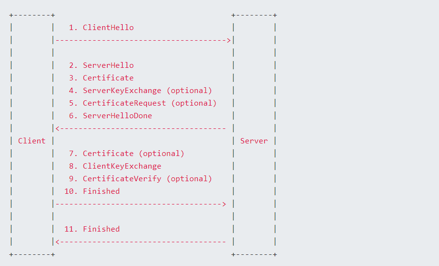

https
=====================

hypertext Transfer Protocol Secure.

HTTPS = HTTP + SSL/TLS

## 加密相关的概念

### 对称加密算法 (Symmetric encryption)

加密和解密使用同一个密码，成为对称加密。比如加密文件通常就是输入一个密码，解密的时候输入同一个密码。常见的算法有 AES, 3DES

### 非对称加密算法 (ASymmetric encryption)

非对称加密使用两个不一样的密码，一个叫私钥(private key), 一个叫公钥(public key), 用其中一个密钥加密的数据只能用另一个密钥进行解密。

私钥一般自己保存，公钥则对外发布。同等加密强度，非对称加密算法的速度比不上对称加密算法的速度；所以非对称加密算法通常用于数字签名和密钥交换。

常见的算法有 RSA、DSA、ECC

### 摘要算法 (Digest)

这个不属于加密算法，它的作用是将任意内容的数据转换成固定长度的内容，相当于计算数据的指纹，主要用来做数据校验，验证数据的完整性和准确性。

常见的算法有 CRC、MD5、SHA1、SHA256

### 数字签名 (数字签名)

数字签名是 非对称加密 + 摘要算法；目的不是为了加密，而是用来防止他人篡改数据。

核心思想是：比如 A 要给 B 发送数据，A 先用摘要算法得到数据的指纹，然后用 A 的私钥加密指纹，加密后的指纹就是 A 的签名，之后将明文数据和签名一起发给B。B 收到明文数据和A的签名后，先用通用的摘要算法计算出指纹，然后用A的公钥解密A的签名得到指纹，再比较两个指纹；如果相同，说明数据没有被篡改。假设 C 想改 A 发送给 B 的数据来欺骗 B。但是修改数据后，指纹就会发送变化，B 接收到数据后对签名进行解密得到未修改的指纹，就能比对是否被篡改；想要欺骗 B，就得改签名，但是 C 没有 A 的私钥，所以改不了。如果 C 用自己的私钥生成一个新的签名， B 收到数据后用 A 的公钥是解不开，同样能知道信息已经被篡改。

## SSL/TLS

SSL: Security Socket Layer. 目前使用的是 SSL 3.0

TLS: Transport Layer Security. 是 SSL 3.0 的升级，目前有 TLS 1.0, 1.1, 1.2 版本，1.3 版本还在开发中

最初的SSL只支持TCP，目前也支持了UDP，请参考 Datagram Transport Layer Security Version 1.2

__注意：__ SSH 和 SSL/TLS 是两个不同的协议，SSH 并不依赖于 SSL/TLS

## 握手 (密钥协商过程)

SSL 协议分为两部分：Handshake Protocol 和 Record Protocol；Record Protocol是用来描述数据的格式。

Handshake Protocol 的目的有两个：

+ 一个是保证通信双方都是自己期待的对方，任何一方都不可能被冒充，这个就是通常所说的认证；
+ 另一个是协商双方数据通信所需的对称加密密钥。认证是通过证书来实现，而密钥交换是通过证书里面的非对称加密算法和公钥来实现。

因为非对称加密的速度比较慢，所以需要协商出一份密钥，然后使用对称加密算法来进行通信。



### 客户端发送请求 (ClientHello)

```
client->server: 
hello，咱建立个连接呗，我这边的支持的最高版本是TLS1.1，
支持的密码套件（cipher suite）有“TLS_RSA_WITH_AES_128_CBC_SHA”和“TLS_RSA_WITH_AES_256_CBC_SHA256”，
支持的压缩算法有DEFLATE
我这边生成的随机串是abc123456。
```

首先，客户端需要告知服务端，自己能支持哪些加密算法，因此需要将本地支持的加密套件(Ciper Suite) 的列表传送给服务端。另外客户端还需要生成一个随机数，这个随机数需要在客户端保存，也需要发送给服务端，这个随机数会跟后面服务端发送回来的随机数结合起来产生 Master secrect。

这里有几点需要解释：
+ 客户端会把自己最喜欢的密码套件放在最前面，这样服务端就会根据客户端的要求优先选择排在最前面的算法套件
+ 算法套件是一个加密算法的三件套，包含一个非对称加密算法，一个对称加密算法，以及一个数据摘要算法。以TLS_RSA_WITH_AES_128_CBC_SHA为例，RSA是非对称加密算法，表示后面用到的证书的公钥用的就是RSA算法，通信的过程中需要签名的地方也用这个算法，包括密钥交换也是使用这个算法。AES_128_CBC是对称加密算法，用来加密握手后数据的传输，其密钥是由RSA负责协商生成；SHA是数据摘要算法，所有需要数据校验的地方都是用这个算法。
+ 一个客户端生成的随机数，稍后用于生成 master secret
+ ClientHello里面还包含session id，表示重用前面session里的一些内容；比如已经协商好的算法套件等。服务器收到这个session id后会去内存里面找，如果是一个合法的session id，那么就可以选择重用已有session 信息，这样可以省去很多握手的过程

### 服务器回应 (ServerHello)

server收到client的hello消息后，就在自己加载的证书中去找一个和客户端支持的算法套件相匹配的证书，并且挑选一个自己也支持的对称加密算法(证书里面只有非对称加密算法和摘要算法，不包含对称加密算法)。如果出现以下几种情况，握手失败：
+ 客户端支持的TLS版本太低，比如server要求的最低版本是1.2，而客户端支持的最高版本是1.1
+ 根据客户端所支持的密码套件，找不到对应的证书
+ 无法就支持的对称加密算法达成一致

如果一切都OK，那么服务端会返回ServerHello：

```
server->client: 
hello，没问题，我们就使用TLS1.1吧，
算法采用“TLS_RSA_WITH_AES_256_CBC_SHA256”，这个加密强度更高更安全，
压缩就算了，我这边不支持
我这边生成的随机数是654321def。
```
### Certificate

服务器在发送完ServerHello后紧接着发送 certificate 消息，里面包含自己的证书。

> 当然这步在有些情况下可以忽略掉，就是非对称加密算法选择使用 dn_anon, 这种是特殊情况，并且也不安全

```
server->client
这是我的证书（身份证），请过目
```

### ServerKeyExchange（可选）

在前面的ServerHello中，双方已经协商好了加密套件，对于套件里的非对称加密算法，有些需要更多的信息才能生成一个可靠的密码，比如DHE_RSA, 就需要服务端发送一些特殊信息给客户端，以便它生成 准密钥(premaster)；而有些算法不需要，比如RSA,就不需要发送额外信息，由客户自己生成一个准密钥就可以了

> premaster 可以理解为最终密钥的初级版本，有了这个密钥之后，稍微再做一下计算就可以得到最终要使用的对称加密密钥

```
server->client: 这是生成premaster所需要的一些信息，请查收
```

### CertificateRequest（可选）

只有需要验证客户端身份的时候才需要用到，在大部分情况下，尤其是HTTPS，这一步是不需要。比如访问银行网站，我们只要确保那确实是银行网站就可以了(验证服务端)；银行是通过账号、密码验证用户，而不是通过证书验证。而U盾就是一个验证客户端的例子，银行给的U盾里包含了客户端的证书，通过U盾访问银行网站，银行会通过U盾里的证书验证是不是客户本人。这种情形，客户和银行进行握手，就会涉及 CertificateRequest 请求

```
server->client: 把你的证书（身份证）也给我看看，我要确认一下你是不是XXX。
```

### ServerHelloDone

```
server->client: 我要告诉你的就是这么多了，处理完了给我个回话吧。
```

### Certificate（可选）

如果客户端在接收到服务端的CertificateRequest请求，那么就会在这里给服务端发送自己的证书，就算没有证书，也要发送这个消息告诉服务端自己没有证书，然后由服务端决定是否要继续：

```
client->server: 这是我的证书（身份证），请过目
```

### ClientKeyExchange

客户端验证完服务端的证书后(如何验证证书后面介绍)，就会生成一个premaster。生成premaster的方式，跟采用的非对称加密算法有关，如果是采用 RSA 算法，那么由客户端自己生成一个48字节长的 premaster 即可。如果是 DHE_RSA 算法，就得结合 ServerKeyExchange 发送过来的信息生成 premaster

```
client->server:
这是计算真正密钥要用到的premaster，它是用你证书里的公钥加密了的哦，
记得用你的私钥解密后才能看到哦
```

### CertificateVerify（可选）

如果客户端给服务端发送了证书，就需要再发送该消息给服务端，主要用于验证证书里公钥所对应的私钥确实是在客户端手里。

```
client->server:
这是一段用我私钥加密的数据，你用我给你的证书里的公钥解密看看，
如果能解开，说明我没骗你，私钥确实是在我手里，
并不是我随便找了一个别人的证书忽悠你
```

__注意__: ClientHello 和 ServerHello 过程都是明文传输，从 ClientKeyExchange 开始，也就是客户端完成服务端证书校验后，就会使用非对称加密算法开始交换密钥信息

### Finished

当前面的过程都没有问题后，服务端和客户端根据得到的信息计算对称加密所需的密钥

```
master_secret = PRF(pre_master_secret, "master secret",
                          ClientHello.random + ServerHello.random)
                          [0..47];
```

pre_master_secret,就是ClientKeyExchange里面客户端发给服务端的premaster。ClientHello.random 和 ServerHello.random分别是握手开始时双方发送的hello请求中的随机字符串。

> 这里加入随机数的原因主要是为了防止重放攻击，保证每次握手后得到的密钥是不一样

由于客户端和服务端所使用的算法和输入参数是一样的，因此计算出来的master_secret也是一样。

之后双方将握手过程中自己缓存的数据计算出一个校验码，再用对称加密算法和刚算出来的master密钥加密，发给对方。这一步有两个目的，一个是保证双方算出来的密钥是一样的，即我这边加密的数据你那边可以解开。另外一个目的是保证两个人通信过程中的每一步都没有被其他人篡改。因为握手的前半部分是明文，所以有可能被篡改。只要双方根据各自握手过程中缓存的数据算出来的校验码是一样的，说明中间没被人篡改。

```
client->server: 这是用我们协商的对称加密算法和密钥加密过的握手数据的指纹，看能不能解开，并且和你那边算出来的指纹是一样的
server->client: 这是用我们协商的对称加密算法和密码加密过的握手数据的指纹，你也看看能不能解开，并且和你那边算出来的指纹是一样的
```

如果双方发送完Finished而对方没有报错，握手就完成了，双方都得到密钥，并且这个密钥别人不知道，后续的所有数据传输过程都会用这个密钥加密，加密算法就是ServerHello里面协商好的对称加密算法。

> 在上面握手的过程中，一旦有任何一方觉得有问题，都可能随时终止握手过程。

### 握手不成功常见问题

配置好了之后还是连不上，一般会是以下问题：

* 版本不一致，有一方的版本太低，另一方为了安全不同意跟它通信
* 无法就加密套件达成一致，有一方支持的加密算法太弱，安全程度不够
* 证书有问题，没法通过验证
* 服务端需要验证客户端证书，而客户端没有配置

## 证书相关

### 相关概念

私钥：一个算法名称加上密码串，自己保存，从不给任何人看
公钥: 一个算法名称加上密码串，一般不会单独给别人，而是嵌在证书里面一起给别人
CA: 专门用自己的私钥给别人进行签名的单位或者机构

### 申请(签名)文件

在公钥的基础上加上一些申请人信息，比如我是谁，来自哪里，名字叫什么，证书适用于什么场景等，然后带上自己的签名，发给CA(私下安全的方式发送)，带上自己签名是为了防止别人篡改文件。

### 证书文件

证书由公钥加上描述信息，然后经过私钥签名之后得到。一般都是以一个私钥给另一个公钥签名；如果是自己的私钥给自己的公钥签名，就叫自签名。

商业证书都是用 CA 私钥给实体(公司)的公钥进行签名，从而生成证书，再发给实体。

### 签名过程

CA收到申请文件后，会走核实流程，确保申请人确实是证书描述的申请人，防止别人冒充申请者申请证书。核实通过后，CA用自己的私钥对申请文件进行签名。签名后的证书包含申请者的基本信息，CA的基本信息，证书使用期限，申请人的公钥，签名用到的摘要算法，CA的签名

### 证书找谁签名合适

别人认不认你的证书要看上面的签名是谁，所以签名一定要权威的人来签。那谁是权威呢？那就是CA，哪些CA是可信呢？那就要看软件配置，配置相信谁就是谁。比如浏览器安装好后，里面默认配置了一些信任的证书，这些就是CA签名的证书，浏览器就会相信。如果是自己写的程序，可以由自己指定信任的CA。

那么CA的证书又是由谁签名呢？一般CA是分级，CA的证书都是由上一级的CA来签名，而最顶级的CA证书就是自签名证书。

### 证书如何验证

以浏览器为例：

1. 在 TLS 握手过程中，浏览器得到了网站的证书
2. 打开证书，查看是哪个 CA 签名的证书
3. 在浏览器信任的 CA 库中，找到相应的 CA 证书
4. 用 CA 证书里面的公钥解密网站证书上的签名(这个签名是用 CA 私钥加密), 得到对应的校验码(指纹)，然后用同样的摘要算法算出网站证书的校验码，如果校验码跟签名中的校验码对得上，说明这个证书是合法的，且没有被篡改过
5. 读出证书里的 CN，对于网站的证书，这个一般包含的就是域名
6. 检查里面的域名跟当前访问的网站域名是否一致，一致的话，说明这个证书确实是颁发给这个网站。
7. 到此证书验证通过。

如果浏览器发现有问题，一般是证书里的签名不是浏览器信任的 CA，浏览器就会给出警告，这时候就得谨慎，有可能证书被掉包。如访问12306网站，由于12306的证书是自己签的名，并且浏览器不认为12306是受信的CA，所以就会给警告，但是一旦你把12306的根证书安装到了你的浏览器中，那么下次就不会警告了，因为你配置了浏览器让它相信12306是一个受信的CA。

## 证书生成示例

下面以实际的例子来看看怎么生成证书。

### 文件描述

+ 私钥文件：这个是必须
+ csr 文件：certificate Signing Request, 这个是 CA 对证书进行签名所需要的文件，申请证书时需要发送该文件；这个文件由 私钥文件 生成，包含公钥、CN(common name) 等其他跟证书申请者有关的信息
+ 证书文件：由 CA 或者 自签名得到的文件，这个文件包含了证书签名、摘要算法、证书有效期等信息。申请者得到这个文件后，就会部署到网站，之后发送给客户端。

### 生成CA的私钥和证书

```sh
#创建一个cert目录，后续操作都在该目录下进行
$ mkdir cert && cd cert

$ openssl req -newkey rsa:2048 -nodes -sha256 -keyout ca.key -x509 -days 365 -out ca.crt

```

+ -newkey rsa:2048: 生成一个长度为2048的采用RSA算法的私钥
+ -nodes：这个私钥在本地存储的时候不加密 (可以通过其他参数来加密私钥，确保存储更安全)
+ -sha256: 生成的证书里面采用 sha256 摘要算法
+ -keyout ca.key: 输出私钥到 ca.key 文件
+ -x509：生成证书格式为 x509，目前 TLS 默认只支持这种格式的证书
+ -days 365：证书有效期是1年
+ -out ca.crt: 生成的证书保存到 ca.crt 文件中

> 生成的过程中要求填一些信息，其中 Common Name 要填写网站域名，这个要特别注意，否则后面校验证书会失败

__注意：__ 如果是交给商业 CA 进行签名，就不需要这步操作; 如果是内部或者开发使用，使用这种方式，带上 -x509 表示是自签名证书，就可以了

### 生成私钥和证书申请文件 (certificate Signing Request)

```sh
$ openssl req -newkey rsa:2048 -nodes -sha256 -keyout domain.key -new -out domain.csr
```

和上面的区别是，这边使用 -new 生成一个证书签名申请文件，而上面用 -x509 生成一个自签名文件

从这边可以看出，CA 的私钥和普通人的私钥没有区别，唯一区别是 CA 用私钥自签名的证书受别人相信，而普通人的自签名证书别人不信，所以需要用 CA 来给证书签名

__注意：__ 采用商业 CA 进行签名，才需要这一步，如果是开发或者内部使用，只需要通过 -x509 生成自签名文件即可

### 使用 CA 私钥对申请文件进行签名

```sh
$ openssl x509 -CA ca.crt -CAkey ca.key -in domain.csr -req -days 365 -out domain.crt -CAcreateserial -sha256
```

由于需要往生成的证书里写入签名者的信息，所以需要加上 ca.crt, 这个里面有 CA 的描述信息，ca.key 里只有 CA 私钥信息。

__注意：__ 商业 CA 签名的话，这步也不需要，由 CA 签名后发回证书就行

### 查看证书内容

上面生成的证书都是 pem 格式。通过下面的命令可以查看证书内容

```sh
openssl x509 -text -noout -in ca.crt
openssl x509 -text -noout -in domain.crt
```

### 程序支持 TLS 需要哪些文件

对于服务端而已，至少需要自己的私钥和证书，也就是 domain.key 和 domain.crt

对于客户端而已，至少需要一个 CA 证书，即 ca.crt，不然无法验证服务器的证书是否正确

## 参考引用

[OpenSSL Essentials: Working with SSL Certificates, Private Keys and CSRs](https://www.digitalocean.com/community/tutorials/openssl-essentials-working-with-ssl-certificates-private-keys-and-csrs)

[OpenSSL Essentials](https://www.digitalocean.com/community/tutorials/openssl-essentials-working-with-ssl-certificates-private-keys-and-csrs#about-certificate-signing-requests-(csrs))

-----------------------------------------------------
## 数字证书

数据证书的目的是用于校验身份。SSL/TLS 协议默认只校验服务端身份，当客户端发起 SSL 握手，服务端提供证书给客户端进行校验。

### 生成证书

服务器生成公钥和私钥，并且把 公钥 发给 CA，由 CA 生成证书，证书包含 公钥、证书主体、数字签名等内容，注册成功后，CA 将证书颁发给服务器。 服务器实体拿到证书后，将证书部署到服务器端，供后续使用

### 校验证书

完成服务器这个实体的身份认证(就是到 CA 那边去注册身份信息, 这个过程叫 CSR: certificate Signing Request)

客户端拿到数字证书后，怎么确认这个证书是由CA签发

1. 首先 CA 对证书内容(包含在证书里)进行哈希算法处理生成摘要， 然后利用 CA 自己的私钥对摘要进行加密，生成数字签名内容，这个内容包含在证书里
1. 客户端拿到数字证书后，使用 CA 对外公布的公钥解密数字签名内容得到摘要；同时使用证书里提供的 哈希算法 对证书内容进行签名，然后比对摘要，如果一致就说明是对应的主体。

### 中间人劫持

数字证书是为了解决中间人劫持的问题。中间人劫持的大概流程如下：
+ 中间人创建一对 公钥/私钥 和证书；
+ 中间人拦截 client 和 server 通讯信息，对于 client 而已，中间人就是一个 server；对于 server 而已，中间人就是一个 client。
+ 当 server 向 client 发送证书时，中间人可以拦截这部分信息，然后将实际证书替换成中间人的证书发送给 client
+ 如果没有数字证书校验，那么 client 得到伪造的证书后，使用证书里的公钥跟 server 协商对称加密密钥
+ 中间人拦截交互密码的信息，使用自己的公钥解密 client 发送的信息，然后用 server 的公钥将信息加密再发送给 server
+ server 拿到信息后可以正常解密，解密后再发送信息给 client，中间人用 server 的公钥解密数据，用自己的私钥加密发送给 client
+ 在整个密钥交互过程中，中间人都可以得到交互信息。一旦密钥确认好。client 和 server 就使用约定好的算法和密钥进行数据加密通讯
+ 而中间人已经知道算法和密钥，因此client 和 server 发送的数据都可以被解密，甚至可以被篡改、伪造。

只所以中间人可以劫持成功，根本原因就是没有对中间人发送给 client 的数字证书进行验证。这也是为什么访问一些 browser 不认识的网站时，会出现警告，原因就是该网站提供的证书，浏览器认为是不是权威 CA 认证过，如果用户选择相信证书，信息就有可能被劫持。

像抓包工具，其实就是一个中间人，我们使用抓包工具抓取 https 请求，是需要先安装证书，这个证书其实就是抓包工具服务商提供的。选择使用转包工具，就是认为抓包工具服务器提供的证书是可信。

## openssl

1. genrsa - generate an RSA certificate, this is our private key.
1. req - create a CSR
1. X509 - Sign the private key with the CSR to product a public key.