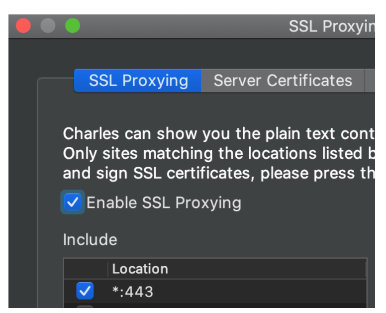

charles 
===============

## 安装证书
你用手机上的safari访问这个地址：chls.pro/ssl
手机得连上charles，然后访问这个地址，应该会弹出一个对话框，点击允许
访问之后会让你安装一个证书
然后你到设置--通用--描述文件与设备管理，把Charles这个证书安装
安装成功之后再到设置--通用--关于本机--证书信任设置，把Charles的那个证书开关打开
手机证书搞定之后，就到charles的proxy菜单，进入SSL proxying setting，这么配置就行了

